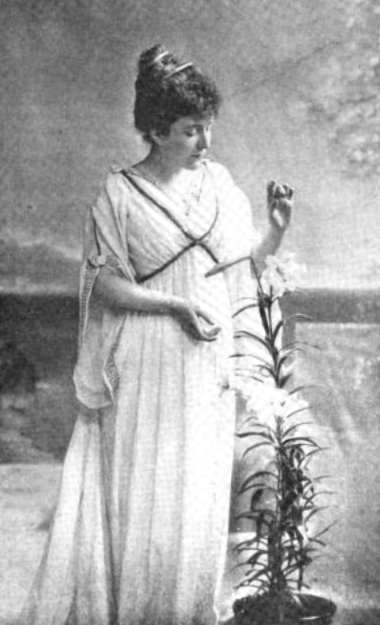

# From Elocution to the National Health Service

Elsie Fogerty founded the Central School of Speech Training and Dramatic Art at the Royal Albert Hall in 1906. The school trained actors — Olivier, Ashcroft, Gielgud passed through later generations of the same rooms — and it trained people who would sit with children who stammered. In 1913 Fogerty opened a speech clinic attached to the Almoner’s Department at St Thomas’ Hospital and became its superintendent. A British timeline held at Strathclyde puts an earlier hospital post at St Bartholomew’s in 1911, Cortland MacMahon as “Instructor for Speech Defects.” The profession’s English origin is therefore double: a theatre school with a social conscience, and an ENT corridor with a job title that still sounds like elocution.

*Elsie Fogerty. The Sketch, 21 September 1898. Lafayette studio. Public domain.*

## Societies, then a college

Between the wars the work organized itself in the British Society of Speech Therapists and rival groups. In 1945, as the war ended and the National Health Service was being designed, the College of Speech Therapists brought the societies’ members under one name. Hospital sessions that had been two afternoons a week became, for some people, a job.

Muriel Morley is the clearest wartime-to-NHS life. Born 1899, she answered a 1932 advertisement from the Newcastle plastic surgeon William Wardill (the name is Wardill in surgical histories; some speech-therapy retellings print Wardell). He wanted an “educated woman” to measure speech before and after a new pharyngoplasty. She had been a secretary. She learned on the ward, trained with colleagues in Liverpool and London, and took the Society diploma in 1938. *Cleft Palate and Speech* — written as a thesis, published in 1945 — became a standard text. By the end of the war she was full-time across three Newcastle hospitals, including aphasic ex-servicemen. In 1959 she helped set a university course. She edited the college journal (1966–1971) and served as president (1971–1973). OBE, 1980. Died 1993.

Margaret Cicely Langton Greene (16 July 1913 – 26 September 2007) wrote *The Voice and Its Disorders* in 1957, edited the college *Bulletin* and the journal *Speech* in the mid-1950s, and in 1968 founded AFASIC, a charity for children with speech and language impairments. The voice book went to a sixth edition (Lesley Mathieson, 2001). OBE, 1987.

## A fight about whose profession

In the late 1950s the Professions Supplementary to Medicine Bill threatened to park speech therapists under medical supervision as a helper grade. Morley wrote a memorandum, *A profession concerned with disorders of communication*, and the college lobbied. The speech therapists were removed from the bill. The 1960 Act went ahead without them. That is a small parliamentary story with a large meaning: the British profession decided it was not a doctor’s leftover.

The later name, Royal College of Speech and Language Therapists, adds “language” the way ASHA did, and “Royal” the way Central eventually did (2012). Fogerty, who once said she was too busy with children in poor districts to chase a royal title for her school, would have recognized the pattern.

## Not a small America

British speech therapy did not copy Iowa. It copied, if anything, the hospital and the education authority. Training sat in colleges and in Central’s speech-therapy department as much as in universities. Phonetics came from Daniel Jones’s London, not from Seashore’s Iowa. Cleft palate came from plastic surgery partnerships in Newcastle and from Catherine Renfrew’s later Oxford work, not from Penn State. The stammering literature read Van Riper, then argued with him.

Joan van Thal, Winifred Kingdon-Ward (who had worked in Scripture’s London clinic and disliked his “octave twist”), Anne McAllister in Scotland — these names belong in a longer British book. This essay holds the spine: Fogerty’s school and clinic, the 1945 college, Morley’s hospitals, Greene’s voice book and AFASIC, the 1960 escape from “supplementary.”

## What a U.S. reader should notice

The NHS made speech therapy a public right earlier than American school law made it a public duty. The caseload mixed hospital and classroom because the same college trained both. The word on the badge is still *therapist*, not *pathologist*. That is not a translation error. It is a different bet about whether the work is a medical specialty or a treatment profession standing beside medicine.

**Further in this series.** Fogerty (24). Morley (39). Scripture’s London years (22). The global mismatch of names (essay 16).
