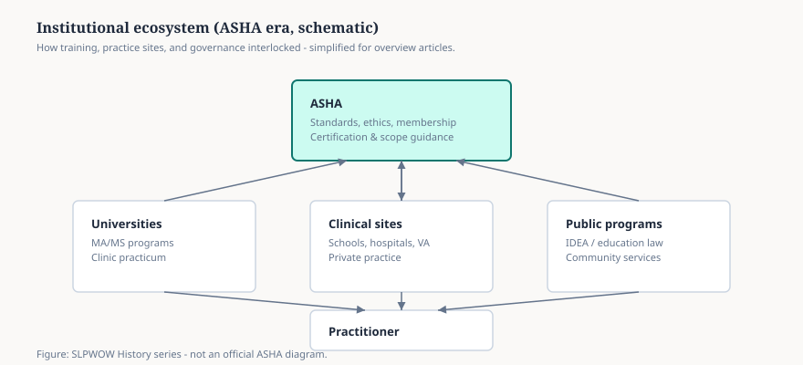

# Four Names, One Association

The 1925 academy could fit in a hotel room. The 1978 association needed a building and a legal name long enough to hold three jobs. Between those dates the group renamed itself four times and acquired the habits that still run the American field: a journal with teeth, a certificate, a code, a national office.

<figure class="slpwow-figure slpwow-figure--schematic">
  
  <figcaption>
    <strong>Figure 1.</strong> Institutional ecosystem in the later ASHA era (schematic, not an official ASHA diagram). IDEA (1975) belongs to the late band, not the 1925 hotel. SLPWOW History series — editorial graphic.
  </figcaption>
</figure>

## The names, again, because the names are the plot

- 1925 — American Academy of Speech Correction
- 1927 — American Society for the Study of Disorders of Speech
- 1934 — American Speech Correction Association
- 1947 — American Speech and Hearing Association
- 1978 — American Speech-Language-Hearing Association

“Academy” lasted two years. It sounded like a closed club, which, in membership terms, it was. “Society for the Study” sounded like a seminar. “Correction” carried the elocutionist’s broom. 1947’s “Hearing” is the honest one: audiology had become a war profession and would not stay a subcommittee. 1978’s “Language” is the other honest one: child language and aphasia had made “speech” too small a noun.

The acronym ASHA attaches to the 1947 name. People who say “ASHA” for 1925 are speaking later English.

## Journals that stopped being newsletters

Wendell Johnson edited the *Journal of Speech Disorders* from 1943 to 1948. Grant Fairbanks took *Journal of Speech and Hearing Disorders* in 1949 and, colleagues later said, made it look like a scientific journal instead of a club bulletin. The *Journal of Speech and Hearing Research* followed. Fairbanks’s own Illinois laboratory and his *Voice and Articulation Drillbook* (1937; 1960) sat on the same desk as the red pencil. A field that wants to be a science needs someone willing to reject a paper. That is a dull, necessary founding.

## Certificates, honors, a Rockville address

Certification — the CCC later generations treat as oxygen — is a mid-century invention, not a 1925 one. The early academy used membership itself as the filter. Honors of the Association, once rare enough to print in the journal with a portrait, went to West (1947), Travis (1948), Stinchfield Hawk (1953), Fairbanks (1955), Johnson (1946, in some listings as the first wave of Honors), and on down a list that now runs into the hundreds. McDonald, 1976. Templin, 1981. Schuell’s Honors arrived after her death.

The national office in Rockville is a late fact. For decades the association was a journal, a December meeting, and a file cabinet. Paden’s 1958 history stops before the modern bureaucracy. That is useful. It reminds you that “ASHA says” once meant a room of people who knew each other’s middle initials.

## Presidents as a weather report

West first (1925–28). Stinchfield Hawk first woman (1939–40). Johnson in 1950. Harlan Bloomer in 1955. Raymond Carhart, the audiologist, in 1957. Jon Eisenson in 1958. The gavel passed through stuttering, university administration, hearing science, aphasia. A presidential list is not a history of ideas. It is a history of who had the institutional hours.

## What growth cost

As membership rose, the intimate blacklist of “not scientific” became a legal process. School clinicians outnumbered the laboratory people and still do. Special-interest groups multiplied. The association learned to lobby. It also learned to be late — late on language, late on multilingual practice, late on swallowing, late on its own demographic. The 1978 name is an admission of lateness as much as a triumph.

A history series hosted by a private therapy brand does not need to recite ASHA’s current strategic plan. It needs the older plot: a splinter of a teachers’ convention that became the body that writes the exam. Everything a new graduate now treats as weather — the CCC, the code, the journals — was once a vote in a small room.

**Further in this series.** The McAlpin meeting (essay 06). Fairbanks in the “correction to CSD” essay (15). Bloomer (31). Eisenson (32).
