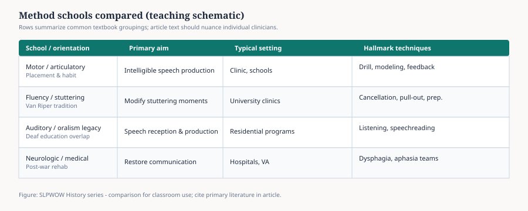

# From “Correction” to Communication Sciences

Charles Van Riper’s *Speech Correction: Principles and Methods* landed in 1939. The title is a period photograph. A person has a defect. A trained worker corrects it. The book went through ten editions and outlived the word on its spine. By the last ones, Robert Erickson was helping keep Van Riper’s sentences while the profession around them changed clothes.

<figure class="slpwow-figure slpwow-figure--chart">
  
  <figcaption>
    <strong>Figure 1.</strong> Selected method schools compared (teaching schematic). Rows are textbook groupings, not cages. Swallowing as an SLP staple is later than the 1939 title. SLPWOW History series — editorial graphic.
  </figcaption>
</figure>

The clothes had new labels. Speech pathology. Speech and hearing science. Communication disorders. Communication sciences and disorders. Each label is a small act of embarrassment about the last one.

## Science as a lab, not a slogan

Grant Fairbanks (1910–1964) is the cleanest example of the mid-century turn. He came out of Iowa’s experimental culture, wrote *Voice and Articulation Drillbook* in 1937, and in 1948 took a chair at the University of Illinois as professor of speech and director of a new Speech Research Laboratory. Illinois’s later college history says the first doctorates in speech and hearing science on that campus came out of that lab. From 1949 to 1954 Fairbanks edited *JSHD* and, colleagues said, stopped it from looking like a newsletter. ASHA Honors, 1955. He left for a California research post in 1962 and died in 1964, fifty-three or fifty-four.

Fairbanks’s 1954 paper on the speech mechanism as a servosystem is the kind of sentence Van Riper would not have written in 1939. The mouth becomes a control loop. The student becomes a person who must learn acoustics.

## Language walks in

Mildred Templin’s 1957 monograph on typical children’s language skills, Roger Brown’s later developmental work, the psycholinguistics that washed through the 1960s — these made “speech correction” sound like a man with a lisp and a mirror. Children who did not combine words, children who did not seem to understand, adults whose sentences had gone, all needed a noun larger than *speech*.

ASHA added “Language” in 1978. University departments added “sciences” to look like they belonged with psychology and linguistics, not with the old speech-and-theatre split. Some of that was fashion. Some of it was accurate. A person who measures voice onset time and a person who writes a goal for /s/ are in the same building because someone, around 1960, refused to keep them in separate buildings.

## Audiology’s polite divorce

The 1947 association name already admitted hearing. Clinical audiology then built its own graduate path, its own CCC, its own personality. Raymond Carhart’s Northwestern years are the American textbook version. Bloomer, at Michigan, was still writing in 1956 about joint professional training in “speech correction and clinical audiology,” as if the marriage could be saved in the curriculum. It was saved in the association and separated in the job market. That is a typical American solution.

## What got lost in the rename

“Correction” was arrogant. It also named an activity: a teacher and a pupil, a sound, a retry. “Communication sciences” can sound like a research park. The risk of the later name is not kindness. It is distance — from the school room, from the hour, from the fact that someone still has to sit there.

Van Riper, to his credit, never became distant. The later editions keep the person in the chair. Brookshire’s writing manuals for graduate students are the same ethic in a different font: say what you saw, do not decorate it.

## A working translation

If you read an old journal and sneer at *speech correctionist*, you are sneering at Stinchfield Hawk’s job title. If you read a modern department website and cannot find the word *clinic*, you are looking at Fairbanks’s victory without Van Riper’s remainder. The field needed both: the laboratory that would reject a sloppy paper, and the book that would not let a student forget there is a face attached to the spectrogram.

**Further in this series.** Van Riper (30). Templin (35). Brookshire (40). ASHA’s names (essay 12).
