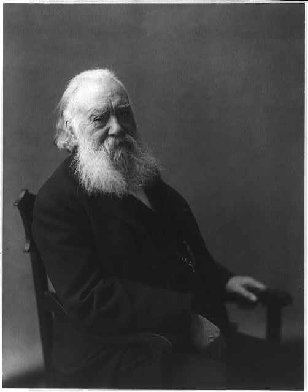

# Alexander Melville Bell

The Library of Congress print is a late photograph: white beard, dark coat, the face of a man who has spent a life telling other people how to hold their mouths. Frances Benjamin Johnston took it. The sitter is Alexander Melville Bell (1819–1905), Edinburgh elocutionist, London lecturer, inventor of a writing system he believed could record every human sound.

*Alexander Melville Bell. Photograph by Frances Benjamin Johnston. Library of Congress. Public domain.*

## Edinburgh, then the alphabet

He was born in Edinburgh on 1 March 1819, son of Alexander Bell, who already sold elocution. In 1844 he married Eliza Grace Symonds. Three sons lived long enough to enter the story: Melville James, Edward Charles, and Alexander Graham. Tuberculosis later took the first two. Melville lectured on elocution at the University of Edinburgh (1843–1865) and at the University of London (1865–1870). The family trade was practical: stammering, thick accents, the pulpit, the bar. He wanted a notation that did not depend on a particular language’s spelling.

Visible Speech appeared as a system in 1864 and as a book in 1867: *Visible Speech: The Science of Universal Alphabetics*. The letters are stylized pictures of the vocal organs. A reader who learned the code, Melville claimed, could pronounce a language he had never heard. He also claimed the same marks could teach articulation to people who stammered and to deaf pupils.

The second claim is the one that pulled the family across the Atlantic. In 1868 he toured North America. He sent his son Aleck to Hull’s Kensington school. Boston’s school board, after hearing him at the Lowell Institute, opened a day school under Sarah Fuller to try oral methods. The telephone was still eight years away and not his.

## Canada, Washington, the Bureau

After the deaths of two sons from tuberculosis, the remaining family left Britain. Melville spent time in Brantford and, late in the 1870s, taught philology at Queen’s College, Kingston. In 1881 he and his wife Eliza Grace Symonds moved to Washington, D.C., where their surviving son was already a public man. The Volta Bureau became a family imprint. Melville’s late titles wear its address: *English Visible Speech in 12 Lessons* (1893), *The Science of Speech* (1897), *Principles of Speech and Dictionary of Sounds* (1900), with the old promise in the subtitle — stammering, faults of articulation, exercises.

He died in Washington, D.C., on 7 August 1905. The son had seventeen years left.

The 1864 public demonstrations — Edinburgh audiences watching a stranger read sounds from marks — are the origin story Melville preferred. Later phoneticians preferred Henry Sweet and then the IPA. Both stories can be true: a showman’s alphabet can still be the first time a teacher sees a mouth as something you can write down. The Volta Bureau reprints kept the show in print after the profession had moved on.

## What to keep, what to leave

Keep the alphabet. It is a genuine ancestor of articulatory phonetics as a teaching tool. Henry Sweet and the IPA went another way — more linguistic, less pictorial — but Melville’s instinct that a clinician needs a mark for a mouth-shape is now so ordinary it is invisible.

Leave the sales pitch. Visible Speech did not become the world’s spelling. It did not “cure” stammering in the sense the 1900 subtitle wants. It did become a method in oral deaf education, which means its history is tangled with the suppression of signed languages. That tangle is the son’s public life more than the father’s. The father built the tool.

A speech-language series that starts its American story in 1925 without Melville Bell is starting in the middle of the sentence. The 1925 people were in rebellion against elocution. They were also standing on its furniture.

**Further in this series.** The Visible Speech essay (03). Alexander Graham Bell (18). Before the clinic (01).
