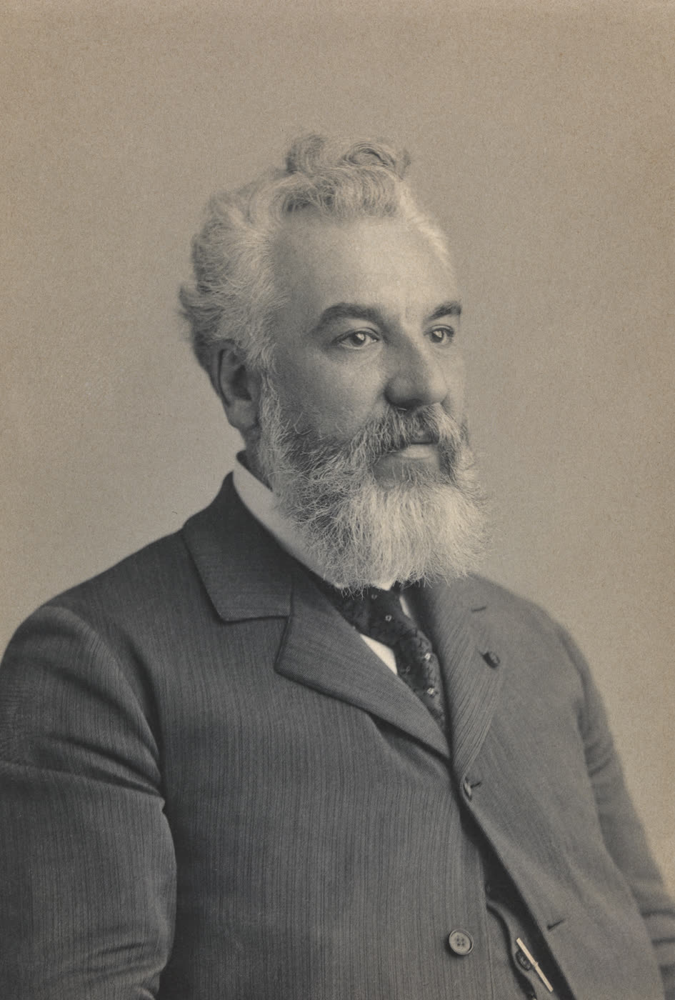

# Alexander Graham Bell, Speech Teacher

The Smithsonian portrait is from 1895: three years after the Volta Bureau had a building, five years after Bell became first president of the American Association to Promote the Teaching of Speech to the Deaf. He looks like the telephone. This article is about the other job, the one he said he preferred.

*Alexander Graham Bell, 1895. Photographer unknown. Smithsonian National Portrait Gallery, NPG 77.363. CC0.*

## Born into the mouth

Alexander Graham Bell was born 3 March 1847 in Edinburgh. His mother, Eliza, had hearing loss. His father was Melville Bell. Two brothers died of tuberculosis. Aleck studied anatomy and physiology at University College London (1868–1870) and did not finish a degree. What he finished was an apprenticeship: Visible Speech demonstrations, Hull’s Kensington school (1868), Boston in 1871 with Sarah Fuller, a long career as a teacher of deaf pupils.

Mabel Hubbard, deaf after childhood scarlet fever, was in that Boston world; they married in 1877. The telephone patent of 1876 made him rich enough to fund the next twenty years of advocacy. The Dictionary of Canadian Biography is blunt: until his death he saw himself as a teacher of the deaf, and the public saw the inventor.

## Volta money

The Volta Prize (1880) and its 50,000 francs became the Volta Fund, the Volta Laboratory, and, in 1887, the Volta Bureau. The 1893 building in Washington still stands as a monument to a program: collect the literature of deafness, publish *The Volta Review*, train teachers to use speech. In 1890 Bell took the presidency of the AAPTSD. Those initials later fold into the Alexander Graham Bell Association for the Deaf and Hard of Hearing — a living organization, and a living argument.

## Oralism, Milan, the 1883 memoir

Bell taught speech. He also argued, in print and in policy, that signed language kept deaf people apart from the hearing world and that deaf-deaf marriage risked a “deaf variety” of the race. *Memoir upon the Formation of a Deaf Variety of the Human Race* (1883) is the document later historians correctly file under eugenics. The 1880 Milan congress, which preferred oral education, was not his personal decree; his name became a flag for people who wanted the decree enforced. The Canadian biography notes his disagreements with some boarding-school zealots. It does not clear the memoir.

Deaf communities have said this for decades. A speech-pathology brand that hosts a history series has to say it on the same page as the Visible Speech chart. Articulation teaching and oral methods are part of the field’s ancestry. So is the harm done when those methods were used to forbid a language.

## What a clinician can still use

Not a protocol. Not a hero. A set of facts:

He treated speech as something that could be analyzed and taught, not as a mystery. That is the usable ancestor.

He built a bureau and a journal. Later associations copied the shape.

He was wrong, and influential, about signed languages and about marriage. Influence is not virtue.

He died 2 August 1922 at Beinn Bhreagh, Nova Scotia. ASHA was three years from its hotel room. The Volta Bureau was already thirty-five. The two institutions are not parent and child. They are neighbors who did not always speak.

**Further in this series.** Melville (17). Visible Speech (essay 03). The older deaf-education fight (essay 01).
