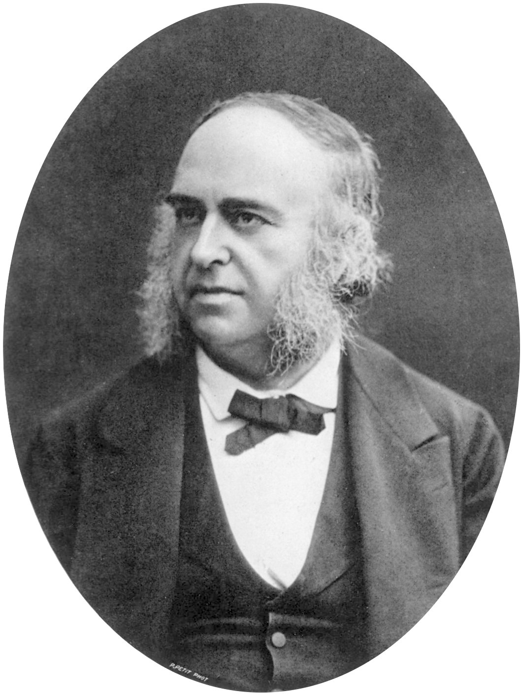

# Paul Broca

Pierre Petit photographed him in the studio style of the Second Empire: dark coat, watch chain, the face of a surgeon who also measured skulls. Pierre Paul Broca (1824–1880) is in this series because a ward name — “Tan” — and an 1861 autopsy still sit in every introductory lecture on aphasia. He is not in it because he was a speech therapist. He was not.

*Paul Broca. Photograph by Pierre Petit. Wellcome Collection / Wikimedia Commons. Public domain.*

## Sainte-Foy to Bicêtre

He was born 28 June 1824 at Sainte-Foy-la-Grande. He trained in Paris, became a surgeon, a professor, a politician late. The scientific fame is localization of articulated speech to the third left frontal convolution, announced after the death of Louis Victor Leborgne, the Bicêtre patient who had said “tan” for years. Broca’s 1861 remarks to the Société Anatomique, and the cases that followed, made “aphemia” — his first word — into a public fact. The world later said *aphasia* and put his name on the nonfluent type.

He had predecessors. Gall, Bouillaud, Auburtin. Broca had the specimen and the society. Medicine rewards the person who brings the brain to the meeting.

Leborgne had been at Bicêtre for years with a right hemiplegia and almost no speech. Broca’s second famous case, Lazare Lelong, was an elderly man who could say a handful of words. The two autopsies, read together, let Broca argue that the third frontal convolution was not a curiosity. Later writers have gone back to the specimens — still preserved — and argued about the exact extent of the damage. The 1861 paper remains the public event. The jars remain the private argument.

## The other laboratory

The same career includes the Société d’Anthropologie de Paris (he founded it in 1859), a flood of cranial measurements, and racial rankings that later science discarded and later ethics condemned. The man who gave the field a frontal convolution also gave the nineteenth century a scientific vocabulary for hierarchy. A profile that prints only the convolution is doing public relations for a lecture slide.

## What speech-language pathology actually inherited

A permission: language failure can be a focal brain fact, not a moral one.

A pair of names: Broca’s area, Broca’s aphasia. Both names are too tidy for the scans, and still useful as a first map.

A habit of the specimen: the brain in the jar, the photograph, the paper. Goodglass’s Boston and Schuell’s Minnesota are behavioral answers to that habit. They keep the respect for pattern and drop the wait for autopsy.

Broca died 9 July 1880 in Paris. Wernicke’s pamphlet was six years old. Gutzmann was fifteen. The American academy was forty-five years away. The line from Bicêtre to a modern therapy hour is real and thin. It runs through wars, VA wards, and a lot of people Broca would not have hired.

**Further in this series.** The lesion essay (02). Wernicke (20). The people who sat with the living (Schuell, Goodglass, Luria).
