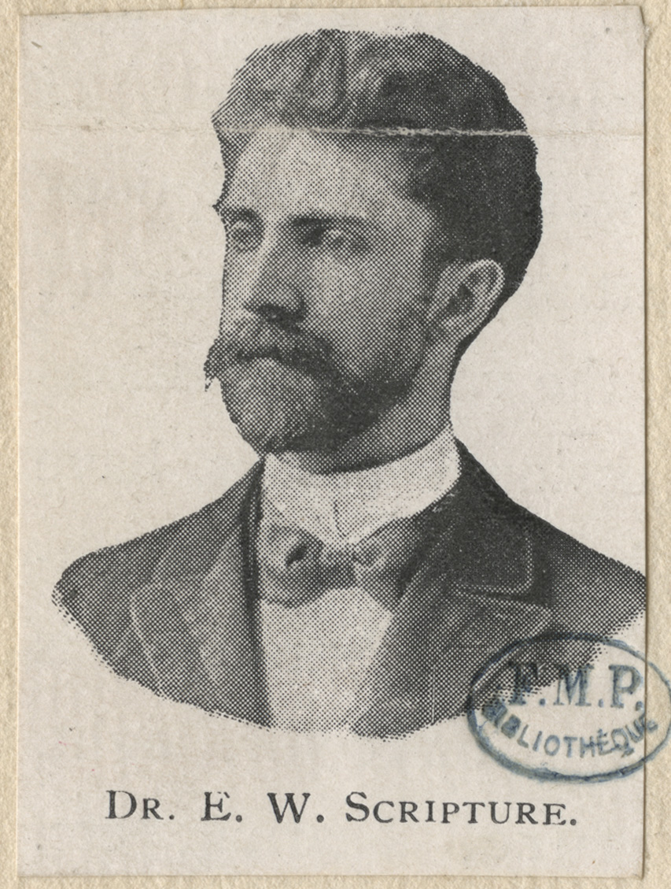

# Edward Wheeler Scripture

The Paris medical-library photograph is labeled in the old catalog style: Scripture, Edward Wheeler. He looks like a laboratory, not a clinic — high forehead, hard collar, the face of a man who would invent a pendulum timer and then pick a fight with his chairman.

*Edward Wheeler Scripture. Bibliothèque interuniversitaire de santé, Paris (CIPA0438). Licence Ouverte.*

## Leipzig, Yale, the door

He was born 21 May 1864 in Mason, New Hampshire. He took a Leipzig Ph.D. in 1891 under Wilhelm Wundt, married May Kirk in Berlin in 1890, spent a year at Clark with G. Stanley Hall, and in 1892 went to Yale. He founded Yale’s experimental psychology laboratory. He and May ran phonetic studies. On 8 July 1892 he was among the founders of the American Psychological Association. In 1902 the Carnegie Institution gave him what later writers call the first grant for experimental psychology to study the sounds of human speech. In 1903 Yale fired him after a fight with George Trumbull Ladd about what psychology was. Ladd left too. The laboratory did not make him gentle.

He took an M.D. at Munich in 1906. In 1915 he and May were at Columbia’s medical center, in a neurology laboratory and speech clinic tied to the Vanderbilt Clinic. Stammering, lisping, the “octave twist” — a pitch jump on stressed words that he thought would break a monotone. He mixed habit-training with the psychoanalytic weather of the decade. The marriage frayed; the work collaboration lasted longer.

## London, Vienna, London again

In 1919 he opened a speech clinic at the West End Hospital for Nervous Diseases in London and hired Winifred Kingdon-Ward. She thought the octave twist was a gimmick and said so. She left, then later directed the clinic after he moved on. In 1929 he took experimental phonetics at the University of Vienna. After 1933 the trail, in the Max Planck file, is private practice in London. He died 31 July 1945 in Henleaze, England. (Some American notes misspell the suburb. Henleaze is the one.)

Career tables disagree about overlapping years. Columbia “1915–29” sits beside a 1919 London clinic and a 1929 Vienna chair. The honest version is a man who kept two continents and did not always file a clean resignation.

## Why the 1925 people still owed him

He made American experimental psychology listen to speech as sound, not only as oratory. He put a clinic next to a medical school before Wisconsin’s 1914 experiment was famous. He trained, by collision, a British therapist who rejected him. That last item is not a failure. It is how methods die in public.

Do not revive the octave twist. Do not call him the first speech pathologist; the Germans and the Bells were already at work. Call him what the record supports: a Wundtian who wanted a clinic, a physician who wanted a laboratory, and a restless Atlantic commuter who died in a Bristol suburb while the American association was twenty years old and still changing its name.

**Further in this series.** Before the clinic (01). German phoniatrics (04). Kingdon-Ward in the British essay (11).
