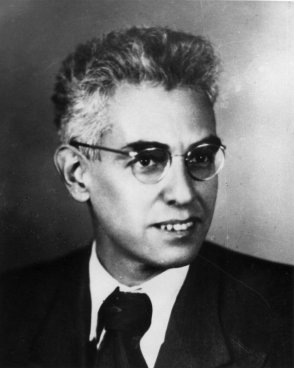

# Aleksandr R. Luria

The photograph on Commons is dated to the 1940s, photographer unknown, file marked public domain, credit to a UCSD Luria page. A 1940s portrait of a man who died in 1977 may yet have a rights holder. The pack follows the file page and says so.

*Aleksandr R. Luria, c. 1940s. Photographer unknown. Wikimedia Commons (stated public domain; see `PORTRAIT_SOURCES.md`).*

Aleksandr Romanovich Luria was born in 1902 and died in 1977. He is the Soviet psychologist and physician whose wartime aphasia work reached English-language clinics late and then all at once.

## Vygotsky’s junior, then a medical degree

The 1920s Luria is a Moscow psychologist in Lev Vygotsky’s circle, writing a “real psychology” that would not be published as a book at the time. He understood, by the mid-1930s, that the brain questions required a physician’s training. M.D., 1936. The same year he opened a neuropsychology laboratory at the Burdenko Institute of Neurosurgery and began to see aphasic patients there.

## 1941

When Germany invaded the Soviet Union in June 1941, the laboratory became a war service. Luria wanted young men with focal penetrating wounds, not elderly stroke patients with three other diseases. Teams assessed in field hospitals and followed patients to institutes in the rear. *Traumatic Aphasia* appeared in Russian in 1947 (Academy of Medical Sciences press). *Restoration of Brain Functions After War Trauma* followed in 1948. A revised *Traumatic Aphasia* (1959) became, in Douglas Bowden’s English, the 1970 Mouton edition that Western aphasiologists finally held.

He wrote that recovery used the intact components — the patient’s strengths — to rebuild the work of the damaged ones. That sentence, stripped of Pavlovian dress, is now so common in rehab talk that people forget someone had to write it after a war.

## Late to the West, then unavoidable

A 1958 English paper, “Brain disorders and language analysis,” was an early Western sighting. Penfield and Roberts’s *Speech and Brain Mechanisms* (1959) was the North American event of that year; Luria knew Penfield’s earlier work. The full traffic in ideas is a historians’ argument (see Eling and colleagues, 2024). What a clinician needs is simpler: by the 1970s you could not write about functional systems and aphasia rehab without Luria on the desk, even if you rejected the Soviet frame.

*The Man with a Shattered World* and *The Mind of a Mnemonist* made him a general reader’s name. Those books are not treatment manuals. They are the reason some speech-language students first heard him.

## Why he is in an SLP series

Because the American VA story is not the only war-and-language story. Because “use what is spared” is a Luria sentence whether or not the syllabus says so. Because Boston’s syndromes and Minnesota’s stimulation and Moscow’s functional systems are three answers to the same wounded century.

He was not an SLP. There was no such job in his institutes. He is an ancestor the way Broca is an ancestor, with a difference: Luria sat with the living for years, not only with a specimen.

**Further in this series.** War wards (essay 09). Medicine finds the lesion (essay 02). Goodglass (37). Schuell (34).
