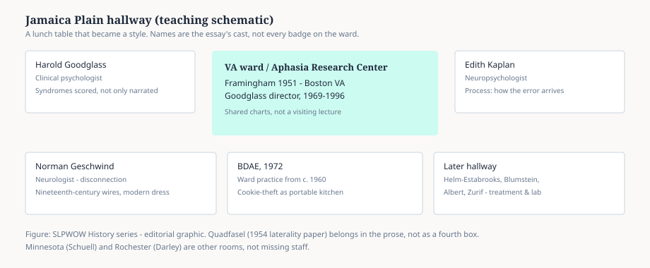

# Embed — boston-va

```html
<figure class="slpwow-figure slpwow-figure--schematic">
  
  <figcaption>
    <strong>Figure 1.</strong> Jamaica Plain hallway (teaching schematic). A lunch table that became a style — not a complete staff list for every year.
    <span class="figure-credit">SLPWOW History series — editorial graphic.</span>
  </figcaption>
</figure>
```
