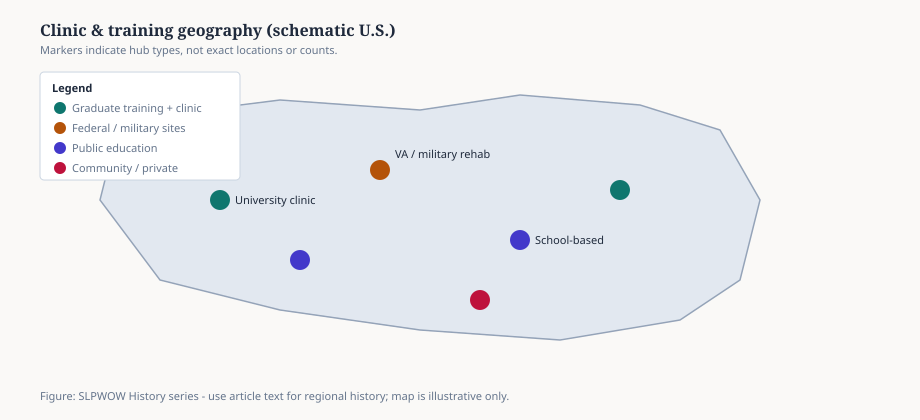

# Embed — clinic-geography-schematic

```html
<figure class="slpwow-figure slpwow-figure--map">
  
  <figcaption>
    <strong>Figure 1.</strong> Clinic and training geography in the United States (illustrative schematic).
    Markers indicate hub <em>types</em>, not precise locations or historical counts.
    <span class="figure-credit">SLPWOW History series — editorial graphic.</span>
  </figcaption>
</figure>
```
