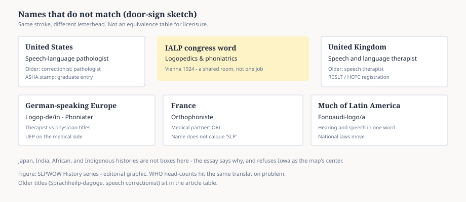

# Embed — global-profession

```html
<figure class="slpwow-figure slpwow-figure--map">
  
  <figcaption>
    <strong>Figure 1.</strong> Names that do not match (door-sign sketch). Same overlapping work, different letterheads — not a licensure-equivalence table.
    <span class="figure-credit">SLPWOW History series — editorial graphic.</span>
  </figcaption>
</figure>
```
