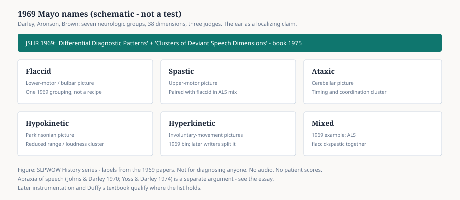

# Embed — mayo-motor-speech

```html
<figure class="slpwow-figure slpwow-figure--chart">
  
  <figcaption>
    <strong>Figure 1.</strong> 1969 Mayo names (schematic). Labels from Darley, Aronson, and Brown — not for diagnosing anyone, and not patient audio or scores.
    <span class="figure-credit">SLPWOW History series — editorial graphic.</span>
  </figcaption>
</figure>
```
