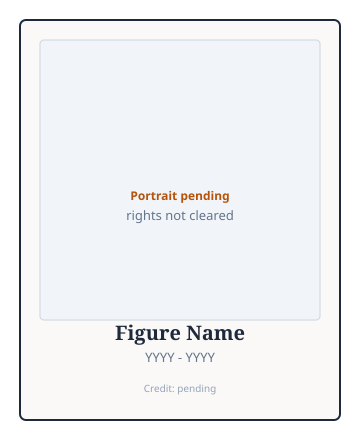

# Embed — portrait figure block (template)

## When rights are cleared

Replace `PORTRAIT_SRC` with `../assets/portraits/<portrait_id>.jpg` (or actual ext). Credit must match `PORTRAIT_SOURCES.md`.

```html
<figure class="slpwow-figure slpwow-figure--portrait">
  
  <figcaption>
    <strong>FULL_NAME</strong> (BIRTH — DEATH).
    <span class="figure-credit">Photo: CREDIT_LINE</span>
  </figcaption>
</figure>
```

## Pending plate (default until cleared)

Use slug-specific SVG under `assets/<slug>/portrait-plate-pending.svg` or customize copy below.

```html
<figure class="slpwow-figure slpwow-figure--portrait slpwow-figure--portrait-pending">
  
  <figcaption>
    <strong>FULL_NAME</strong> (BIRTH — DEATH).
    <em>Portrait pending — rights not cleared.</em>
    See <code>PORTRAIT_SOURCES.md</code> for clearance status.
  </figcaption>
</figure>
```

### Slug-specific pending embeds

- `charles-van-riper.md` — `../assets/charles-van-riper/portrait-plate-pending.svg`
- `lee-edward-travis.md` — `../assets/lee-edward-travis/portrait-plate-pending.svg`
- `wendell-johnson.md` — `../assets/wendell-johnson/portrait-plate-pending.svg`
