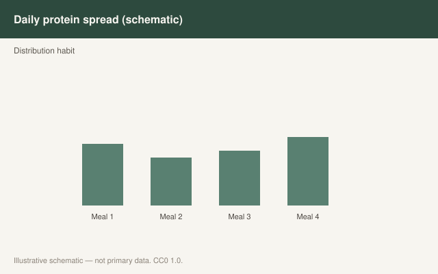

This is draft sports-nutrition copy for coaches, athletes, and sports RDs. It is not medical advice, not a meal plan, and not cleared for public use.

<figure class="sn-rd-figure sn-rd-figure--chart">
  
  <figcaption>
    <strong>Schematic only.</strong> Illustrative day pattern: even distribution helps some athletes hit daily totals; acute MPS studies do not by themselves prove superior hypertrophy for four vs three meals.
    Original schematic. CC0 1.0. See figures/protein-distribution/RIGHTS.md.
  </figcaption>
</figure>

# Spreading protein out is still a habit, not a law

The even-distribution story is easy to coach: four meals, each with enough protein to “hit the leucine threshold,” every three or four hours. Areta’s 2013 trial is the slide everyone still uses — 80 g of protein after lifting did more for 12-hour MPS as **4 × 20 g** than as 2 × 40 g or 8 × 10 g. That study is foundational, short, and in young men. It is also why a lot of us still write “q3–4h” on a plan.

The 2020s did not kill that habit. They made it look less like a law.

## The reviews that tried to settle it

Jespersen and Agergaard (2021) asked whether an even protein pattern associates with more muscle, more strength, or a better turnover signal in healthy adults. Fifteen studies got in. Three of seven that looked at mass saw a link with evenness. Two of seven saw a strength link. One of six saw a synthesis link. Their conclusion was the kind editors hate and practitioners need: **mass maybe; strength and turnover, not enough.**

That is a systematic review, not a new RCT. It is also a useful cold shower if your entire philosophy is “never skip the 10 a.m. shake.”

Trommelen 2023 sits on the other shoulder. If a 100 g meal is still feeding muscle at hour 12, then a skewed day — light breakfast, working lunch, big dinner after training — is not obviously a failed anabolic program. The 2024 *IJSNEM* exchange with Witard and Mettler is the field arguing this in public: is the *fraction* of a meal that lands in muscle the thing to maximize, or the *total* amino acids incorporated over a long enough clock?

We do not have a 12-week hypertrophy trial that isolates “even vs skewed” at a matched high daily intake in trained people and settles the argument. Until that exists, distribution is a **risk-management tool**, not a hypertrophy switch.

## When evenness still earns its keep

I still push a more even day when:

- Daily protein is not actually high. Spreading 70 g across three meals is not the same problem as spreading 160 g.
- The athlete “doesn’t do breakfast” and then wonders why the 11 a.m. session feels empty. That is energy and carbohydrate as much as protein — but a 0 g morning is a missed feeding.
- The person is older, smaller, or plant-based and each meal was 10–12 g. Then evenness is really “stop serving garnish portions.”
- UEFA’s football notes apply: three to four meals at about **0.4 g/kg**, plus a look at the pre-sleep gap, because players in their dataset were eating about 0.1 g/kg at night.

I stop obsessing when the athlete hits 1.6–2.2 g/kg, trains, sleeps, and the “skew” is a cultural dinner. Trommelen’s long clock is permission to stop treating a family meal like a programming error.

## A practical pattern that does not pretend to be settled science

- Meal-size floor for a high-quality feeding: **~0.3–0.5 g/kg**, or 25–40 g for most adults, more after a whole-body session if appetite allows.
- Three feedings will do the job for a lot of people. Four is easier when the day is long or the sport is a two-a-day.
- A very large evening meal can cover a long overnight. That is a 2023-shaped idea, not a 2013-shaped one.

Distribution is how you make the daily number happen in a life. It is not, on current evidence, a separate adaptation pathway you can sell.

## Sources

- Jespersen & Agergaard, 2021, *Eur J Nutr*, PMID:33550490
- Trommelen et al., 2023, *Cell Rep Med*, doi:10.1016/j.xcrm.2023.101324
- Trommelen et al., 2024, *Int J Sport Nutr Exerc Metab*, doi:10.1123/ijsnem.2024-0107
- Areta et al., 2013, *J Physiol* (foundational)
- Collins et al., 2021, *Br J Sports Med*, doi:10.1136/bjsports-2019-101961
- Jäger et al., 2017, *J Int Soc Sports Nutr* (foundational)
