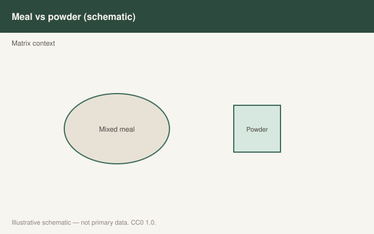

This is draft sports-nutrition copy for coaches, athletes, and sports RDs. It is not medical advice, not a meal plan, and not cleared for public use.

<figure class="sn-rd-figure sn-rd-figure--chart">
  
  <figcaption>
    <strong>Schematic only.</strong> Schematic only: mixed meals deliver protein within carbohydrate, fat, and fiber matrices that change digestion speed; powders are tools when food is impractical.
    Original schematic. CC0 1.0. See figures/food-matrix-and-real-meals/RIGHTS.md.
  </figcaption>
</figure>

# The steak is not a failed isolate

Most of what we know about “fast” and “slow” protein was learned with powders: whey, casein, soy isolate, milk protein concentrate. Those studies are clean. Dinner is not clean. Dinner has fat, collagenous bits, phytate, a potato, and a conversation. The 2020s started taking that mess seriously without throwing the isolate data away.

## What isolates taught us (still true)

Whey is fast and leucine-dense. Micellar casein is slower. That difference is why pre-sleep work leaned casein, and why post-lift work leaned whey. Pinckaers’ plant-protein papers (wheat 2021, potato 2022) used concentrates for the same reason: you can label them, dose them, and compare them to milk protein.

Monteyne’s mycoprotein work is the plot twist *inside* whole food. A 70 g serving of the fungal food (about 31 g protein, leucine-matched to a milk drink) drove a larger rise in mixed-muscle FSR than the milk protein in trained young men (2020). That is not “powder lost.” That is “the food matrix, the dose, and the leucine match all sat in the same glass.” The follow-up — a smaller BCAA-fortified serving — could not fake the bigger feeding.

## What I refuse to do with matrix talk

I will not tell a player that a whey isolate is “unnatural” and therefore worse. Isolate is how a lot of people hit 40 g when the kitchen is a hotel. UEFA 2021’s “food first” line is a philosophy for a squad dietitian, not a purity test.

I also will not tell a player that a mixed meal is “too slow to count.” Gwin 2021 used a mixed meal as one arm in energy deficit. Whole-body kinetics differed by format; mixed-muscle MPS did not. The meal still did MPS work. It just delivered fewer free EAAs per gram of protein than the enriched whey.

Cooking changes digestibility. That is a food-science fact (DIAAS methods care about it). It is not a reason to eat raw eggs in 2026. Heat can make some proteins easier to digest and can damage others. For athlete practice, “eat the cooked meal you will actually finish” beats a lab ranking of sous-vide vs boiled.

## A matrix rule I can defend

- Use **food** for the bulk of the day. You get the amino acids and the rest of the diet.
- Use an **isolate** when the constraint is appetite, travel, or a tight energy budget that still needs a leucine-rich feeding.
- Compare foods at **matched protein**, not matched plate weight. 200 g of broccoli is not a protein feeding. 200 g of tempered tofu is in the conversation.
- If the food is mycoprotein, potato protein, or mealworm isolate, the 2020–2021 tracer papers say those can stand next to milk in young men at ~30 g. That is a matrix-and-source story, and it is newer than the whey-vs-casein poster.

The meal is the intervention most humans will repeat. Powders are how we measured the meal’s cousins. Do not confuse the method for the lifestyle.

## Sources

- Monteyne et al., 2020, *Am J Clin Nutr*, doi:10.1093/ajcn/nqaa092
- West / Monteyne et al., 2020, *J Nutr*, PMID:32886108
- Pinckaers et al., 2021, *Br J Nutr*, doi:10.1017/S0007114521000635
- Pinckaers et al., 2022, *Med Sci Sports Exerc*, doi:10.1249/mss.0000000000002937
- Gwin et al., 2021, *J Int Soc Sports Nutr*, doi:10.1186/s12970-020-00401-5
- Collins et al., 2021, *Br J Sports Med*, doi:10.1136/bjsports-2019-101961
