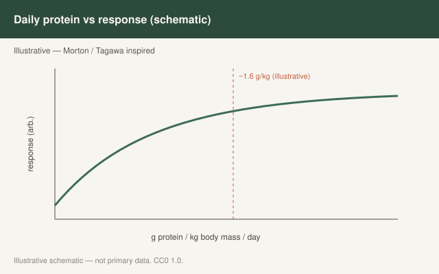

This is draft sports-nutrition copy for coaches, athletes, and sports RDs. It is not medical advice, not a meal plan, and not cleared for public use.

<figure class="sn-rd-figure sn-rd-figure--chart">
  
  <figcaption>
    <strong>Schematic only.</strong> Schematic only: during disuse, maintaining protein intake helps limit lean-mass loss in research settings; return-to-play still requires progressive loading.
    Original schematic. CC0 1.0. See figures/disuse-deloads-return/RIGHTS.md.
  </figcaption>
</figure>

# When the work stops, the protein conversation changes

A deload week is not a broken leg. A month on crutches is not a deload week. We keep using the same shake for both. The 2020s immobilization and energy-restriction papers are why I stopped doing that.

## What unloading does to the signal

Skeletal muscle becomes less interested in a normal meal when it is not being used. That “anabolic resistance” of disuse is an older observation (Wall, Dirks, van Loon). Oikawa and Phillips’ group brought it into energy restriction plus inactivity with high-quality protein work just before and into this window. The practical translation: **the same 20 g whey that looked fine in a training study may not hold the line when the athlete is both underfed and still.**

Gwin’s 2020 *Nutrients* review is the military version of the same idea. During energy deficit, a larger share of dietary amino acids gets pulled into whole-body and splanchnic needs. Muscle is not first in line. Supplemental 20–25 g whey during severe field deficit has failed to look like the energy-balance textbook.

UEFA 2021’s rehab section starts with the unsexy prescription: enough **energy and protein**, and do not play deficiency games with the micronutrients involved in tissue repair. They explicitly warn against treating the inflammatory process as something to nutraceutical away. That is a sports-medicine paragraph, not a license for me to write treatment claims. I will say this much in bounds: you cannot remodel a tissue you are starving.

## Deload vs true disuse

On a planned deload, I keep daily protein where it was (1.6–2.2 g/kg). Appetite often drops with volume. That is when people quietly slide to 1.0 g/kg and call it “listening to their body.” I would rather they listen to the grocery list.

On true immobilization or a long stretch of no loading, I still keep protein high — often toward the top of the athletic range — because the alternative is a low-protein, low-energy couch diet. I do not tell anyone that protein *treats* the injury or replaces physiotherapy. I tell them the muscle is being asked to hold its protein when the usual stimulus is gone, and meals are one of the few levers left.

Return-to-training is a concurrent-training week with worse fitness. Protein at meals, carbohydrate for the new running, and no ice-bath-plus-shake fight on the first hypertrophy block back (see Fuchs 2020).

## What I will not write

I will not write that collagen heals a tendon. I will not write that whey prevents muscle loss in every casted limb. I will not write an anti-inflammatory stack. Those sentences leave sports nutrition and walk into the claims policy.

## Sources

- Gwin et al., 2020, *Nutrients*, PMC7469068
- Gwin et al., 2021, *J Int Soc Sports Nutr*, doi:10.1186/s12970-020-00401-5
- Collins et al., 2021, *Br J Sports Med*, doi:10.1136/bjsports-2019-101961
- Oikawa et al., 2020, *Am J Clin Nutr*, doi:10.1093/ajcn/nqz332 (quality during a vulnerable state)
- Fuchs et al., 2020, *J Physiol*, doi:10.1113/JP278996
- Wall / Dirks / van Loon disuse series (foundational)
