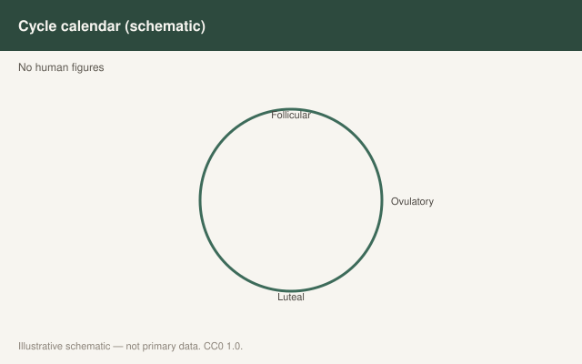

This is draft sports-nutrition copy for coaches, athletes, and sports RDs. It is not medical advice, not a meal plan, and not cleared for public use.

<figure class="sn-rd-figure sn-rd-figure--chart">
  
  <figcaption>
    <strong>Schematic only.</strong> Illustrative calendar only: luteal phase can shift appetite and energy; evidence for large protein requirement changes across the cycle remains limited.
    Original schematic. CC0 1.0. See figures/menstrual-cycle-protein/RIGHTS.md.
  </figcaption>
</figure>

# The cycle changes a lot of things. Protein is not clearly one of them.

I have seen periodized protein plans that move 30 g a day because an app said “luteal.” I have not seen the trial that justifies that as a default.

## What the 2021 review was willing to say

Moore, Sygo and Morton went looking for cycle-specific carbohydrate and protein rules. They found the usual problems: small samples, mixed contraceptive use, exercise protocols that do not look like sport, and energy intake that was not always controlled. On protein, they judged it **premature** to write a different daily target by phase if the athlete is actually fueled. They asked for future work that controls prior exercise, energy, contraceptive type, and phase — and then uses sport-like sessions.

There *are* metabolic hints. Older work (and the 2019 special-populations paper) discusses estrogen’s protein-sparing flavor and luteal-phase shifts in amino-acid oxidation. Those hints are why researchers keep asking the question. They are not why I would take a well-eating athlete from 1.8 to 1.3 g/kg for a week, or the other way around, based on a calendar alone.

## Symptoms are not a protein target

If appetite crashes in the late luteal phase, daily protein falls because *food* falls. That is a practical problem. The fix is food she will eat — dairy, tofu, eggs, a cold shake — not a lecture about leucine thresholds. If she is cramping and nauseated, that is clinical and personal, not an ISSN stand.

If cycles have stopped, we are not in a “protein timing” draft. We are in energy availability and a referral. IOC REDs 2023 is the document. Protein is part of the fueling pattern. It is not the diagnosis and it is not the treatment.

## What I write on a card

- Keep the daily athletic band stable across the month unless energy intake is clearly swinging.
- If a phase reliably wrecks breakfast, plan a fallback feeding in advance.
- Track symptoms and performance if she wants. Track protein only as a check that the fallback is real.
- Do not sell cycle-synced amino-acid products. The 2021 paper did not.

Honesty is the human voice here. We do not have the sport-specific, phase-controlled protein feeding trials we want. Pretending we do is how pink marketing gets written.

If she already periodizes *training* by symptoms — lighter sessions on a bad day — I will periodize carbohydrate with the session, not protein with the app. Protein stays the bass line. If a luteal week reliably adds two kilograms of fluid, I will not chase it with a cut and I will not call it a failed protein plan. Desbrow’s 2019 special-populations paper already warned that body-mass interpretation across a cycle is a trap.

Contraceptive users are not a footnote. Moore, Sygo and Morton asked for trials that name the contraceptive. Until those exist, I will not write a pill-specific protein target. I will ask what she can eat this week and whether energy is actually there.

## Sources

- Moore, Sygo, Morton, 2021, *Eur J Sport Sci*, doi:10.1080/17461391.2021.1922508
- Mercer et al., 2020, *Nutrients*, doi:10.3390/nu12113527
- Desbrow et al., 2019, *Int J Sport Nutr Exerc Metab*, doi:10.1123/ijsnem.2018-0269
- Mountjoy et al., 2023, *Br J Sports Med*, 57:1073-1097
