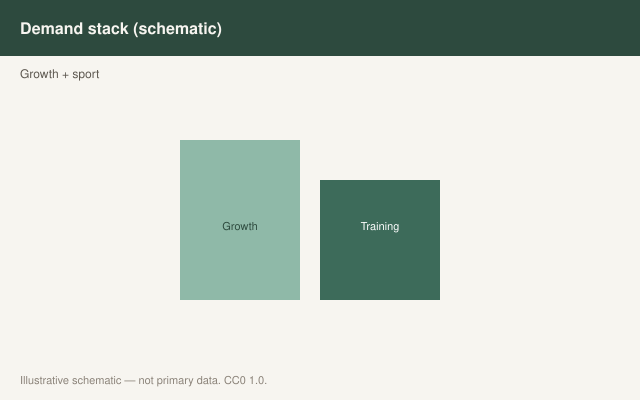

This is draft sports-nutrition copy for coaches, athletes, and sports RDs. It is not medical advice, not a meal plan, and not cleared for public use.

<figure class="sn-rd-figure sn-rd-figure--chart">
  
  <figcaption>
    <strong>Schematic only.</strong> Illustrative only: adolescents need adequate protein for growth and sport; powders are secondary to meals unless a clinician or sports RD directs otherwise.
    Original schematic. CC0 1.0. See figures/youth-adolescent-athletes/RIGHTS.md.
  </figcaption>
</figure>

# Adolescents are building a body, not a brand

I get nervous when a 15-year-old has a more elaborate isolate stack than the senior men’s eight. Growth is an amino-acid project. So is homework, training, and staying upright in third period. The powder is rarely the missing piece. The missing piece is usually breakfast and a second dinner.

## What Desbrow 2021 actually said

Desbrow and colleagues’ *Sports Medicine* paper on youth athlete development is the one I want in a high-school program. During peak growth they cite lean-mass accretion on the order of **~2.3 g/day in girls and ~3.8 g/day in boys** — a few grams, not a few scoops. Adolescents in the work they review look *more* efficient with protein than weight-stable adults (better whole-body net balance at small-to-optimal post-exercise doses). Nitrogen-balance work in adolescent sprinters did not demand extra protein beyond an already adequate diet to stay in balance during peak growth.

Their practical synthesis, if energy is adequate: about **0.11 g/kg/hour** in the post-exercise hours, or about **1.5 g/kg/day** as something like **0.3 g/kg × five feedings**. That is food. That is milk, eggs, yogurt, beans, leftover chicken, a sandwich that is not only jam.

UEFA 2021 has a junior-player section with the same instinct: food first, copy the senior remodeling budget only as the training starts to look senior, and do not turn a 16-year-old into a walking supplement sticker.

## The real failure modes

Energy. If the kid is in a sport that praises thinness, protein becomes firewood. Desbrow says it plainly: with low energy, endogenous protein gets pulled toward other jobs. That is not a reason to write a disease claim. It is a reason to feed the athlete and to get a qualified person in the room if growth, periods, or mood are sliding.

Safety and culture. High-school locker rooms are where contaminated “test boosters” sneak in next to whey. Maughan’s IOC supplement consensus (2018, still the staff-education document) is the conversation I want with parents: **food, then a batch-tested protein if the day is genuinely short.** Not a fat-burner. Not a pre-workout that lists a symphony.

I do not put a 40 g whey rule on a 45 kg gymnast. I do put protein at breakfast.

A 45 kg gymnast at 1.5 g/kg is 68 g of protein for the day. That is yogurt, eggs, a sandwich with a real filling, and dinner. It is not three scoops. A 75 kg 17-year-old rowing twice a day is a different grocery list and still not a senior-men’s isolate stack unless food is failing.

Parents ask about “bulking.” I talk about growth, sleep, and energy. I do not talk about a surplus as a personality. Desbrow’s accretion numbers — a few grams of lean mass per day at peak growth — are the cold water. The kid is already building a body. Our job is not to add a brand. Our job is to not get in the way with a low-energy culture and a contaminated tub.

## Sources

- Desbrow et al., 2021, *Sports Med*, doi:10.1007/s40279-021-01534-6
- Collins et al., 2021, *Br J Sports Med*, doi:10.1136/bjsports-2019-101961
- Maughan et al., 2018, *Br J Sports Med*, 52:439-455 (foundational)
- Jäger et al., 2017, *J Int Soc Sports Nutr* (foundational)
