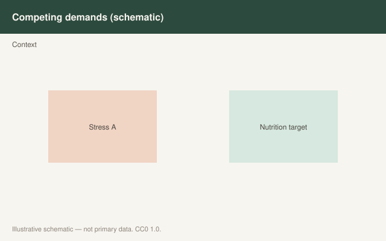

This is draft sports-nutrition copy for coaches, athletes, and sports RDs. It is not medical advice, not a meal plan, and not cleared for public use.

<figure class="sn-rd-figure sn-rd-figure--chart">
  
  <figcaption>
    <strong>Schematic only.</strong> Schematic only: weight-class cuts raise relative protein needs in many protocols; unsafe dehydration or extreme restriction is out of scope and not endorsed.
    Original schematic. CC0 1.0. See figures/weight-class-sports/RIGHTS.md.
  </figcaption>
</figure>

# Making weight is an energy problem that steals protein

Wrestlers, combat-sport athletes, light-weight rowers, and some jockeys do not have a protein philosophy. They have a calendar. The 2020s did not invent a kinder cut. They did show, in deficit trials that look like camps, that **the 20 g post-lift rule is a peacetime rule.**

## What the deficit labs keep repeating

Gwin 2021: five days at about −30% energy, then a mixed session, then one of three iso-nitrogenous feedings (EAA-enriched whey, whey, mixed meal). Whole-body net balance favored the enriched whey. Mixed-muscle MPS did not differ. Translation: in a cut, the *body* is hungrier for amino acids than the textbook muscle-centric meal.

Gwin 2020 (Clin Nutr) and the 2020 *Nutrients* review: raising EAA intake in deficit can move whole-body kinetics; a standard athletic serving that was enough in balance may not cover whole-body plus muscle when calories are short.

Hector and Phillips (2018, foundational) and Longland 2016 (foundational) are why sports RDs still write **~2.0–2.4 g/kg** during aggressive fat-loss phases with lifting. UEFA 2021 copied that instinct for players who must drop mass: 2.0–2.4 g/kg, scaled to load and stress.

ISSN 2017’s 2.3–3.1 g/kg band for hypocaloric lean-mass hold is the older umbrella. I still use the lower half of that more often than the top. Appetite and food volume are real. So is the fact that a 3 g/kg cut is a lot of chicken in a 1,600 kcal day.

## Practice that does not pretend the weigh-in is healthy theater

- Raise protein **before** you slash carbohydrate into the floor. The sport still has to be performed.
- Keep lifting if the sport allows it. Tagawa 2022: protein without the strength work is a weaker story.
- After the weigh-in, the first job is carbohydrate and fluid. Protein rides along in the recovery meal. It is not the rehydrate.
- I will not write a dehydration protocol. I will not write a “safe” extreme cut. Reale, Slater, Burke’s weight-making papers are the staff reading. This draft is the protein subplot.

Making weight is not a disease, and protein is not a treatment for the mess it creates. It is how you stop the cut from being a low-protein crash on top of a low-energy crash.

## Sources

- Gwin et al., 2021, *J Int Soc Sports Nutr*, doi:10.1186/s12970-020-00401-5
- Gwin et al., 2020, *Clin Nutr*, doi:10.1016/j.clnu.2020.07.019
- Gwin et al., 2020, *Nutrients*, PMC7469068
- Collins et al., 2021, *Br J Sports Med*, doi:10.1136/bjsports-2019-101961
- Jäger et al., 2017, *J Int Soc Sports Nutr* (foundational)
- Hector & Phillips, 2018 (foundational)
- Longland et al., 2016, *Am J Clin Nutr* (foundational)
