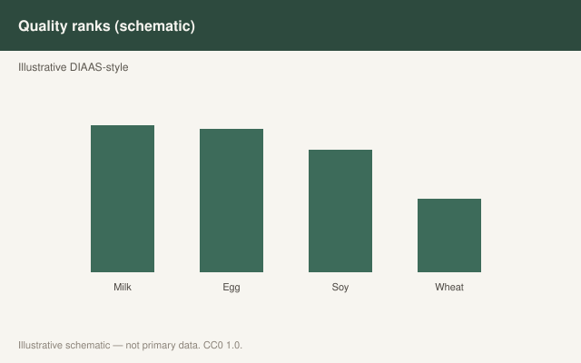

This is draft sports-nutrition copy for coaches, athletes, and sports RDs. It is not medical advice, not a meal plan, and not cleared for public use.

<figure class="sn-rd-figure sn-rd-figure--chart">
  
  <figcaption>
    <strong>Schematic only.</strong> Schematic summary only: when total protein and leucine are matched, many trials show similar training adaptations; food pattern still matters for adherence.
    Original schematic. CC0 1.0. See figures/plant-proteins-hypertrophy/RIGHTS.md.
  </figcaption>
</figure>

# Plant patterns can grow muscle. They cannot grow it on 70 grams a day.

The old argument was acute: plant proteins raise blood leucine less, so they must grow less muscle. The 2021 training study that actually lasted 12 weeks did not play along.

## The São Paulo trial

Hevia-Larraín, Gualano, Roschel, Phillips and colleagues took 19 habitual vegan men and 19 omnivores, all young and previously untrained. Twelve weeks, twice-weekly supervised lower-body lifting. Protein was brought to **1.6 g/kg/day** with soy isolate on the vegan side and whey on the omnivore side. Leg lean mass rose 1.2 kg in both groups. Rectus femoris and vastus lateralis CSA rose in both. Type I and II fiber CSA rose in both. Leg-press 1RM rose in both. No between-group differences.

That is *Sports Medicine*, 2021, doi:10.1007/s40279-021-01434-9. It is not a tweet about “plants are superior.” It is a matched-protein, untrained-men, soy-supported trial. The honest limitations belong on the same page: not women, not trained lifters, not a food-only vegan diet without isolate, twice-weekly lower body only.

## The acute work that made the trial less surprising

Pinckaers’ 2021 review argued that several plant isolates (soy, pea, potato, corn) carry enough leucine to be taken seriously if the *dose* is not timid. The 2022 potato-protein trial: 30 g potato vs 30 g milk, same MPS at rest and after a unilateral session. The 2021 wheat paper: wheat alone is the awkward one; blending with milk erased the awkwardness.

Lim 2021’s meta-analysis of animal vs plant for lean mass and strength found, at most, a small animal-protein edge across mixed trials. That edge is not a reason to badger a vegan who is already at 1.6–2.0 g/kg and lifting. It is a reason to stop comparing 80 g of mixed plant protein to 140 g of mixed animal protein and calling it a philosophy.

## What I write for a plant-based athlete

- Hit the same daily band as everyone else, and if the foods are lower-density, **aim at the top of the band**.
- Use soy, pea, potato, mycoprotein, or a blend when a 30 g feeding is needed and the plate is lentils-only.
- Do not use “I read plants are incomplete” as a reason to add BCAAs. Add food or a complete isolate.
- We still need the trained-woman version of Hevia-Larraín. Until then, I coach the evidence we have, not the evidence I wish we had.

## Sources

- Hevia-Larraín et al., 2021, *Sports Med*, doi:10.1007/s40279-021-01434-9
- Pinckaers et al., 2021, *Sports Med*, doi:10.1007/s40279-021-01540-8
- Pinckaers et al., 2021, *Br J Nutr*, doi:10.1017/S0007114521000635
- Pinckaers et al., 2022, *Med Sci Sports Exerc*, doi:10.1249/mss.0000000000002937
- Lim et al., 2021, *Nutrients*, doi:10.3390/nu13020661
- Monteyne et al., 2021, *Br J Nutr*, doi:10.1017/S0007114520004481
