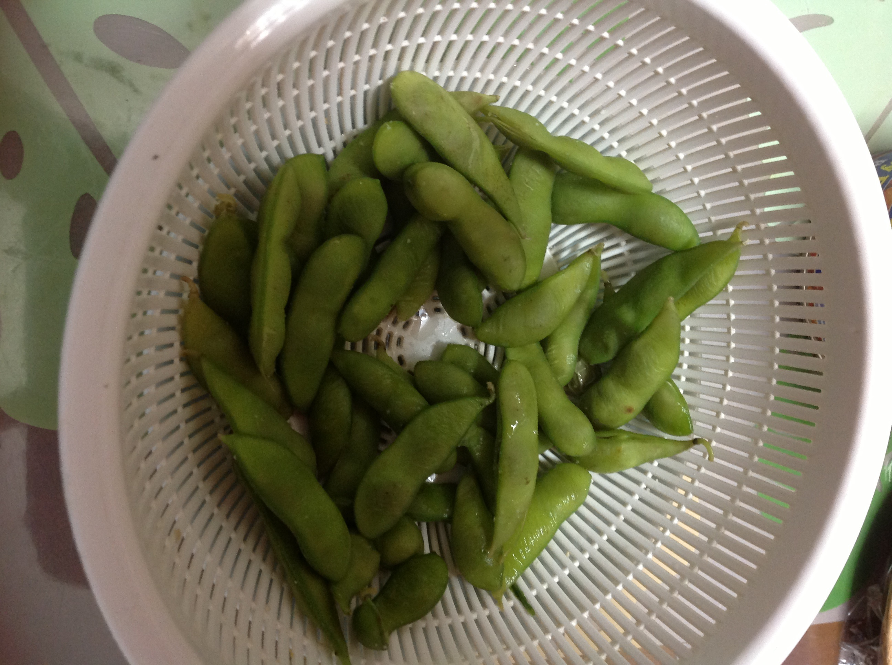

This is draft sports-nutrition copy for coaches, athletes, and sports RDs. It is not medical advice, not a meal plan, and not cleared for public use.

<figure class="sn-rd-figure sn-rd-figure--photo">
  
  <figcaption>
    <strong>Photograph.</strong> Photograph for context: soy provides complete plant protein in many forms; athletic use is a food-choice question, not a hormone treatment claim.
    See figure credit in RIGHTS.md. See figures/soy-in-the-2020s/RIGHTS.md.
  </figcaption>
</figure>

# Soy survived the internet. The hormones talk did not.

Every intake still includes a man who “doesn’t do soy” because of a forum post from 2009. I am not writing an endocrine lecture. I am writing what the training and tracer papers used soy *for*.

## What soy did in the studies we are allowed to lean on

Hevia-Larraín 2021 used **soy isolate** to lift vegan men to 1.6 g/kg. The training adaptations matched the whey-supported omnivores. That is the chronic paper.

Pinckaers 2021 lists soy among the plant proteins with leucine in a usable range (they cite about 6.9%). UEFA 2021’s grocery leucine table puts **~2.5 g leucine in ~30 g isolated soy**, next to 25 g whey. That is a cooking number for a dietitian, not a testosterone panel.

Churchward-Venne’s concurrent-training feeding work (cited in Pinckaers 2021) found no myofibrillar or mitochondrial synthesis difference between whey, soy, and leucine-enriched soy when each was taken with carbohydrate after mixed exercise. Acute soy did not lose the afternoon.

Lim 2021’s animal-vs-plant meta includes a lot of soy-supported arms. The sky did not fall.

## What I will not do

I will not claim soy treats or prevents anything. I will not write a breast or prostate paragraph. I will not diagnose gynecomastia from tofu. Those sentences are how this series would fail its own claims policy.

I will say: if the athlete tolerates soy, it is one of the few plant isolates with a 12-week hypertrophy trial behind it as the supporting protein. If they hate soy, use pea, potato, mycoprotein, dairy, or eggs. The identity is optional. The grams are not.

Whole soy foods (tofu, tempeh, edamame) are how most of the world actually eats this protein. Isolates are how the trials dosed it. Both can live on the same card.

A block of firm tofu is not 30 g of isolate. Read the package. A lot of “I eat soy” days are 12 g of tofu and a lot of rice. That is a Pinckaers dose problem, not a soy-hormone problem. If the athlete will eat tempeh at lunch and edamame at the station, we may never need the tub. If they will not, the isolate is how Hevia-Larraín made the comparison fair.

I will also say the boring allergy and GI sentence: soy is a common allergen and a common “this wrecks my gut” food. Swap it. Pea, potato, mycoprotein, dairy, egg — the 2020s gave us options. What I will not do is keep a 90 kg lifter at 90 g of mixed plant protein because a forum told him soy would unman him. That sentence has wasted more training years than soy ever did.

## Sources

- Hevia-Larraín et al., 2021, *Sports Med*, doi:10.1007/s40279-021-01434-9
- Pinckaers et al., 2021, *Sports Med*, doi:10.1007/s40279-021-01540-8
- Lim et al., 2021, *Nutrients*, doi:10.3390/nu13020661
- Collins et al., 2021, *Br J Sports Med*, doi:10.1136/bjsports-2019-101961
