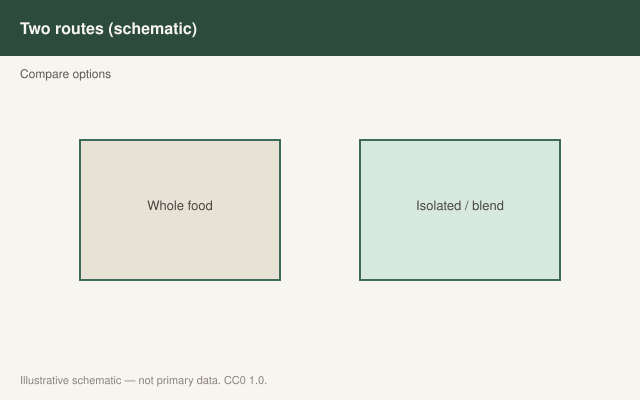

This is draft sports-nutrition copy for coaches, athletes, and sports RDs. It is not medical advice, not a meal plan, and not cleared for public use.

<figure class="sn-rd-figure sn-rd-figure--chart">
  
  <figcaption>
    <strong>Schematic only.</strong> Schematic only: collagen is low in leucine relative to whey; connective-tissue studies do not replace resistance training for hypertrophy outcomes.
    Original schematic. CC0 1.0. See figures/collagen-vs-whey/RIGHTS.md.
  </figcaption>
</figure>

# Collagen and whey are different jobs. Stop making them compete.

Collagen is what you get when you boil connective tissue and dry the peptides. It is rich in glycine, proline, hydroxyproline. It is poor in essential amino acids and almost a practical joke in leucine. Whey is the opposite kind of protein. Comparing them on a myofibrillar-synthesis graph is how Oikawa 2020 should have ended the “collagen for gains” pitch. Comparing them on a PINP graph is a different experiment.

## Muscle: whey wins, and it is not close

Oikawa, Phillips and colleagues (AJCN 2020): 22 healthy older women, 30 g whey or 30 g collagen peptides twice a day for six days, unilateral lifting. Acute MPS rose with whey at rest and after exercise. Collagen raised MPS only after exercise, and less. Over the week, integrated MPS rose with whey and did not with collagen. If the job is skeletal-muscle protein, buy the whey (or soy, or milk, or potato isolate). Do not buy collagen and hope.

I will not use the word sarcopenia as a sales hook. The paper was in healthy older women. The lesson is quality.

## Connective tissue: a different endpoint

Shaw 2017 (foundational): vitamin C–enriched gelatin before short bouts of intermittent activity raised markers of collagen synthesis. Lee et al. 2024: in resistance-trained young men, **30 g hydrolyzed collagen plus 50 mg vitamin C** an hour before back squats produced a larger PINP AUC than 15 g or 0 g. Glycine and proline availability were higher at 30 g. Bone-resorption marker β-CTX fell over the day in all arms; it did not separate the doses.

That is a **whole-body collagen-synthesis marker** paper, not a tendon-MRI paper, not a return-to-play paper, not a treatment claim. PINP is not a repaired ACL.

Baar’s engineered-ligament and timing ideas (gelatin or collagen, vitamin C, then load in the next hour) are the practice pattern people are testing. I will describe the pattern. I will not say it heals a tendon.

## How I write it on one card

- Muscle day: complete protein. Collagen does not count toward that job.
- If we are running a tendon-loading session and the athlete wants the Shaw/Lee pattern, collagen or gelatin + vitamin C sits **before the loading**, and dinner is still chicken or tofu.
- Never substitute collagen for whey in a cut and call it “protein.”

Two proteins. Two jobs. One claims policy.

## Sources

- Oikawa et al., 2020, *Am J Clin Nutr*, doi:10.1093/ajcn/nqz332
- Lee et al., 2024, *J Nutr*, PMC11282471
- Shaw et al., 2017, *Am J Clin Nutr* (foundational)
- Jäger et al., 2017, *J Int Soc Sports Nutr* (foundational quality/leucine lines)
