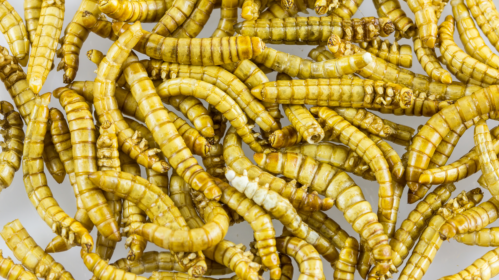

This is draft sports-nutrition copy for coaches, athletes, and sports RDs. It is not medical advice, not a meal plan, and not cleared for public use.

<figure class="sn-rd-figure sn-rd-figure--photo">
  
  <figcaption>
    <strong>Photograph.</strong> Photograph for context: insect meals can be protein-dense; allergen risk, regulation, and athlete acceptance vary by region.
    See figure credit in RIGHTS.md. See figures/insect-protein/RIGHTS.md.
  </figcaption>
</figure>

# Mealworm protein went through the same tracers as milk

I do not need you to like insects. I need the citation to be right when someone asks whether “bug protein counts.”

## Hermans 2021, the paper that counts

Hermans, van Loon and colleagues produced intrinsically labeled lesser mealworm (*Alphitobius diaperinus*) protein and put 30 g of it against 30 g of milk protein in 24 young men after a unilateral session. Over five hours, 73% of mealworm phenylalanine and 77% of milk phenylalanine showed up in the circulation — not a meaningful gap. Mixed-muscle synthesis rose at rest and after exercise with both. Dietary amino acids landed in new muscle protein more in the worked leg than the rest leg, both proteins. No between-group differences.

That is *AJCN* 2021, doi:10.1093/ajcn/nqab115. Trial NL6897. It is an acute, young-men, isolate-or-concentrate-style feeding. It is not a season of burgers.

## What came after

A 2024 *Journal of Nutrition, Health and Aging* trial (daily lesser mealworm vs whey vs placebo, 11 weeks, physically active older adults) reported a skeletal-muscle-mass increase with the mealworm arm. I will not oversell a single older-adult supplement trial as “better than whey for athletes.” I will note that the 2021 acute story now has a chronic cousin, and that young athletes in other small trials have not always changed body composition when they were already eating a high-protein diet. That last pattern should sound familiar. It is the Morton/Nunes problem: extra protein on top of enough protein does little.

## Practice, culture, allergy

Shellfish-allergic athletes and insect protein are a clinician conversation. I do not freelance that. Acceptance is cultural and personal. A 30 g feeding that no one will swallow is a 0 g feeding.

Sustainability pitches are not this series. MPS is. On MPS, 30 g lesser mealworm protein was not different from 30 g milk in the trial we have.

I will also keep the Pinckaers qualifier in my mouth: young, healthy, ~30 g. That is the same qualifier I use for potato protein. It is not a season of trained female athletes. It is not a weight-class cut. It is not a hotel buffet. If a product is 15 g of mealworm in a bar under a pile of sugar, that is a snack. Hermans used 30 g of the protein.

Acceptance will decide more of this category than the biopsy will. I will not moralize a gag reflex. I will not let a gag reflex become “so plants don’t work either.” Those are different shelves. Soy and potato already have their drafts. Insect protein is an option with a surprisingly adult tracer paper. Offer it. Do not baptize it.

## Sources

- Hermans et al., 2021, *Am J Clin Nutr*, doi:10.1093/ajcn/nqab115
- 2024 lesser mealworm supplementation trial, *J Nutr Health Aging*, doi:10.1016/j.jnha.2024.100364
- Nunes et al., 2022, *J Cachexia Sarcopenia Muscle*, PMID:35187864
- Pinckaers et al., 2021, *Sports Med*, doi:10.1007/s40279-021-01540-8
