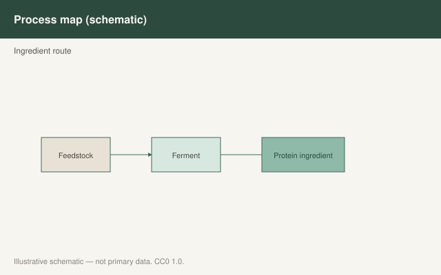

This is draft sports-nutrition copy for coaches, athletes, and sports RDs. It is not medical advice, not a meal plan, and not cleared for public use.

<figure class="sn-rd-figure sn-rd-figure--chart">
  
  <figcaption>
    <strong>Schematic only.</strong> Illustrative process only: fermented and cellular ingredients are emerging; sports claims require the same evidence bar as established proteins.
    Original schematic. CC0 1.0. See figures/future-proteins-fermentation/RIGHTS.md.
  </figcaption>
</figure>

# Precision fermentation is a factory. It is not yet a literature.

I can buy a whey-identical protein that never met a cow. I cannot yet hand you a 12-week hypertrophy trial of that protein in trained athletes that looks like Hevia-Larraín. That gap is the draft.

## What exists

Precision fermentation can make specific proteins (including β-lactoglobulin-style whey fractions) using microbes as the factory. Algae and bacterial biomasses are on shelves. Insect and mycoprotein, by contrast, already have human tracer papers (Hermans 2021; Monteyne 2020). Those two left the “future” category.

If a fermented whey isolate is chemically the protein we already studied, the *biochemical* bet is that it behaves like whey. That is a reasonable bet. It is not a published MPS curve until someone runs it. I will not cite a brand white paper as if it were *AJCN*.

## How I talk about it without becoming a pitch deck

- Function first: does the product deliver ~2–3 g leucine and a full essential profile in 25–30 g? If yes, I treat it like an isolate.
- Evidence second: mycoprotein and mealworm have biopsies. “Novel” dairy-identical proteins should have to earn the same.
- Safety and labeling are regulatory jobs. I do not do those jobs in a draft.
- No disease claims, no planet-saving poetry. Other departments can write those if they can defend them.

The 2020s were the decade plant isolates and fungal foods grew up in the tracer lab. The next decade is when fermentation either does the same or stays a menu story. Until the biopsy exists, I will use the word **candidate**, not the word proven.

A practical test I will run on any new tub, fermented or otherwise:

1. Can I name the protein? If the panel says “next-gen matrix,” I am done.
2. Is there ~2.5 g leucine and a full essential set in a serving a human will finish?
3. Has *this format* been in a human MPS or training paper, or am I borrowing whey prestige?
4. Is there a batch test if the buyer is a tested athlete (Maughan 2018)?

If the answers are “whey-identical isolate, yes, not yet, yes,” I will allow it as a travel powder and I will say the evidence is borrowed. If the answers are “blend, unknown, press release, no,” I will not put it in a program. Novel is not a synonym for studied. Mycoprotein had to earn Monteyne 2020. Mealworm had to earn Hermans 2021. Fermentation can get in line.

## Sources

- Monteyne et al., 2020, *Am J Clin Nutr*, doi:10.1093/ajcn/nqaa092
- Hermans et al., 2021, *Am J Clin Nutr*, doi:10.1093/ajcn/nqab115
- Hevia-Larraín et al., 2021, *Sports Med*, doi:10.1007/s40279-021-01434-9
- Pinckaers et al., 2021, *Sports Med*, doi:10.1007/s40279-021-01540-8
- Ferrando et al., 2023, *J Int Soc Sports Nutr*, doi:10.1080/15502783.2023.2263409 (what a “complete essential” feeding is supposed to do)
