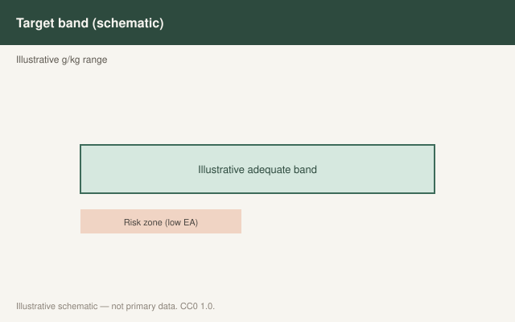

This is draft sports-nutrition copy for coaches, athletes, and sports RDs. It is not medical advice, not a meal plan, and not cleared for public use.

<figure class="sn-rd-figure sn-rd-figure--chart">
  
  <figcaption>
    <strong>Schematic only.</strong> Illustrative zones only: low energy availability harms performance and health; refer athletes with suspected REDs to qualified clinicians.
    Original schematic. CC0 1.0. See figures/energy-availability-reds/RIGHTS.md.
  </figcaption>
</figure>

# Energy availability is the diagnosis lane. Protein is a passenger.

Relative Energy Deficiency in Sport is a clinical syndrome. The 2023 IOC consensus (Mountjoy et al., *BJSM* 57:1073) is a physician-led document. This draft does not treat REDs. It does not claim protein prevents REDs. It says where protein sits when the staff is already in that room.

## What the 2023 statement changed for a nutritionist

The update leaned harder on **problematic vs adaptable** low energy availability, on carbohydrate availability as a partner problem, on male athletes as well as female, and on a four-color CAT2 tool that a physician uses with the whole team. Body-composition assessment got a safety warning of its own. Prevention is organizational, not a sachet.

Protein appears in that world as part of **fueling**, not as a biomarker. UEFA 2021 had already said low energy availability associates with more illness in players and that protein-energy inadequacy is one of the boring ways you get there. “At least 1.2 g/kg for immune function” in that document is a floor for a squad, not a treatment claim I will enlarge. I will not write that protein prevents infection.

## What I am allowed to do as a draftsperson

- If an athlete is under-eating, I do not “tighten protein.” I restore energy, including protein foods, under a clinician’s plan.
- I do not use a high-protein, low-energy crash as a body-comp shortcut in a sport that already runs hot on REDs risk.
- I do not interpret a missed period, a bone-stress injury, or a collapsing total triiodothyronine from a protein log. That is CAT2 territory.
- I do keep protein in the restored meal pattern, because a 3,000 kcal diet of only sugar is a different failure.

Gwin’s deficit work is the physiology rhyme: when energy is short, amino acids get reassigned. That is a performance and remodeling problem. The IOC document is the health-and-participation problem. Do not mash them into one shake.

A sentence I will say to a coach, and a sentence I will not. I will say: “If we keep asking for the same GPS week on 300 fewer calories, protein cannot hold the remodeling.” I will not say: “Add two scoops and we will clear the CAT2 orange.” The 2023 tool is physician-led for a reason. Body-composition testing itself got a safety warning in that statement. I will not run a DEXA as a motivational poster in a sport that already runs hot.

Moore, Sygo and Morton’s female-athlete paper is the other fence: do not invent a sex-specific protein powder while energy is the actual missing number. If she is eating 1.8 g/kg and still presenting with the indicators the consensus lists, the protein log is not the lead finding. The energy and carbohydrate availability are. I stay in my lane. The lane is food. The diagnosis is not.

## Sources

- Mountjoy et al., 2023, *Br J Sports Med*, 57:1073-1097
- Stellingwerff / Mountjoy et al., 2023, IOC REDs CAT2, *Br J Sports Med*, doi:10.1136/bjsports-2023-106914
- Collins et al., 2021, *Br J Sports Med*, doi:10.1136/bjsports-2019-101961
- Gwin et al., 2020, *Nutrients*, PMC7469068
- Moore, Sygo, Morton, 2021, *Eur J Sport Sci*, doi:10.1080/17461391.2021.1922508
