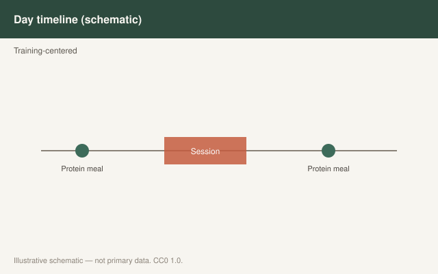

This is draft sports-nutrition copy for coaches, athletes, and sports RDs. It is not medical advice, not a meal plan, and not cleared for public use.

<figure class="sn-rd-figure sn-rd-figure--chart">
  
  <figcaption>
    <strong>Schematic only.</strong> Schematic only: compressed windows require planning to hit protein totals; religious practice decisions stay with the athlete and their advisors.
    Original schematic. CC0 1.0. See figures/time-restricted-ramadan/RIGHTS.md.
  </figcaption>
</figure>

# The eating window moved. The daily grams did not retire.

Time-restricted eating and Ramadan get mashed together on the internet. One is a chosen window. One is a lived religious practice with sunset and sunrise. UEFA 2021 treated Ramadan as a scheduling and meal-quality problem. Trommelen 2023 accidentally became the best scientific comfort for both: a large feeding can keep working for a long time.

## Ramadan, as the football document wrote it

Train after sunset when you can. *Suhour* close to sunrise, carbohydrate-forward, and still part of the protein and fluid budget. *Iftar* as the recovery meal you actually design, not only a social feast. Sports foods if the gut needs them. Daily carbohydrate and protein targets do not get a theological exemption. The clock does.

That is practice, not a tracer study in fasting footballers. I will not invent one.

## Chosen time restriction

Tinsley and others spent the late 2010s asking whether a 16:8 lifter can still gain lean mass if protein is high. The honest 2020s read: **if the daily protein and the training are real, the window is less important than the influencers wanted.** If the window is eight hours and the person needs 160 g of protein, the meals get large. Trommelen says those large meals are not a metabolic comedy. Areta 2013 still whispers that very small, frequent doses were the worst acute pattern — which is not the 16:8 problem. The 16:8 problem is skipping the day’s last 40 g because “the window closed.”

Reis 2020’s pre-sleep review becomes a Ramadan tool: the night *is* the window.

## What I will not write

I will not write that fasting treats metabolic disease. I will not write a religious instruction. I will not write that 16:8 is superior for hypertrophy. I will write: **hit the daily band inside the hours you have, make the feedings complete, and stop using the clock as a reason to eat 90 g.**

A 16:8 lifter who trains at 7 a.m. and opens the window at noon is a timing draft plus this one. The session was fasted. The first meal needs to be real — protein and, if the session earned it, carbohydrate — not a salad that photographs well. A 16:8 lifter who trains at 6 p.m. and eats from noon to 8 p.m. is the easy version. Put 0.4 g/kg at lunch, post-session, and dinner. UEFA’s pre-sleep hole is now just “dinner.”

Ramadan in a long-daylight summer is the hard version. Iftar to suhour may be seven hours. That is still three feedings if you are willing to treat the night like a day. Trommelen’s 12-hour clock is the scientific kindness. The social feast that is only dessert is the practical unkindness. I design Iftar as the recovery meal first and the celebration second. That sentence has lost me arguments at tables. It has also kept daily protein from falling off a cliff.

## Sources

- Collins et al., 2021, *Br J Sports Med*, doi:10.1136/bjsports-2019-101961
- Trommelen et al., 2023, *Cell Rep Med*, doi:10.1016/j.xcrm.2023.101324
- Reis et al., 2020, PMID:32811763
- Areta et al., 2013, *J Physiol* (foundational)
- Jäger et al., 2017, *J Int Soc Sports Nutr* (foundational)
