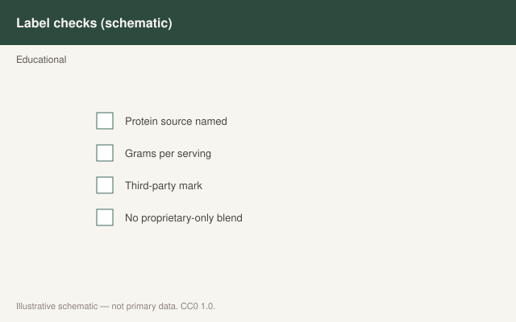

This is draft sports-nutrition copy for coaches, athletes, and sports RDs. It is not medical advice, not a meal plan, and not cleared for public use.

<figure class="sn-rd-figure sn-rd-figure--chart">
  
  <figcaption>
    <strong>Schematic only.</strong> Schematic only: third-party testing reduces some contamination risk; it does not replace food-first fueling or medical care.
    Original schematic. CC0 1.0. See figures/contamination-batch-testing/RIGHTS.md.
  </figcaption>
</figure>

# The protein is only as clean as the factory

A whey isolate can be a 25 g leucine-dense feeding. It can also be how a stimulant that was never on the label gets into a urine sample. Those two facts have shared a shelf for twenty years. The 2020s did not fix the industry. They did keep the IOC’s 2018 supplement consensus on every sensible staff reading list.

## What Maughan 2018 still asks us to do

The IOC document is not a protein paper. It is the risk paper. Dietary supplements can be mislabeled, spiked, or cross-contaminated. The athletes who can least afford that are the ones most likely to buy a “high-protein, high-everything” product before a championship. The practical controls have not gotten more magical: **need, evidence, and a third-party tested batch.** Informed-Sport, NSF Certified for Sport, Informed-Choice — pick the program your sport recognizes and then still remember it is risk reduction, not a halo.

UEFA 2021 copied the philosophy into football: food first, supplements only when the food cannot do the job, and no casual tub in the dressing room.

## Protein-specific messes

Protein powders have their own folklore: heavy metals scare stories, “amino spiking” (the next draft), and mystery blends. I will not recycle a scare headline without a citation I trust. I will say: if you cannot name the protein source, the dose per serving, and the testing mark, you are not buying a sports-nutrition tool. You are buying a vibe.

The ugly cases I have actually had to deal with were not “the whey was 2% low.” They were a “protein + fat burner + focus” tub a parent bought because the label had a biceps on it. Maughan’s document exists because the aisle is not sorted by evidence. It is sorted by shelf rent.

Youth athletes (Desbrow 2021) should not be in this aisle without an adult who has read Maughan. The isolate is optional. The contamination risk is not a rite of passage. A 15-year-old who hits 1.5 g/kg from milk, eggs, and dinner does not need a second identity in a tub.

If the sport tests, the default is: food, then a product with a current batch certificate you can show a coach, then nothing else. “My teammate uses it” is not a certificate.

## Sources

- Maughan et al., 2018, *Br J Sports Med*, 52:439-455 (foundational)
- Collins et al., 2021, *Br J Sports Med*, doi:10.1136/bjsports-2019-101961
- Jäger et al., 2017, *J Int Soc Sports Nutr* (foundational)
- Desbrow et al., 2021, *Sports Med*, doi:10.1007/s40279-021-01534-6
