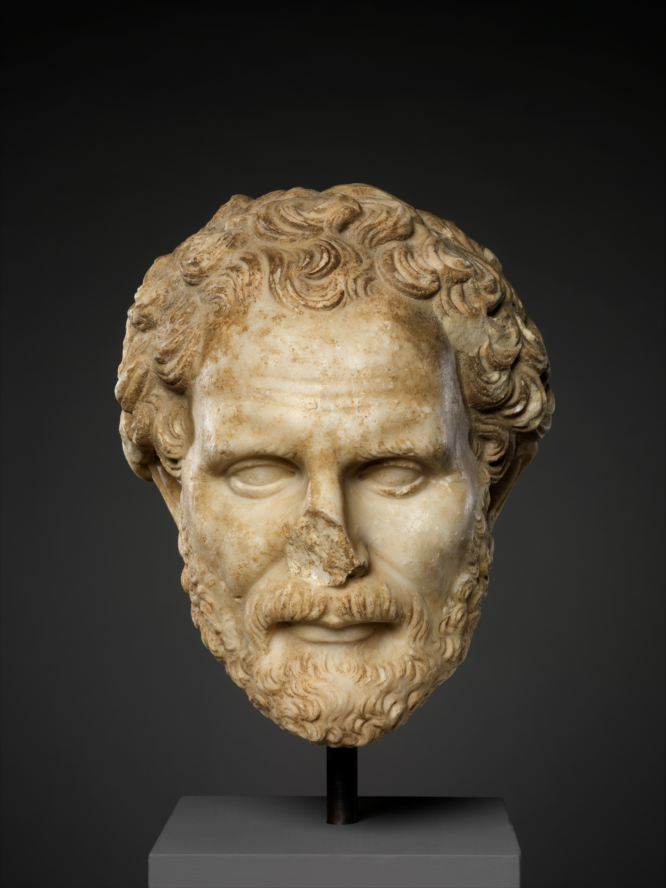

This is history for a general reader. It is not a diagnosis, not a treatment plan, and not a substitute for care with a licensed clinician.

<figure class="slpwow-lead-portrait">

<figcaption>Demosthenes of Athens (c. 384–322 BCE), marble head after a Hellenistic portrait type. Credit: Metropolitan Museum of Art, CC0 1.0 (Open Access). See <code>RIGHTS.md</code>.</figcaption>
</figure>

The marble heads in Rome and Naples are copies of copies. A thin, tight face, the hair a Hellenistic fashion, the man who made Philip of Macedon listen. Museums label them Demosthenes. Speech-language pathology labels him a mascot. He was neither a clinician nor a willing patient. He was an Athenian politician whose later biographers needed a difficult mouth to make the oratory look earned.

He was born about 384 BCE and died in 322, by suicide on Calauria after the Macedonian victory had run him out of usable politics. Those dates are the ordinary handbook dates. They are not contested in the way a 1983 obituary is contested. What is contested is the speech.

## The vita without the beach

Orphaned young, cheated by guardians, he sued, he spoke, he became the anti-Macedonian voice of a city that was losing. The *Philippics* and the *Olynthiacs* are political objects. The mouth that delivered them — if the later stories are even half true — sometimes stopped. Ancient writers mention a weak voice, a lisp or a stammer, a shoulder that jerked. They do not agree on the symptom list. They agree that he practiced.

Plutarch, writing in the first century CE, is the source schoolteachers still paraphrase: pebbles in the mouth, speeches to the waves, a shaved head to keep him in the house studying. Plutarch is a moralist. He likes effort. A modern clinic that hands a child a pebble because of that page has mistaken a *Life* for a methods section.

## What the field inherited

A famous person who stuttered (or did something the tradition called a stammer) and still spoke in public. That inheritance is real and thin. It is useful against the lie that a blocked mouth cannot hold a room. It is useless as onset science, as prevalence, as a warrant for any drill.

The other inheritance is darker: the idea that greatness *requires* the overcoming story. People who stutter and do not become Demosthenes are not failed orators. They are people. The marble head does not get to grade them.

This pack’s era essay on old names (01) keeps the beach. This profile keeps the man in the assembly. The sentences are not copied from a profession-pack paragraph because the profession pack, rightly, barely wants him. He is fluency folklore, not ASHA.

## Portrait

Shipped file: `assets/portraits/demosthenes.jpg` (Metropolitan Museum of Art, CC0). Recheck the Commons file page before any CMS re-import. Do not generate a “reconstructed young Demosthenes.” Do not put pebbles in a stock child’s mouth to illustrate him.
