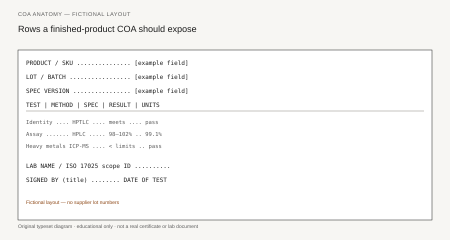

**Disclaimer.** Educational only. Not medical advice. Dietary supplements are not intended to diagnose, treat, cure, or prevent any disease (DSHEA; 21 U.S.C. § 321(ff); 21 CFR 101.93). This is not legal advice and not an audit.

A certificate of analysis is a signed statement that *this lot* was tested against *this spec* by *this lab* with *these methods* and passed or failed. That sentence is the whole document. If any noun is missing, you are holding a brochure.

The trade uses "COA" for four different objects. A founder who treats them as one object will ship a lot they cannot defend.

## Four PDFs that share a nickname

**Incoming / ingredient COA.** The extract house, the vitamin premix plant, or the amino-acid broker tested a drum. Useful. Required as a starting point if you intend to qualify a supplier under 21 CFR 111.75. Not enough to release *your* bottle.

**In-process COA or in-process data.** Blend assay, fill weight, moisture, a marker check at a control point named in the master manufacturing record. This is how you know the batch did not walk off during manufacturing. It is not a finished-product story.

**Finished-product COA.** Someone tested the capsules, tablets, powder, or liquid that will see a label. Identity of the finished form, assay against the label claim, contaminants, micro. This is the document a grown-up buyer asks for.

**Marketing PDF.** A template with last year's lot, a lab logo that does not match the footer, "conforms" on every row, and no method. Shopify will accept it. A retailer quality desk will not.

21 CFR 111 never uses the phrase "certificate of analysis" as a magic form. The rule asks for specifications (111.70), for scientifically valid tests or examinations to see whether those specifications are met (111.75), and for records that prove you did the work (111.95). A COA is one way those records travel. It is not a substitute for the work.

## What has to be on the page

Open a finished-product COA. If you cannot find these, stop.

<figure class="blog-figure">
  
  <figcaption><strong>Figure.</strong> Fictional COA anatomy — field names only, no real supplier lots. <em>Original typeset diagram; not a certificate you can file.</em></figcaption>
</figure>

1. **Your product name and SKU**, not last season's formula and not the CMO's house code alone.
2. **Lot or batch number** that matches the bottle, the drum, and the batch production record.
3. **Date of manufacture** and **date of test**. A 2021 test on a 2026 lot is a costume (piece 06, piece 39).
4. **Specification version.** The numbers in the spec column have to be the numbers quality control approved, not a lab default.
5. **Method** on every result row: HPLC, UPLC, ICP-MS, HPTLC, a USP monograph, AOAC, a validated in-house method with an ID you can ask for.
6. **Result** with units that match the spec. "Conforms" on a potency row is a rumor.
7. **Lab name.** A person or a title that signed. An accreditation claim you can check (piece 18).
8. **Pass/fail or a clear comparison** to the spec. A number without a limit is a measurement, not a release.

You write the spec before you see the COA. The COA reports against the spec. A plant that "sends the COA and you can use those numbers as your spec" is asking you to skip 111.70.

## What a COA is not

It is not FDA approval. FDA does not pre-approve supplement SKUs.

It is not a cGMP certificate. Part 111 is a regulation you either meet or fail. A passing lot can still sit in a plant that cannot survive an inspection on records, training, or the quarantine cage (piece 20).

It is not "pharmaceutical grade." That phrase is not a defined USP mark for dietary supplements. Do not put it on a cart page.

It is not a consumer seal. USP Verified, NSF Certified for Sport, and Informed-Sport are programs with directories (piece 37). A COA from a 17025 lab is testing. A program mark is a program.

It is not an efficacy claim. "Lead below 0.5 mcg/serving" is a contaminant result. It does not mean the product treats anything, prevents anything, or is appropriate in pregnancy. Do not convert a quality row into a disease story (`CLAIMS_GUARDRAILS.md`).

It is not a license to skip identity testing of a dietary ingredient. 111.75(a)(1) still wants at least one appropriate identity test or examination on each dietary ingredient. A supplier COA does not replace that test. FDA has been writing that sentence into warning letters for years (piece 02, piece 07, piece 28).

## Why founders get this wrong

The sales call is easy. A catalog page has a gold badge. A PDF arrives in twenty minutes. The founder is trying to hit a launch date. The CMO says "we test everything." The founder hears "every bottle, every row, finished product, ISO lab, current lot."

What was actually sent is often an incoming COA for the flavor system, or a composite from three lots ago, or a skip-lot result presented as a release (piece 17). None of those sentences are automatically illegal. Passing them off as a finished-product, every-batch, named-lab story is.

A lot prepared, packed, or held under conditions that do not meet Part 111 is adulterated under 21 U.S.C. § 342(g)(1) whether or not a customer complained. The COA is how you show you were not that lot. Or how an investigator shows you were.

## A reading order that does not waste an afternoon

Do not start on the pretty header. Start on the lot number. Then the product name. Then the date. Then the spec column. Then the method column. Then the lab. Then the signature. Then, and only then, the results.

If the first four already fail, the results do not matter. You are not looking at this lot.

File the PDF with the batch record, the approved spec, the label PDF, and the purchase order in one folder named for the lot. When a 3PL or a retailer asks for "the COA" eleven months later, you will want that folder, not a search through Slack.

## What this pack is for

The next forty-three pieces teach the rows, the plant, and the contract. This piece is only the object.

A COA is a signed statement about a lot. Treat it like a bank statement. Match the account. Match the date. Match the amount. If you would not accept a statement that said "conforms" with no figure, do not accept that sentence on a potency row.

Quality is not a vibe and it is not a stock photo (see `PHOTO_NOTES.md`). It is a lot number you can defend.
