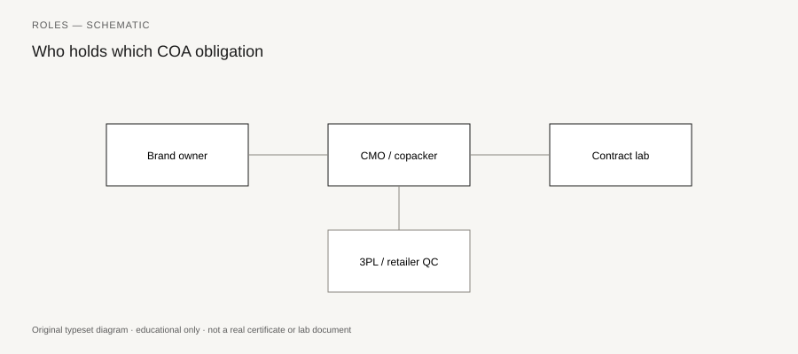

**Disclaimer.** Educational only. Not medical advice. Dietary supplements are not intended to diagnose, treat, cure, or prevent any disease (DSHEA; 21 U.S.C. § 321(ff); 21 CFR 101.93). This is not legal advice and not an audit.

White-label, in this trade, means you buy a formula the contract manufacturer already runs. They own the recipe, or they act like they do. You pick a flavor, a capsule color, a name. They print your artwork on a bottle that may share a blend tank with three other brands.

That is a legitimate way to start. It is not a way to skip Part 111. It is not a way to skip a COA that matches *your* lot. It is not a way to invent a laboratory you do not operate.

## The transaction

<figure class="blog-figure">
  
  <figcaption><strong>Figure.</strong> White-label splits formula ownership, manufacturing, testing, and retailer QC — each box holds different COA obligations. <em>Schematic roles map.</em></figcaption>
</figure>

You sign a purchasing agreement and, if you are lucky, a quality agreement (piece 29). You pay an NRE for artwork and a first-article run, or you skip first-article and regret it (piece 34). You take a MOQ. You receive bottles that look like a brand.

What you did *not* automatically buy:

- The formula (piece 32).
- Exclusive use of the blend.
- A finished-product COA on every lot unless the agreement says so.
- The right to see the MMR.
- A unique lot that contains only your bottles.

Ask those five out loud. The answers change the price and the risk.

## Shared lots

A house "Sleep Blend" may be one 200 kg batch split across five labels. The finished-product COA, if it exists, may be for the blend lot, not for your label lot. That can be acceptable if the pack-out does not change the specs you owe and if the lot code still traces to the blend and to your ship.

It is not acceptable if your panel differs from the house panel — extra magnesium, a different D3 amount — and they still hand you the house COA. That is someone else's assay.

It is not acceptable if they pack your bottles on Tuesday and the COA sample was pulled from Monday's brand.

Write the trace: blend lot → pack lot → your ship lot. If those three numbers are one number, fine. If they are three, you need the map.

## What you still owe

- Specifications you approved (111.70), even if they started as the house spec.
- Identity of dietary ingredients — someone ran it, you have the record (piece 07).
- A finished-product story for the specs you claim (piece 02).
- A label that 101.36 can live with, without disease language (piece 04, piece 35).
- Reserves you can reach (piece 43).
- A complaint mailbox (piece 27).

The CMO's other customers do not owe your retailer a PDF. You do.

## Catalog pages are not specs

A white-label catalog will say "5-HTP 100 mg, 60 caps, MOQ 500." That is a sales row. The spec is the document with methods and ranges. Ask for it before you design the PDP. If the catalog says "5-HTP" and the MMR says a blend with griffin extract and a flavor, you are about to misbrand.

Do not copy a competitor's structure/function sentence onto a house formula you have not read. The formula may not even contain the ingredient the sentence assumes.

## When white-label is the right tool

You need to learn the operator jobs before you own a custom formula. You have one SKU, not forty. You can live with shared lots if the file is real. You will spend money on testing and not only on ads.

When it is the wrong tool: you need exclusivity, a novel ingredient, a retailer that demands unique lots, or a formula you intend to move to a second plant next year (piece 32, piece 33).

## What you may say

Allowed when true: "Manufactured for us by a contract manufacturer under 21 CFR 111. We review specifications and lot records."

Not allowed: "Made in our facility" when it is not.

Not allowed: a lab coat stock photo as implied staff (`PHOTO_NOTES.md`).

Not allowed: "unique proprietary blend" on a house formula four other brands sell.

## Other brands in the tank

Ask, in writing, whether this blend lot will be sold under other labels. If yes, a public complaint or a warning letter about *their* panel can still point at the same blend lot. You cannot control their claims. You can decide whether you want that coupling.

If they will not say, assume yes.

## The launch week compression

You need bottles on a Monday for a retail window. The CMO offers to ship Friday's house lot under your new label, using Thursday's house COA. The panel matches. The lot is already made.

That can be a mapped shared lot if the agreement says so and the trace is real. It can also be a label slapped on a lot you never approved, with a COA that never saw your artwork revision. Run the first-five matches and the four columns anyway (piece 06, piece 15). If Friday is the first time you see the file, you do not have a quality unit. You have a calendar.

Pay for a week. Miss the window if the file is empty. The window will come back. A misbranded shared lot will not un-ship.

White-label is a purchasing pattern. It is not a quality system. Buy the pattern if it fits. Install the system either way.
