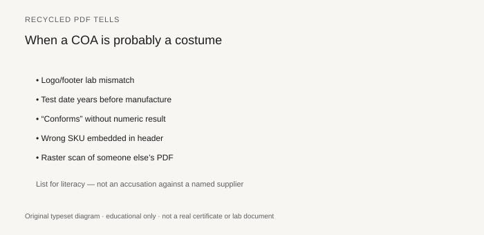

**Disclaimer.** Educational only. Not medical advice. Dietary supplements are not intended to diagnose, treat, cure, or prevent any disease (DSHEA; 21 U.S.C. § 321(ff); 21 CFR 101.93). This is not legal advice and not an audit.

Most ugly COAs are sloppy, not criminal. Sloppy still cannot release a lot. A smaller set are costumes: a PDF that learned to look like a test. You do not need to prove intent to send it back. You need to notice.

## The tells

<figure class="blog-figure">
  
  <figcaption><strong>Figure.</strong> Common tells that a PDF is a template — literacy list, not an accusation against a named supplier. <em>Original typeset list.</em></figcaption>
</figure>

**Dates that cannot be true.** Test before manufacture. A 2021 test on a 2026 lot. A signature dated on a Sunday the lab is closed, if you happen to know they are closed. (Do not invent a closed day. If you do not know, skip this tell.)

**The same number to three decimals on two lots.** pH 5.432 twice. Lead 0.137 twice. Nature is not that loyal. Methods have noise. Two identical noisy numbers is a copy-paste.

**Lot number from the component in the finished-product header.** Or a lot that does not exist on the BPR (piece 06, piece 19).

**No method, no spec, no lab.** Piece 15. A costume loves a blank column.

**Flavor, color, or excipient COA** presented as the SKU.

**Identity standard with the same lot as the sample.** LXR 714568 is the public version.

**Accreditation logo with no name**, or a 17025 claim the scope does not support (piece 18).

**Language leftovers.** Another customer's product name in the footer. A watermark "example." A spec range from a different vitamin.

**Too fast.** A full metals/micro/HPLC package timestamped 40 minutes after you asked, on a lot they said they manufactured today. Some labs are fast. Many costumes are faster.

**Pixel tells.** A number that sits in a different font. A scanned signature on a digital form from 2026. Not proof. A reason to ask for the native file.

## What you do when you see a tell

Hold the lot (piece 23). Ask for the native lab report and the BPR header. Send a split from *your* retain (piece 38). Do not argue about feelings on the phone. Ask for documents.

If the CMO cannot produce a native file, you do not have a test. If they produce a native file that matches the costume, you have a deeper problem: the lab or the sample chain.

Do not post about it. Do not threaten in email like a television show. Collect the file. Call counsel if you already shipped. Call the quality unit if you have not.

## Sloppy versus costume

Sloppy: LOQ missing, units messy, spec column blank, but the lab exists and will send a corrected page.

Costume: the corrected page cannot exist because the work did not.

Treat sloppy as a supplier-qualification event (piece 28). Treat costume as a walk-away event (piece 41) unless you have a reason to stay that you would say in front of an investigator.

## What you may not do

Do not "fix" their PDF in your own template. That makes you the costume department.

Do not reuse a pretty COA on a later lot because the formula "didn't change." The lot changed.

Do not put "anti-fraud tested" on a PDP. The absence of a costume is not a consumer claim.

## A two-lot habit

Keep the last COA next to the new one. Diff the numbers. Diff the dates. Diff the product name. Humans see copy-paste when two pages sit together. They miss it in a single email.

## Two lots, one chromatogram

Ask for the native HPLC or ICP file on two consecutive lots. If the file names, run times, or spectra are identical except for the typed lot number, you are not looking at two tests. You are looking at one test wearing two headers.

Not every lab will send a raw file to a founder. A serious lab will send a report with unique run IDs. No run ID, same decimals, same time stamp: costume cluster. Hold both lots.

## The "typical COA" in the media kit

A PDF titled `ASHWAGANDHA_TYPICAL_COA.pdf` with no lot, or a lot from 2022, used as the file for every customer. Sales swears production lots "match typical." Typical is a marketing object. It is not 111.75.

Ask for the COA that shares a lot number with the drum or bottle you will receive. File typical in a "sales" folder if you must. Never in the lot folder. Never in a retailer portal.

If typical is all they have on Friday, you do not have Friday.

A COA is a signed statement about a lot. If the statement is about some other lot, it is a costume. Send it back. Then decide whether you still have a manufacturer.
