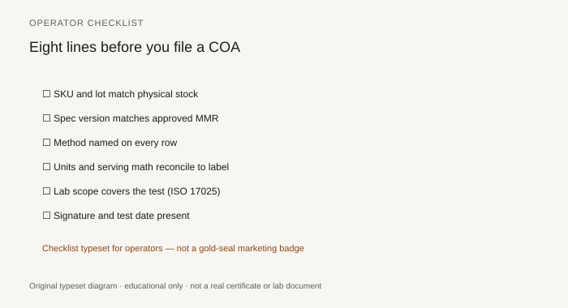

**Disclaimer.** Educational only. Not medical advice. Dietary supplements are not intended to diagnose, treat, cure, or prevent any disease (DSHEA; 21 U.S.C. § 321(ff); 21 CFR 101.93). This is not legal advice and not an audit.

This is the one-sitting pass. It does not replace the rest of the pack. It is what you run before you pay the invoice or upload the SKU. If a box fails, you are in hold (piece 22, piece 23), not in "we will tidy the PDF later."

Print it. Write the lot number at the top. Sign it.

<figure class="blog-figure">
  
  <figcaption><strong>Figure.</strong> Printable-style checklist — use with the numbered sections below, not as a substitute for the BPR. <em>Fictional form layout.</em></figcaption>
</figure>

## 0. Three files open

- Label PDF (the one that will be on the bottle).
- Finished-product COA (or the mapped blend COA plus the map).
- BPR header (lot, date, yield, QC sign-off) or a written reason you do not have it.

If you only have the COA, stop. You are not doing this checklist yet.

## 1. First five matches (piece 06)

- [ ] Product name / SKU / formula revision match.
- [ ] Lot on COA = lot on bottle plan = lot on BPR.
- [ ] Dates can be true together (test not before manufacture; not a 2021 test on a 2026 lot).
- [ ] Assay analyte and units can meet the panel (piece 08, piece 16).
- [ ] Serving size used on the COA is the panel serving.

## 2. Four columns on every release row (piece 15)

- [ ] Spec you approved (not a lab default).
- [ ] Result with a unit, or a qualitative outcome that matches a qualitative spec.
- [ ] Method named.
- [ ] Lab named.

Identity of each dietary ingredient has an incoming record, not only a supplier PDF (piece 02, piece 07).

## 3. Contaminants you actually owe

- [ ] Metals Pb As Cd Hg, ICP-MS or validated alternative, LOQ ≤ spec (piece 09, piece 14).
- [ ] Serving-day math written (piece 16). Prop 65 conversation flagged for counsel if CA ships (piece 36).
- [ ] Micro: TAMC/TYMC and named organisms as specified (piece 10).
- [ ] Solvents if an extract or solvent process exists (piece 11).
- [ ] Pesticides if a botanical exists (piece 12).
- [ ] Mycotoxins if the crop wants them (piece 13).

If a row is skip-lot or 111.75(d), the SOP and the reason are attached (piece 17). The cart page does not say "every bottle tested."

## 4. Lab and sample

- [ ] 17025 scope covers the rows if 17025 was claimed (piece 18).
- [ ] Sample description is a lot sample, not "client sample, 1 g, unknown."
- [ ] Split scheduled or performed if this lot is on the split plan (piece 38).
- [ ] No costume tells, or tells explained with native files (piece 39).

## 5. Label / formula / pack

- [ ] Panel, MMR list, and COA names agree (piece 35).
- [ ] Allergen matrix agrees with plant and panel (piece 24).
- [ ] Reserve pulled or mapped (piece 43).
- [ ] You are not paying an invoice for a sample lot dressed as production (piece 34).

## 6. Adjectives

- [ ] No "FDA approved," "pharmaceutical grade," "heavy-metal free," "cGMP certified by FDA."
- [ ] No disease language on the pack or the PDP that will sit next to this lot (piece 04).
- [ ] No program logo unless the SKU is in the directory (piece 37).

## Sign-off

Lot ________  SKU ________  Date ________

I reviewed the file. I release / I hold (circle one).

Name ________

If you circle hold, write the box that failed. Do not pay the production invoice until that box has a document, not a promise.

## Keep the signed page

Scan the signed checklist into `LOT-XXXX`. When a retailer asks "who released this?" you have a name and a date besides the CMO's QC stamp. Two signatures are better than one. None is a Shopify upload.

## What "I hold" does next

Circle hold. Write the failed box. Then pick one:

- Ask for a corrected native report (sloppy, piece 39).
- Ask for a missing incoming identity (piece 07).
- Start an OOS / split (piece 22, piece 38).
- Refuse the invoice for a sample dressed as production (piece 34).
- Walk away if the pattern is costume plus refused files (piece 41).

Email the CMO the same day with the lot number and the box. Do not wait for a weekly call. Lots move on forklifts, not on calendars.

A hold without a next action is a mood. A hold with a next action is quality control.

## How long this should take

First time, with messy files: two hours. Tenth time, with a CMO who already sends a four-column table: twenty minutes. If it always takes two hours, the CMO is sending costumes and incoming PDFs (piece 15, piece 39). Fix the input, not your patience.

Do not run the checklist from a phone in the car after you already uploaded the SKU. The checklist is a gate, not a diary.

If you skip a box because "it's a simple vitamin," write the skip as a signed 111.75(d) or skip-lot exception. An unsigned skip is a fail.

Quality is a lot number you can defend. This page is how you remember to look.
