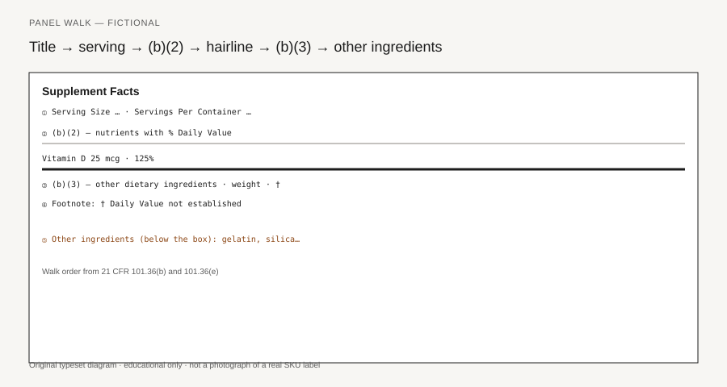

**Disclaimer.** Educational only. Not medical advice. Dietary supplements are not intended to diagnose, treat, cure, or prevent any disease (DSHEA; 21 U.S.C. § 321(ff); 21 CFR 101.93). This is not legal advice and not a labeling opinion for a specific SKU.

21 CFR 101.36(e) requires the nutrition information for a dietary supplement in a box. The title **Supplement Facts** must be larger than all other print in that panel. Chapter IV of FDA's Dietary Supplement Labeling Guide (April 2005), question 4-35, repeats both points and adds the one people still skip: the title and the headings are bold. If a contractor sends you a panel that looks like a Nutrition Facts box with "Supplement" swapped in 8-point type, they did not read (e). They copied a yogurt cup and hoped.

<figure class="blog-figure">
  
  <figcaption><strong>Figure.</strong> Walk order from 21 CFR 101.36(b) and 101.36(e); the heavy bar separates (b)(2) from (b)(3). <em>Original typeset diagram; fictional panel — not a real product label.</em></figcaption>
</figure>

Piece 01 is the category split. This piece is the walk. Title, serving, (b)(2) ingredients that have Daily Values, a heavy bar, (b)(3) other dietary ingredients, then the other-ingredient statement *under* the box. The rule wrote that order so a buyer, an auditor, and an investigator find the same facts in the same places.

## The box and the title

101.36(e) is format, not flavor. The panel is enclosed by hairlines. The title is larger than every other line and, unless impractical, full width. Headings — Serving Size, Servings Per Container, Amount Per Serving, % Daily Value — are bold so they do not collapse into the rows. Chapter IV, 4-35, is the short form of that paragraph.

Type is not a mood board. 101.36(e) wants a single easy-to-read style, contrasting type, upper- and lowercase, at least one point of leading, and letters that do not touch. Except for small and intermediate packages, body type is no smaller than 8 point; headings and footnotes may go to 6 point (Chapter IV, 4-36, 4-37). Appendix B is a model, not a Helvetica mandate (4-39).

The title is how you know which regulation you are in. Nutrition Facts: 101.9, no (b)(3) botanical row. Supplement Facts: 101.36. The format rule makes the title *legible as a title*, not a caption under a brand banner.

## Serving Size before any milligram

101.36(b) wants names and quantities of dietary ingredients, **Serving Size**, and **Servings Per Container**. The serving line sits under the title, left-aligned. You do not start the panel on a milligram. The milligram is meaningless until you know the object it attaches to.

Serving size is the maximum amount recommended on the label per eating occasion, or one unit if there is no recommendation (21 CFR 101.12(b) Table 2, miscellaneous; Chapter IV, 4-4). Piece 03 is that object. Here, the only point is order. If you read "Vitamin D 125 mcg" before "Serving Size 2 gummies," you have read a number that is not the day's number.

Servings Per Container can drop out when it restates net contents — 100 tablets, serving size 1 tablet (Chapter IV, 4-3). That is a space rule, not a permission to hide a 30-day bottle that is a 15-day bottle because the serving is 2. Piece 04. A heavy bar sits under Servings Per Container, or under Serving Size if that line is omitted (101.36(e)(6)(i)). Everything below it is an amount *per that serving*.

## (b)(2) in food order

The (b)(2) block is dietary ingredients that have Daily Values — RDIs and DRVs from 101.9(c). They come first, in food order, vitamins and minerals grouped. Chapter IV, 4-13, still lists the 2005 sequence: vitamin A, vitamin C, vitamin D, vitamin E, vitamin K, thiamin, riboflavin, niacin, vitamin B6, folate, vitamin B12, biotin, pantothenic acid, then the minerals. Current 101.36(b)(2)(i)(B) inserts choline before calcium and iron, and puts fluoride at the end. Recheck the live section before you lock a print file [VERIFY current 101.36(b)(2)(i)(B) order against the eCFR]. The idea did not move: you do not invent a marketing order that puts the hero mineral first.

Calories, fat lines, cholesterol, sodium, carbohydrate, fiber, sugars, protein, and the old food-style vitamin/mineral pair must be listed when they are present in a measurable amount (Chapter IV, 4-6). Other vitamins and minerals are required when you added them for supplementation or when you make a claim (4-7). The 27 May 2016 final rule (81 FR 33742) rebuilt those rows and the units. Use 2005 for *assembly*. Use current 101.9 / 101.36 for *which rows and which units* (piece 09). You do not print "0" for a nutrient that is not there (Chapter IV, 4-2). Synonyms are a closed list (4-14). Amounts and %DV sit in this block *before* any botanical gets a milligram (pieces 05–06).

## The hairline

Two different lines do two different jobs.

A **hairline** centered between lines of text separates each dietary ingredient from the one above and beneath it (101.36(e)(5); Chapter IV, 4-38). Except for small and intermediate packages, it is required.

A **heavy bar** sits under the last (b)(2) ingredient (101.36(e)(6)(ii)). That bar is the category break. Everything above it has a Daily Value, or is a food-style nutrient that can trigger the 2,000-calorie footnote. Everything below it is a (b)(3) other dietary ingredient. A light bar sits under the Amount Per Serving and % Daily Value headings (e)(7).

If your art file draws one weight of rule for every line, you have erased the cue that phosphatidylserine is not vitamin C. Small and intermediate packages may, when space is gone and type is already at the minimum, replace the centered hairline with a row of dots (Chapter IV, 4-53; 101.36(i)(2)(v)). That is a space exception, not a license to run (b)(2) and (b)(3) as one list.

## (b)(3) and the asterisk

"Other dietary ingredients" have no RDI or DRV. FDA's own example is phosphatidylserine (Chapter IV, 4-28). Ashwagandha root extract, a 400 mg "focus blend," lutein, and most botanicals live here or they do not live on the nutrition label. Nutrition Facts will not take them.

They sit *after* the (b)(2) block, under the heavy bar (4-29; 101.36(b)(3)(i)). Common or usual name. Weight per serving. A symbol in the %DV column that points at **Daily Value not established** (4-30). If you skip the column format, the symbol follows the weight. Plant part is required for botanicals (101.4(h); piece 18). A proprietary blend gets a name, a *total* weight, and indented names in descending order (101.36(c); 4-34). RDI nutrients cannot hide inside it. If there are no (b)(2) rows, (b)(3) starts under Amount Per Serving. You still owe the title, the serving, the box, and the footnote.

## Under the box

Binders, fillers, colors, flavors, the capsule shell, magnesium stearate: **other ingredients**, 21 CFR 101.4, not 101.36 rows. They sit below the box, in order of predominance. Chapter IV, 4-10, is the magnesium-salt example. A magnesium salt used as a *binder* is listed under the box. It is not a magnesium %DV row unless you are actually supplementing magnesium.

If the source is already named in the box — "Calcium (as calcium citrate)" — you do not have to repeat it below (101.4(h); Chapter IV, 4-2). Allergen work starts on this list (piece 37). A last heavy bar sits under the last (b)(3) row (101.36(e)(6)(iii)). Then you are outside the nutrition label. Claims on the principal display panel are not the next row. They are 101.93, or a nutrient-content claim, or a health claim. Different chapters.

## Small-pack exceptions are not a new category

Chapter IV, 4-45 through 4-53, is the space file. Small packages: less than 12 square inches of surface available to bear labeling. Intermediate: 12 to 40. Type may drop to 4.5 point on small packs, 6 point on intermediate. Tabular or linear format is allowed when vertical columns will not fit. Abbreviations from 101.9(j)(13)(ii)(B) — "Serv size," "Servings" — are allowed. A telephone number or address may replace the panel on a small pack *if* the label carries no claims and no other nutrition information (4-46).

None of that creates a third kind of product. A 10-square-inch tin of lozenges is still a dietary supplement if that is how it is sold. It still owes serving size as the maximum per eating occasion, plant part, and the 100% rule for added dietary ingredients (101.9(g)(3)–(4), through 101.36(f)). The exception is type, hairlines, and sometimes the presence of the box. It is not a permission to skip the walk.

If space is gone on the information panel or the PDP, 101.36(i) lets you put the box on another panel that can readily be seen (4-56). Multi-unit inners and bulk have placement rules (4-57, 4-58). The order inside the panel, when the panel exists, does not change. If a file cannot survive that walk, do not print it. The box is cheap. A recall for a category error is not.
