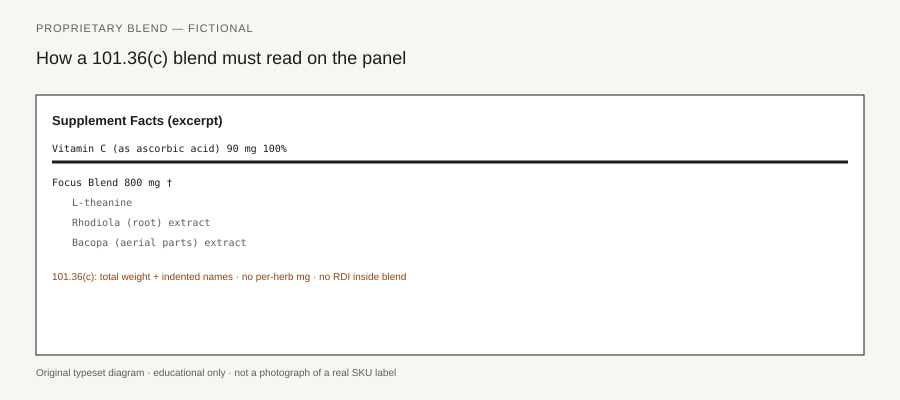

**Disclaimer.** Educational only. Not medical advice. Dietary supplements are not intended to diagnose, treat, cure, or prevent any disease (DSHEA; 21 U.S.C. § 321(ff); 21 CFR 101.93). This is not legal advice and not a labeling opinion for a specific SKU.

The number to the right of the blend name is the blend, not each herb. 21 CFR 101.36(c)(3) puts the total weight of all *other dietary ingredients* in the proprietary blend on the same line as the name, under the amount column. A buyer who reads "Focus Matrix 1,250 mg" and thinks each indented name is 1,250 mg has been taught the wrong object.

The 2005 Dietary Supplement Labeling Guide, Chapter IV, question 4-34, is the short version of the same rule. Name the blend. Give the total. Indent the other dietary ingredients in descending order of predominance by weight. Pull anything with a Daily Value out of the cloak and declare it on its own line.

## What the rule actually requires

<figure class="blog-figure">
  
  <figcaption><strong>Figure.</strong> 21 CFR 101.36(c): total weight, indented names in descending order; RDI nutrients stay above the hairline. <em>Original typeset diagram; fictional panel — not a real product label.</em></figcaption>
</figure>

101.36(c) opens by placing a proprietary blend in the (b)(3) list — the other-dietary-ingredient block under the heavy bar. You identify it by the words "Proprietary Blend" or by another appropriately descriptive term or fanciful name. You may bold that name. You do not get to skip the rest of 101.36 because the name is fanciful.

Four duties sit in (c)(1) through (c)(3):

1. Dietary ingredients that belong under (b)(2) — the ones with RDIs or DRVs — are declared under (b)(2). They are not absorbed into the blend total.
2. The other dietary ingredients inside the blend are declared indented, column or linear, in descending order of predominance by weight.
3. The number on the blend line is the total weight of those other dietary ingredients, placed to the right of the name, with the asterisk that points at "Daily Value not established."
4. A sample layout lives at 101.36(e)(11)(v). It is a method, not camera-ready art.

DSLG 4-34 adds nothing mystical. It restates those duties in Q&A form. If a contractor tells you a proprietary blend is "how you protect the formula," ask them to read (c) aloud. The names still print. The order still prints. The one number you may withhold is the milligram of each indented herb.

Serving size still governs the total. Amounts are per serving (piece 05). A blend that is 1,250 mg per 2 capsules must not be restated on the front as 1,250 mg per capsule unless you have a per-unit column that says so (101.36(b)(2)(iv)). The blend is not a second serving-size system.

## RDI nutrients cannot hide in the blend

101.36(c)(1) is the sentence catalogs skip. If the blend contains vitamin C, calcium, magnesium, or any other (b)(2) dietary ingredient, that ingredient comes out of the blend and is declared with its own weight and its own %DV.

A "Sleep Blend 800 mg" that includes 3 mg of melatonin and 50 mg of magnesium as magnesium oxide cannot treat magnesium as a secret. Magnesium has a Daily Value. It is a (b)(2) row, sourced in parentheses, elemental weight (piece 14). Melatonin, which has no DV, may stay indented under the blend if it is truly part of that blend.

Vitamin C sprinkled into a "Immune Blend" to make the blend weigh more is still vitamin C. It goes above the hairline. The blend total is the other dietary ingredients only. If you leave the C inside the 800 mg figure, you have inflated the blend and under-declared the vitamin.

Protein, fat, and carbohydrate are DRV nutrients when they are present in measurable amounts. A collagen-plus-herb powder that parks 5 g of collagen inside a fanciful blend, and then prints no protein row, is using 101.36(c) as a Nutrition Facts dodge. Check whether the collagen is a (b)(2) declaration before you let it disappear into the blend weight.

The hairline still matters (piece 02, piece 07). (b)(2) ingredients first, in food order. Heavy rule. Then (b)(3), including the named blend. A blend that appears *above* the hairline, among the vitamins, is in the wrong neighborhood.

## Descending order is information

Indentation plus descending weight is the information 101.36(c) actually gives the buyer. The first indented name is the heaviest other dietary ingredient in the blend. The last name is the lightest. You still do not know the milligrams. You know the order.

That order is why a 2 g blend that lists "maltodextrin-adjacent rice flour" first and a 50 mg-class herb last is readable as a pile of cheap weight with a famous leaf on the end — if the rice flour is even a dietary ingredient. If the rice flour is a filler, it does not belong in the blend total at all. It belongs under the box (piece 17). Putting a filler inside 101.36(c) to bulk the number is not "proprietary." It is a category error.

Ties in weight are not a license to alphabetize the expensive name to the top. If two herbs are present in equal amount, say so in the formula card and keep the label order honest. The regulation says descending order of predominance by weight. It does not say "descending order of brand priority."

Linear versus column is allowed. Linear is how a small pack hides the walk. A linear blend that runs six Latin names in a 6-point string still has to be descending. If you cannot defend the order from the batch record, do not print the order.

Plant part and Latin name still apply to the botanicals inside the blend (piece 18; 101.4(h)). "Ginseng" as an indented word, with no part and no species, is not saved by the blend heading.

## What you still do not know

You do not know the milligrams of each indented ingredient. That is the one secrecy the rule allows. A 1,250 mg blend of eight herbs can be 1,000 mg of the first name and dust of the rest. It can be a relatively even split. The panel will not tell you.

You do not know the extract ratio of each indented extract unless you put it there (piece 15). You do not know the solvent unless it appears in the box or under it. You do not know whether the first name is a 10:1 dried extract or a crude powder. 101.36(c) does not waive (b)(3)(ii).

You do not know lot-to-lot drift from the panel alone. The 100% rule for added dietary ingredients (101.9(g)(3)–(4)) still applies to what you added. The blend total is a declared amount. A lot that cannot support 1,250 mg of those other dietary ingredients is short on the number the rule made you print. Individual herb milligrams, if they are not declared, are a formula-card fact and a COA fact, not a panel fact.

A retailer who asks for the breakout is asking for a document that is not the Supplement Facts panel. You may have that document. 101.36(c) does not require you to put it on the bottle. A customer-service macro that recites made-up milligrams for each indented line is labeling you did not print and may not be able to substantiate.

## "Transparency blend" as a costume

Calling the blend "Transparency Blend" or "Open Formula Matrix" does not add milligrams to the indented names. The costume is a fanciful name. 101.36(c) already allowed a fanciful name. Honesty is the descending order and the (b)(2) pull-out, not the adjective.

A label that lists every herb with its own milligram, no blend, is also legal. That is the ordinary (b)(3) walk. You choose the blend form when you want to withhold the split. Do not advertise the withholding as a virtue.

"Proprietary" is not a third-party test. It is not a patent number. It is not FDA review. It is a formatting option in 101.36(c). A QR code that leads to a blog about the "unique ratio" is still labeling. If the blog assigns milligrams the bottle does not, you now have two documents (piece 42). If the blog assigns disease work to the blend, you have a 321(g) problem (piece 20).

The blend total cannot wash a structure/function sentence. "Focus Matrix 1,250 mg" is a quantity. "Supports focus" is 101.93 work: substantiation first, 30-day notice, disclaimer (pieces 21–23). A fanciful name that swallows a disease — FDA's SECG examples include names built on a condition — is a disease claim regardless of how clean the milligram column is. Piece 24 is that list. This piece is the column.

Read a blend in this order: name, total weight, asterisk, indented names from heaviest to lightest, plant parts, any (b)(2) nutrients that should have been pulled out, other ingredients under the box that look like they were stuffed into the total. If the expensive leaf is last and the total is large, you have learned what (c) was willing to tell you. You have not learned the recipe.
