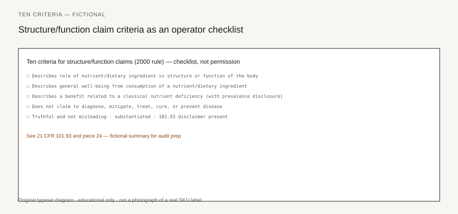

**Disclaimer.** Educational only. Not medical advice. Dietary supplements are not intended to diagnose, treat, cure, or prevent any disease (DSHEA; 21 U.S.C. § 321(ff); 21 CFR 101.93). This is not legal advice and not a labeling opinion for a specific SKU.

The new-claim clock started on 7 February 2000. 65 FR 1000 (6 January 2000) added 21 CFR 101.93(f) and (g). New products, and new statements on existing products after 6 January 2000, took the ten disease-claim criteria that Monday. Large firms had until 7 January 2001 to burn older label stock; small firms until 7 July 2001. After that, leftover inventory was a reprint.

The 9 January 2002 Small Entity Compliance Guide (SECG) is the plain-language map. Every quoted sentence below is a **forbidden-claim example** unless the SECG marks it as a structure/function shape. None of them is product copy. None is a reason to take a supplement for a disease.

<figure class="blog-figure">
  
  <figcaption><strong>Figure.</strong> Operator checklist summarizing 101.93 criteria — not a permission slip for any SKU. <em>Original typeset diagram; fictional panel — not a real product label.</em></figcaption>
</figure>

## Disease defined (g)(1)

101.93(g)(1) defines disease, for the 21 U.S.C. § 343(r)(6) fence, as "damage to an organ, part, structure, or system of the body such that it does not function properly (e.g., cardiovascular disease), or a state of health leading to such dysfunctioning (e.g., hypertension)." Classical nutrient-deficiency diseases — scurvy, pellagra — sit outside that definition. Piece 21 covers the deficiency-disease exception. Do not write a scurvy protocol from this page.

101.93(g)(2) treats a statement as a diagnose / mitigate / treat / cure / prevent claim if it meets one or more of the ten criteria. The agency will read context. "Maintains healthy structure or function" is not automatically a disease claim unless it implies treatment or prevention. Context is the rest of the bottle, the site, the Reel, and the cart.

## Criteria 1–3

**Criterion 1** (101.93(g)(2)(i); SECG Criterion 1). Naming a disease or class of diseases is a disease claim. FDA's forbidden examples: "protective against the development of cancer"; "reduces the pain and stiffness associated with arthritis." Those are not suggestions. They are claims you may not print on a supplement unless you have an authorized health claim or an approved drug.

Implied versions count. SECG's forbidden implied set: "relieves crushing chest pain (angina)"; "improves joint mobility and reduces inflammation (rheumatoid arthritis)"; "relief of bronchospasm (asthma)." The parenthetical is FDA's gloss. The quoted phrase is still the claim.

**Criterion 2** (101.93(g)(2)(ii); SECG Criterion 2). Characteristic signs or symptoms, in scientific or lay words, are enough. You do not need every sign or the ICD name. SECG's always-implied pair: "inhibits platelet aggregation" and "reduces cholesterol" are so tightly bound to stroke and cardiovascular disease that any claim about them is an implied disease claim — unless the cholesterol sentence is fenced to levels already in the normal range. FDA's rescue wording is "maintain cholesterol levels that are already in the normal range." If the rest of the page talks about "high cholesterol," the fence is gone.

SECG also says "improves absentmindedness" might imply Alzheimer's, and "relieves stress and frustration" might imply anxiety disorders, *unless* nothing else on the page links those words to a disease. Piece 31 is that room.

"Restore," "support," "maintain," "raise," "lower," "promote," "regulate," and "stimulate" become disease claims when the object is a disease. "Prevent," "mitigate," "diagnose," "cure," and "treat" do the same work faster.

**Criterion 3** (101.93(g)(2)(iii); SECG Criterion 3). Aging, menopause, and the menstrual cycle are not themselves diseases. Abnormal conditions hanging off those states can be. Two tests: uncommon (SECG: fewer than half of people in that stage), or able to cause significant or permanent harm. FDA's acceptable examples: "mild memory loss associated with aging"; "noncystic acne"; "mild mood changes, cramps, and edema associated with the menstrual cycle." FDA's forbidden examples: "Alzheimer's disease or senile dementias in the elderly"; "cystic acne"; "severe depression associated with the menstrual cycle." Quote those last three as forbidden.

## Names, pictures, citations (4)

**Criterion 4** (101.93(g)(2)(iv); SECG Criterion 4) is a bundle: name, formulation, citation, the word "disease," pictures.

A name that swallows a disease is a disease claim. SECG's forbidden pair: **"CarpalHealth"** (carpal tunnel) and **"CircuCure"** (circulatory disorders). Two tests: the name must not contain the name, or a recognizable piece of the name, of a disease; and it must not use "cure," "treat," "correct," "prevent," or cousins. **"Soothing Sleep"** can be a claim to treat insomnia — a disease FDA named — unless the rest of the labeling makes the claim about occasional sleeplessness. Piece 31 walks that name.

Formulation can do the same work. Listing an ingredient FDA has regulated primarily as a drug, and that consumers already know as a disease treatment, is an implied disease claim. SECG's examples: aspirin, digoxin, laetrile. An article excluded from § 321(ff)(3) because it was a drug first cannot sit in a supplement at all.

A journal citation that names a disease is a disease claim when placement, prominence, or irrelevance to the express structure/function statement makes the citation do treatment work. A balanced bibliography, not on the immediate label, supporting an actual structure/function sentence, is the narrower path.

You may talk about diet and disease prevention in the abstract. SECG's acceptable general sentence: "a good diet promotes good health and prevents the onset of disease." SECG's forbidden product sentence: "Promotes good health and prevents the onset of disease." The second one makes the SKU the actor.

Pictures of healthy organs can be structure/function. Abnormal tissue is implied disease. The **heart symbol** is, in ordinary use, a disease-treatment or disease-prevention mark. EKG tracings are the same: the average buyer cannot tell a healthy tracing from a sick one. Rx or "prescription" on a supplement is usually misleading even when it is not automatically a disease claim, because it dresses the bottle as a prescription drug.

## Classes, substitutes, augment (5–7)

**Criterion 5** (101.93(g)(2)(v)). Claiming membership in a drug class is a disease claim. SECG's forbidden class names: analgesic, antibiotic, antidepressant, antimicrobial, antiseptic, antiviral, vaccine. Laxative, anti-inflammatory, and diuretic can stay structure/function if the page makes the intended effect a non-disease function. SECG's fence: "diuretic that relieves temporary water-weight gain." Piece 32 is the detox version.

**Criterion 6** (101.93(g)(2)(vi)). "Replaces your [drug]" is a disease claim when the named product is a therapy for a disease. Fewer side effects than a disease therapy is the same claim in a softer font.

**Criterion 7** (101.93(g)(2)(vii)). "Works with your chemotherapy" is the teaching shape. Naming a specific therapy, drug, or drug action usually imports that product's intended use. Nutritional-support language is still allowed if it does not imply disease.

## Immune and vectors (8)

**Criterion 8** (101.93(g)(2)(viii); SECG Criterion 8) is the immune split.

Forbidden SECG examples — do not print, do not brief an influencer, do not put in a backend search term:

- "supports the body's ability to resist infection"
- "supports the body's antiviral capabilities"

FDA called those disease claims because they focus the product on preventing or treating infectious disease. Infection is a disease state.

The SECG's example of a *general* structure/function shape is "supports the immune system," without more. That sentence is still a claim. It still needs substantiation, a 30-day notice, and the 101.93 disclaimer (pieces 21–23). It still fails if a virus graphic, a "protocol," a flu hashtag, or a COVID blog next to the cart does the disease work the five words avoided. Piece 30 is the 2020 letters.

A vector is an organism or object that can carry a disease agent. Claims about killing or neutralizing pathogens, or about the signs of infection, are disease claims under this criterion.

## Adverse events and catch-all (9–10)

**Criterion 9** (101.93(g)(2)(ix)). Treating, preventing, or mitigating an adverse event of a disease therapy is a disease claim when that adverse event is itself a disease. SECG's forbidden example: "to maintain the intestinal flora in people on antibiotics" — because it implies prevention of pathogenic overgrowth. SECG's acceptable contrast: counterbalancing a drug's depletion of a nutrient, without turning the side effect into a disease story.

**Criterion 10** (101.93(g)(2)(x)) is the remainder. If the wording or the page suggests an effect on a disease and the first nine boxes did not catch it, this one does. It is not a loophole for clever syntax. It is the rule that syntax is not the test.

## Context is the whole page

101.93(g)(2) says FDA will consider the context in which the claim is presented. The SECG repeats it: look at the objective evidence in the labeling. A clean structure/function line on the principal display panel does not save a disease blog, a disease-titled citation on the carton, a heart glyph, or a product name that already swallowed the condition.

Read the sentence against the ten criteria, then read the rest of the SKU the way piece 20 reads intended use: label, site, marketplace, Reel, chat macro. If any corner supplies the disease the panel omitted, you have a drug claim you have not been allowed to make. A sentence that survives 101.93(g) still has to survive the other drawers — nutrient-content, health claim, FTC 2022 — before it is finished.
