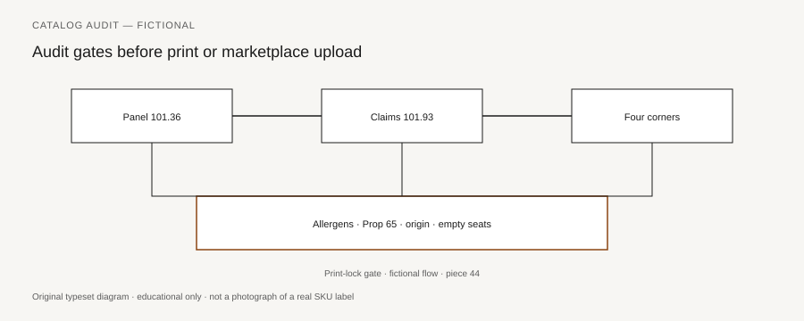

**Disclaimer.** Educational only. Not medical advice. Dietary supplements are not intended to diagnose, treat, cure, or prevent any disease (DSHEA; 21 U.S.C. § 321(ff); 21 CFR 101.93). This is not legal advice and not a labeling opinion for a specific SKU.

Print is the expensive moment. The PDF is cheap. A catalog that is about to become cartons, inserts, and a live Amazon listing is the last morning you can delete a sentence for the cost of a keystroke. After that, the sentence has a die line, a SKU, a 3PL slot, and a URL an investigator can add to a cart (piece 41). This piece is an operator walk, not a brand anthem. It assumes pieces 01–43 exist as the curriculum. It does not re-teach them. It asks whether you did the work.

No hero shot. No launch-day copy. If a claim cannot survive the walk, it does not go to the printer.

## Panel checklist

<figure class="blog-figure">
  
  <figcaption><strong>Figure.</strong> Pre-print walk across 101.36, 101.93, and surfaces in pieces 01–43. <em>Original typeset diagram; fictional panel — not a real product label.</em></figcaption>
</figure>

Open the die line, not the mood board. Walk the box in the order 101.36 wrote it (piece 02).

- **Title.** Supplement Facts, not Nutrition Facts, unless the SKU is actually a conventional food (piece 01). If the title and the claims disagree, stop.
- **Serving Size.** Those two words. Maximum per eating occasion (101.12(b) Table 2; piece 03). "1–3" is 3. Household measure plus metric. Suggested use that fights the panel is a fail.
- **Servings per container.** Omit only when the line restates net contents (piece 04). A 60-gummy bottle at serving 2 is 30 servings.
- **Amount per serving.** Not per bottle (piece 05). Extra columns are extra. Added dietary ingredients: 100 percent of declared.
- **Units.** Post-2016: vitamin D in mcg, folate in mcg DFE, vitamin A in mcg RAE, vitamin E in mg α-tocopherol (pieces 09–13). A 2005 sample label is a history handout. [VERIFY] current 101.9 RDI/DRV tables before this file is camera-ready.
- **Elemental vs salt.** Calcium is the row; calcium carbonate is the source (piece 14). Binder magnesium stays under the box.
- **Extracts.** Liquid vs dried; plant condition; ratio is not 10× in the body (piece 15).
- **Blends.** 101.36(c): fanciful name, *total* weight, indented names in descending order; no RDI nutrients hiding inside (piece 16).
- **Botanicals.** Plant part required. Latin name if you need to stop a collision (piece 18).
- **Other ingredients.** 101.4, order of predominance, capsule and coating (piece 17).
- **Allergens.** FALCPA plus sesame as of 1 January 2023 (piece 37). Contains is not may contain. Flavor letters in the packet.
- **Children's columns.** 101.36(i)(1); DSLG 4-54 shape; current age headings (piece 40). Adult %DV on a toddler SKU is a wrong denominator.
- **Hairline and asterisk.** (b)(3) below the rule; "Daily Value not established" actually printed (piece 07).

If any row on that list is a guess, the die is not ready. The 2005 Dietary Supplement Labeling Guide is still the Q&A. Current 101.36 is still the printer file.

## Claims checklist

The panel can be perfect and the carton can still be a letter. Sort every sentence into a drawer. If it has no drawer, it is decoration or it is a problem.

- **Structure/function.** 21 U.S.C. § 343(r)(6); 21 CFR 101.93(f). Role of a nutrient on a structure or function, or a documented mechanism to *maintain* it. Substantiation first. 30-day notice. Disclaimer in the type and place 101.93 actually specified (pieces 21–23). Notification is not approval.
- **Disease.** 101.93(g); 65 FR 1000; SECG ten criteria (piece 24). If the sentence matches an FDA example — "resist infection," "CarpalHealth," a heart symbol as a wink — it is a fail. COVID, flu, "protocol," "natural vaccine" stay off (piece 30). Sleep, stress, and energy stay in their crowded rooms (piece 31). Weight, cleanse, detox stay in theirs (piece 32).
- **Nutrient-content.** 101.13 / 101.54. "Excellent source" attaches to a nutrient with a DV, not to a blend (piece 25).
- **Health claim / qualified health claim.** 101.14; *Pearson* if you are actually on a QHC letter. Do not invent one (piece 26). [VERIFY] FDA's current QHC page before you quote a letter as live.
- **FTC net impression.** December 2022 *Health Products Compliance Guidance*. The 30-day file can still fail FTC (piece 27). "Clinically studied" is not "this SKU" (piece 28).
- **Endorsements.** 16 CFR 255. Stars, before/after, paid Reels (piece 29). White coats (piece 33).
- **Quality costumes.** No "FDA approved," no "FDA registered" as a grade, no "cGMP certified by FDA" (piece 34). No "pharmaceutical grade" or "clinical strength" without a number that can replace the adjective (piece 35). No "third-party tested" without lot, method, lab, and rows (piece 36). No "heavy-metal free."
- **Prop 65.** Serving-day math against OEHHA's 0.5 µg/day lead reproductive MADL if lead is in the file. Warning in its own box, or a tested-below sentence the lot supports. Consumer Reports 14 October 2025 / 8 January 2026 is press, not a tolerance (piece 38).
- **Origin.** 16 CFR 323. All or virtually all, or a qualifier that is true. No soil story without a chain (piece 39).

Disclaimer placement is a mechanical check: each panel and each page that carries a 101.93 statement; boxed if not adjacent; bold; at least 1/16 inch; plural form if many statements. The box cannot wash a disease claim.

## Surfaces checklist

Four corners, then the surfaces that were invented after the carton (pieces 20 and 41). One inventory of sentences (the table in piece 41). One print lock (the packet in piece 42).

- Carton PDP and information panel
- Insert and mailer
- Brand site product page, FAQ, blog posts in the same cart path
- Amazon title, bullets, A+, backend search terms, image filenames
- Paid Reels, seeded scripts, pinned comments, whitelisted ads
- Chat macros, marketplace Q&A, chatbot trees, returns language
- Retailer sell sheets and 3PL intake grids (those grids must match the label)

Formula card, label, and website must agree on serving, form, amount, blend names, and claims. A COA is the fourth document; read it with the companion manufacturing pack. If the site says 1 capsule and the card says 2, you do not print. You fix the dispute.

Gummies get an extra pass: Cohen *JAMA* 2023 is the reminder that labels and assays can disagree; candy cues are labeling; no child-with-candy art (piece 40).

## Empty seats

Science/QA partner is not named in this pack. Counsel is not named in this pack. There is no chief scientist, no invented laboratory, no "our Utah facility," no corporate parent on the carton. CLAIMS_GUARDRAILS is explicit: empty seats stay empty. A print lock signed by a person you actually employ is not a request to invent a medical director so the white coat has a name (piece 33).

If a retailer form demands a name in an empty seat, the honest answer is that the seat is empty and the file is the specification, the 101.36 panel, the 101.93 notice, and the lot test you hold. Filling the blank with a stock photo is an endorsement you have not hired.

Internal lane names stay off the die. A corporate parent stays off the die. This walk is SKU-agnostic on purpose.

## Walking away

Walking away is a permitted outcome. It is the one this piece is for.

Delete the burst. Delete the bullet. Delete the search term. Delete the Reel line. Delete the macro. Leave the milligram, the serving, the plant part, the other-ingredient list, the allergen line, and — if you have a real one — the program mark that is in a directory. A quiet bottle is a lawful dietary supplement more often than a loud bottle is.

If the only reason the SKU exists is the sentence you just deleted, the SKU does not go to print this morning. That is not a moral. It is a cost. Reprinting a carton after a letter pastes your PDP (piece 43) is more expensive than holding a purchase order.

Do not replace the deleted sentence with a cousin. "Supports the body's ability to resist infection" is not a softer "supports the immune system." FDA already split those (SECG criterion 8). "Clinical strength" is not a softer milligram. "Tested" is not a softer "heavy-metal free" unless the four fields are there.

Sign the print lock or do not send the file. The catalog can wait. The live tree of a brand that ships a disease claim cannot be walked back with a footer. 2026 does not need a new adjective. It needs the walk, then a printer who receives a packet that already survived it.
