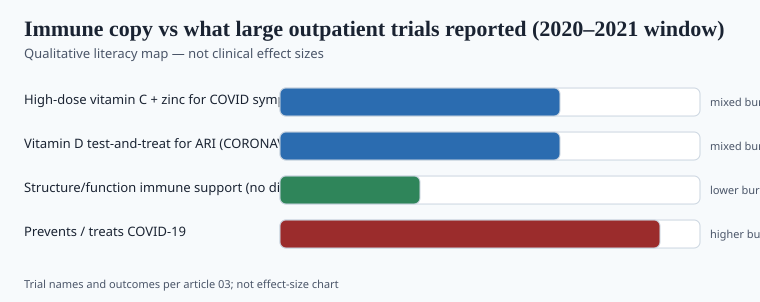
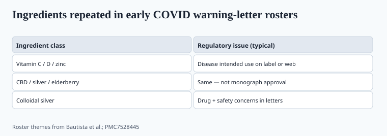

**Disclaimer.** Educational only. Not medical advice. Dietary supplements are not intended to diagnose, treat, cure, or prevent any disease (DSHEA; 21 U.S.C. § 321(ff); 21 CFR 101.93). This piece is about evidence quality and labeling, not about treating infection.

"Immune support" sold through the pandemic because it is a legal-looking phrase that a scared buyer can hear as something else. The research that published afterward was less elastic.

This is a hold / drop / still-open list. It is not a stack.

## The claim that got people letters

FDA's COVID product page and the Bautista 2020 letter review are the primary record. Vitamin C, vitamin D, zinc, elderberry, silver, and CBD were named again and again next to prevent/treat/cure language. Structure/function copy ("helps maintain immune function") was not the violation by itself. COVID intended use was.

If your 2026 PDP still has "defense against seasonal threats" with a virus icon, you are in the same neighborhood. Rewrite it or sit with counsel.

## Zinc and vitamin C — the trial that people actually ran

**COVID A to Z** (Thomas et al., *JAMA Network Open*, 12 February 2021; PMID 33576820). Outpatients with PCR-positive SARS-CoV-2. Open-label. Four arms: ascorbic acid 8,000 mg/day, zinc gluconate 50 mg at bedtime, both, or usual care. Planned ~520; stopped early for futility after 214. High-dose zinc, ascorbic acid, or both did **not** shorten symptom duration versus usual care.

That is one trial, one health system, high doses that also produce GI adverse events, not blinded. It is still the best US outpatient RCT we got for the two SKUs that emptied. It does not support a COVID-treatment claim. It also does not say a person with a documented zinc deficiency should stay deficient. Those are different sentences.

NIH ODS zinc and vitamin C fact sheets remain the adult baseline: zinc deficiency impairs immune function; excess zinc (≥40 mg/day UL for adults, and much higher acute doses) can cause copper deficiency and GI effects; vitamin C deficiency is scurvy; routine megadose C for community infections is not a settled prevention strategy. `[VERIFY]` any numeric UL you print against the current ODS page — they do edit.

## Vitamin D — two different questions

**Question 1: Does correcting deficiency matter for general health?** Yes, as a nutrient. ODS and Endocrine Society materials treat deficiency as a real, testable state. That is not a COVID claim.

**Question 2: Does giving vitamin D prevent or treat COVID-19?** The trials that were large enough to matter came back quiet.

CORONAVIT (Jolliffe et al., *BMJ* 2022; PMID 36215226; PMC9449358): UK adults, December 2020–June 2021, test-and-treat 800 IU or 3,200 IU versus no offer of testing. No reduction in all-cause acute respiratory infection or COVID-19. Phase 3, pragmatic, messy in the way pragmatic trials are (vaccination rolled in; not everyone who was offered testing took it). Still a miss on the endpoints people put on bottles.

A 2017 Martineau *BMJ* meta-analysis (pre-COVID) found a small reduction in acute respiratory infection risk, strongest with daily dosing in people who started deficient. Brands used that paper as a COVID poster in 2020. Using a 2017 ARI meta-analysis as a SARS-CoV-2 treatment claim is how you get a letter. Using it as "some evidence that daily vitamin D, in people who are low, may slightly reduce some respiratory infections" is closer to what the paper said — and still not a disease claim you should run next to a cart button without counsel.

VITAL's vitamin D arm (see piece 04) was not a COVID trial. Do not recruit it as one.

## Elderberry, quercetin, silver, "immune mushrooms"

**Elderberry.** Popular. Identity problems (piece 02). Clinical evidence for *influenza symptom duration* is small, older, and mixed; SARS-CoV-2 treatment evidence is not in the same league as COVID A to Z or CORONAVIT. `[CITE NEEDED]` before you write a specific elderberry efficacy number. Quality of the *material* is the 2020–2026 story that can be told without inventing a virology paper.

**Quercetin.** FRS's letter is the regulatory artifact. Mechanistic papers and in vitro work are not human COVID outcomes.

**Colloidal silver.** Appeared in 11 of the Bautista-coded letters. Not a nutrient. Not a structure/function you can defend. Do not carry it.

**Mushroom blends.** Beta-glucan research exists in other contexts. "Turkey tail / reishi COVID shield" does not. If you sell a mushroom SKU, sell species, part, extract ratio, and beta-glucan assay. Leave viruses off the page.

## What actually held

<!-- graphics-pack:v1 -->

*Figure 1. Qualitative map only — not effect sizes. Trial names and outcomes are in the body text.*

*Figure 2. Roster themes from Bautista et al. (PMC7528445); the violation was intended use, not the nutrient itself.*

*Figure 2. Roster themes from Bautista et al. (PMC7528445); the violation was intended use, not the nutrient itself.*

*Figure 2. Roster themes from Bautista et al. (PMC7528445); the violation was intended use, not the nutrient itself.*

Held, in the boring sense:

- **Deficiency is not a vibe.** Vitamin D, zinc, vitamin A, iron, B12 — if a person is low, that is a clinical problem. A supplement can be one way a clinician fills a gap. That sentence survived 2020.
- **Daily, modest vitamin D in people who are low** still has a literature for skeletal health and a *small, pre-COVID* ARI signal. It did not become a pandemic therapeutic.
- **Zinc lozenges for common cold duration** is an older, messy literature (ion, dose, start time). It is not a SARS-CoV-2 literature. Do not blend them.
- **Sleep, vaccination, and ventilation** moved outcomes more than any capsule. That is not a supplement claim. It is why a serious brand does not pretend it is in that business.

Did not hold:

- High-dose C + zinc as outpatient COVID therapy (COVID A to Z).
- Population test-and-treat vitamin D as COVID/ARI prevention (CORONAVIT).
- Any botanical "protocol" sold as unapproved antiviral.

Still open:

- Very deficient subgroups, different doses, different endpoints (hospitalization vs infection vs smell). Those papers, if they exist and are large, belong in a revision of this draft with their PMIDs. Do not fill the gap with a podcast.

## How to write the label in 2026

Allowed shape, if you have the substantiation file: "Vitamin D contributes to the maintenance of normal immune function" — and then you check whether *that exact wording* is a notified structure/function claim you can defend, plus the DSHEA disclaimer.

Not allowed: virus names, case-count charts, "what I took when I tested positive," bundle names like "COVID Protection Pack" (that phrase appeared in FDA's own letter table).

## What changed since 2020 (box)

In 2020 the category sold hope in a bottle because RCTs had not reported. By 2022 the two RCTs most people can name for C/zinc and for vitamin D-as-COVID-prevention had reported, and they were null on their primary endpoints. The structure/function lane is still open. The disease lane is still closed. The difference is that you can no longer say "the trials haven't been done." Some of them have.
