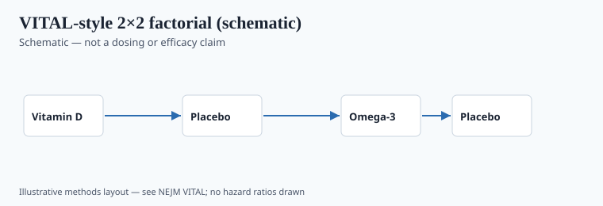
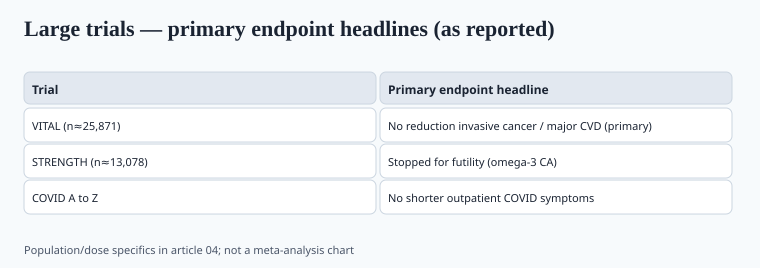

**Disclaimer.** Educational only. Not medical advice. Dietary supplements are not intended to diagnose, treat, cure, or prevent any disease (DSHEA; 21 U.S.C. § 321(ff); 21 CFR 101.93). Prescription fish-oil drugs are not dietary supplements.

Three ingredients did more retail volume after 2020 than almost anything else that is not protein. They also accumulated large, named trials. This is the scorecard. Read the drug trials as drug trials.

## Vitamin D3 — VITAL first, then COVID

<!-- graphics-pack:v1 -->

*Figure 1. Illustrative VITAL-style factorial — see NEJM methods for the published design. No hazard ratios drawn.*

**VITAL** (Manson et al., *NEJM* 2019; PMID 31173679; n = 25,871 US adults, men ≥50, women ≥55). Factorial: vitamin D3 2,000 IU/day and/or marine omega-3 1 g/day. Median intervention 5.3 years. Vitamin D did **not** significantly reduce invasive cancer (HR 0.96, 95% CI 0.88–1.06) or major CVD events (HR 0.97, 95% CI 0.85–1.12). All-cause mortality HR 0.99 (0.87–1.12).

A later writeup (Manson et al., PMC7089819) flagged a possible cancer-*mortality* signal after excluding early follow-up (HR 0.75, 0.59–0.96 when the first two years were dropped). That is a secondary, latency-sensitive analysis. It is not a license to put "cuts cancer deaths" on a 2,000 IU softgel. VITAL observational follow-up is listed on ClinicalTrials.gov through 2026 (`NCT01169259`). Wait for those papers before you update this paragraph.

**CORONAVIT** (Jolliffe, *BMJ* 2022; PMID 36215226): test-and-treat vitamin D did not reduce ARI or COVID-19 in UK adults over a 2020–21 winter. See piece 03.

**What a 2026 label can carry.** Nutrient content. "Helps maintain vitamin D status." Bone and muscle structure/function language *if* your substantiation file matches ODS/Endocrine Society-type evidence and counsel signs it. Not: cancer, COVID, "the sunshine vitamin vs. the virus."

People with documented deficiency still need a clinician and a lab value. Population RCTs in already-replete older US adults are a poor way to argue about a 25(OH)D of 12 ng/mL.

## Zinc — one honest COVID RCT, an older cold literature

COVID A to Z (PMID 33576820): 50 mg zinc gluconate at bedtime, 10 days, outpatients, no shorter symptoms. That is the 2021 paper.

The common-cold zinc-lozenge literature is older than this pack's window. It is heterogeneous (acetate vs gluconate, start within 24 hours, taste-blindness). ODS summarizes it without turning it into a standard of care. Do not drag those papers onto a COVID PDP.

Adult UL is 40 mg elemental zinc/day from all sources (ODS). A 50 mg gluconate tablet is already a study dose, not a candy. Chronic high intake and copper deficiency is a real toxicology story. If you sell 50 mg, you need a reason and a warning set, not a "more is more" Amazon title.

## Omega-3 — do not average the drugs into the softgel

<!-- graphics-pack:v1 -->

*Figure 2. Headline primary outcomes only; dose and population details stay in the sections above.*

Three large objects get mashed together in marketing. They are not the same product.

**VITAL omega-3 arm** (Manson et al., *NEJM* 2019; PMID 30415628). 1 g/day Omacor-type fish oil (840 mg EPA+DHA: 460/380). Primary CVD composite: no significant reduction. Invasive cancer: no significant reduction. Some secondary coronary signals were discussed in the paper; they are not the primary endpoint.

**STRENGTH** (Nicholls et al., *JAMA* 2020; PMID 33190147). 13,078 statin-treated high-risk patients. 4 g/day omega-3 carboxylic acids (EPA+DHA) vs corn oil. Stopped for futility (DMC, January 2020; last visit May 2020). Primary MACE HR 0.99 (0.90–1.09). More atrial fibrillation and more GI events on the omega-3 side. This is a *drug-dose* mixed EPA/DHA carboxylic acid, not a 300 mg supermarket softgel.

**REDUCE-IT** (Bhatt et al., *NEJM* 2019; PMID 30415637). Icosapent ethyl 4 g/day (purified EPA, prescription Vascepa) vs mineral oil in statin-treated patients with elevated triglycerides. Primary endpoint hit. That product is a drug. The comparator (mineral oil) has been argued about since the day the paper published. Neither fact turns a mixed-triglyceride fish oil supplement into Vascepa.

**How to talk about this on a supplement site.** You can talk about EPA and DHA as fats people under-eat if they do not eat fish. You can talk about triglyceride structure/function *carefully*, with the file and the disclaimer. You cannot take REDUCE-IT's hazard ratio and drop it under a 1 g softgel. You cannot ignore STRENGTH and VITAL when a buyer asks "does fish oil stop heart attacks."

Atrial fibrillation signals at *drug doses* in STRENGTH and in some EPA trials belong in the honesty column. `[VERIFY]` the exact AF rates from the STRENGTH paper before you quote them in a comparison chart.

REDUCE-IT used mineral oil as placebo; STRENGTH used corn oil. That comparator fight is why you cannot treat the two 4 g trials as a simple "EPA works, EPA+DHA doesn't" slogan without reading the letters in *JAMA* and *NEJM* that followed. A 1 g supplement trial (VITAL) is a third design. Three designs, three products, one word ("omega-3") on the shelf. The word is doing too much work.

## What changed since 2020 (box)

| Object | Status in Jan 2020 | Status now |
| --- | --- | --- |
| VITAL D + O3 primaries | Just published (late 2018–2019) | Still the primary-prevention anchor; follow-up ongoing |
| STRENGTH | Ending / futility | Published Nov 2020; null at 4 g mixed CA |
| REDUCE-IT | Already out | Still a **drug** EPA story |
| Zinc + C for COVID | Anecdote | COVID A to Z null (2021) |
| D for COVID prevention | Hypothesis | CORONAVIT null (2022) |

## Operator file

Keep four PDFs in the brand folder: both VITAL *NEJM* papers, STRENGTH, REDUCE-IT. Add COVID A to Z and CORONAVIT if you sell D, C, or zinc. When marketing writes "heart healthy omega-3," make them say which paper they think they are citing. If they say REDUCE-IT, the SKU has to be a drug, which it is not.

ODS professional fact sheets are the public-facing ballast. They update. Bind a dated printout to the substantiation file so you know *which* ODS text you relied on.

Zinc, vitamin D, and EPA/DHA are still nutrients. The last six years mainly removed permission to treat them as broad-spectrum disease products. That is a better business, if you can stand the quieter copy.
