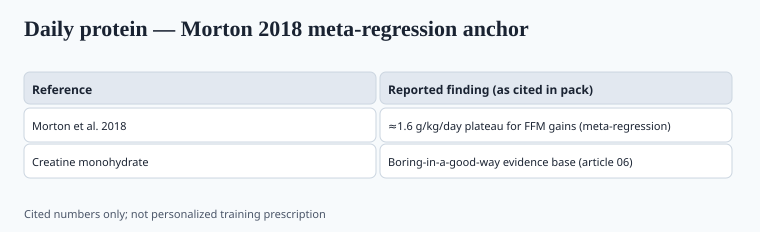
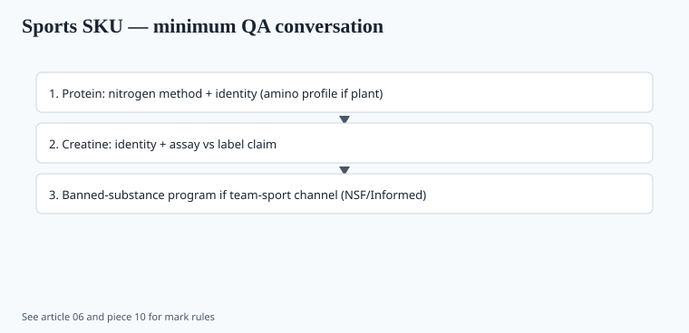

**Disclaimer.** Educational only. Not medical advice. Dietary supplements are not intended to diagnose, treat, cure, or prevent any disease (DSHEA; 21 U.S.C. § 321(ff); 21 CFR 101.93). This is not a prescription for kidney disease, diabetes, or sarcopenia treatment.

Sports nutrition is where supplement evidence looks most like sports nutrition and least like a COVID stack. The molecules did not change. The 2020–2026 papers mostly added who the effect is smaller in.

## Protein: the plateau people still argue with

<!-- graphics-pack:v1 -->

*Figure 1. Cited anchor from the sports literature — not individualized training or medical advice.*

Morton, Murphy, McKellar et al., *BJSM* 2018 (PMID 28698222). 49 RCTs, 1,863 participants. Protein supplementation during resistance training added a little: ~2.5 kg on 1RM, ~0.30 kg fat-free mass, some muscle-fiber CSA. Meta-regression: **no further FFM gain past a total daily protein of about 1.62 g/kg/day.** The authors noted a pragmatic ceiling near ~2.2 g/kg for people who want margin. Trained lifters gained more from powder than untrained. Older adults gained less.

That paper is pre-2020. It is still the one a serious formulator should be able to quote from memory. The post-2020 argument has been about peri-workout timing (mostly overrated once daily totals are hit), vegan vs whey (totals and leucine, not a moral category), and whether very high intakes do anything except raise grocery bills. I will not invent a 2024 meta to settle timing. `[CITE NEEDED]` if you want a specific new number.

ISSN's protein position stand (Jäger et al., 2017; PMID 28642676) sits in the same era: higher intakes for athletes than the RDA, emphasis on complete protein and dose per meal. RDA (0.8 g/kg) is a *minimum to prevent deficiency*, not a hypertrophy target. Those are different design problems.

**Label consequences.** A 25 g whey isolate scoop is a food-like SKU. The lie is usually "50% more muscle" or a stolen Morton number applied to a 10-day challenge. Heavy metals in some plant and cocoa-heavy proteins are a testing story (piece 10), not an efficacy story.

## Creatine monohydrate: still the form

Kreider et al., ISSN 2017 position stand (PMID 28615996; PMC5469049): creatine monohydrate is the form with the weight of evidence for high-intensity performance and lean mass. Loading ~0.3 g/kg/day for 5–7 days then 3–5 g/day, or skip load and take 3–5 g/day. Safety in healthy users: the stand did not find a compelling kidney-damage signal at those doses. People with established kidney disease are a clinician's problem, not a Reddit thread.

"Creatine HCl," ethyl ester, buffered creatine — usually a solubility or patent story. If you sell them, you need *comparative* human data, not a pH graph. Most of the literature that built the ISSN stand is monohydrate.

## What 2024–2025 added

A *Nutrients* systematic review and meta-analysis (2025, 17(17), 2748) pooled 69 RCTs (1,937 people) on creatine plus training vs placebo. Small but statistically significant bumps: bench/chest press +1.43 kg, squat +5.64 kg, vertical jump +1.48 cm, Wingate peak +47.8 W. Leg press and handgrip did not clear significance in the main model. **Subgroups:** younger adults showed the strength increases; older adults as a group did not in that split. Men showed several of the power/strength increases; **women as a group did not** in that analysis.

Read that twice before you write a women's creatine ad. It is not "creatine does nothing in women." It is: this pool, these endpoints, this split, no significant mean effect. Women were underrepresented in the creatine literature for decades. A 2025 meta cannot invent the missing trials. It can stop you from pasting male point estimates onto a pink tub.

A 2025 *JISSN* dose-response meta (doi 10.1080/15502783.2025.2586523) looked at body-mass and FFM in trained vs untrained lifters. Both groups gained body mass and FFM on creatine plus training; between-group differences were small. I am not going to over-quote their kilograms here — open the paper if you put them on a spec sheet. `[VERIFY]` any exact FFM delta against the table.

Cognitive creatine (sleep deprivation, vegetarian, older adults) is an active 2020s literature. It is thinner than the squat literature. Do not lead a sports SKU with IQ points.

## What did not happen

Creatine did not get reclassified as a steroid. It did not start requiring a REMS. The "it wrecks kidneys" meme did not acquire a new ISSN-level paper that I am willing to treat as decisive for healthy users. If a customer has a rising creatinine *because they take creatine*, that is a known assay interference / metabolic fact; it is why you do not diagnose kidney failure off one number in a lifter without a clinician.

Protein did not become toxic at 1.6–2.2 g/kg in healthy athletes in the Morton range. People with CKD are, again, not that population.

## Operator notes

<!-- graphics-pack:v1 -->

*Figure 2. Minimum QA conversation for team-sport and retail buyers.*

- **Monohydrate, Creapure or equivalent CoA, mesh size, residual solvents, dicyandiamide, dihydrotriazine.** Sports buyers know those words now. Have the tests.
- **Informed-Sport / NSF Certified for Sport** if the SKU will see tested athletes. A "banned-substance free" sticker you designed in Canva is a joke (piece 10).
- **Women's line:** sell the same 3–5 g monohydrate. Say the evidence base is still male-heavy. Do not invent a "female-optimized" ester.
- **Protein:** assay (Kjeldahl vs Dumas vs amino acid) and amino-spiking. If the nitrogen is high and the leucine is low, someone added glycine or taurine. That scandal is older than COVID and it is not gone.

## What changed since 2020 (box)

The molecules were already settled. The refresh is honesty about effect size (small-to-moderate, training-dependent) and about who was in the trials. A 1.4 kg bench increase in a meta is real and also not a transformation. Write it that way. The brand that survives a Reddit audit is the one that never promised a transformation.
