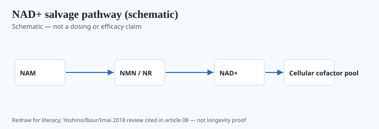
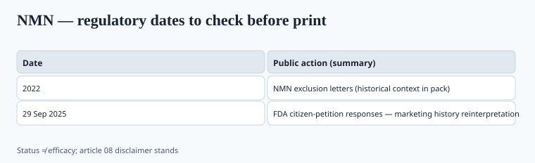

**Disclaimer.** Educational only. Not medical advice. Dietary supplements are not intended to diagnose, treat, cure, or prevent any disease (DSHEA; 21 U.S.C. § 321(ff); 21 CFR 101.93). NMN is not an approved longevity medicine.

The NAD shelf sold a feeling: a battery icon, a mouse paper, a founder in a black t-shirt. The FDA chapter is more interesting than the ads, and the human chapter is thinner than both.

## The biochemistry in one paragraph

<!-- graphics-pack:v1 -->

*Figure 1. Biochemistry schematic for literacy (Yoshino, Baur, Imai 2018 review). Raising NAD+ is not the same as reversing aging.*

## The human evidence, without the keynote

**Yoshino M et al., *Science* 2021 (PMID 33888596).** NMN in postmenopausal women with prediabetes. Metabolic endpoints (including muscle insulin sensitivity) — a physiology paper, modest n, specific population. Not a lifespan trial. Not "women lost 10 years of age."

Other NR/NMN trials through the mid-2020s generally show: NAD+ metabolome moves; some mixed signals on exercise, lipids, or blood pressure; no demonstration that a 50-year-old buyer lives longer. I will not fake a 2024 mega-trial. `[CITE NEEDED]` before you quote a specific % NAD+ rise from a brand white paper.

Safety: flushing and GI effects show up; long-horizon human safety at gram doses is not a VITAL-sized file. People with active malignancy sometimes get told by clinicians to be cautious with NAD-boosting logic. That is a clinic conversation. It is not a "NMN causes cancer" slogan and not a "NMN prevents cancer" slogan.

NR (nicotinamide riboside, often as chloride, Niagen-class) had a cleaner *early* US commerce path than NMN and its own human NAD-metabolome papers. It is still not a lifespan drug. Do not treat NR and NMN as interchangeable on a label: different article, different NDIN file, different assay. Nicotinamide (niacinamide) is cheaper and is already a form of vitamin B3 with a UL. Some "NAD complex" SKUs are mostly nicotinamide with a dusting of NMN. Assay all three if you print all three.

## The regulatory plot, which actually has dates

<!-- graphics-pack:v1 -->

*Figure 2. Agency status with dates — not an efficacy claim.*

## Copy that is already false

- "FDA-approved NMN." No.
- "NMN is illegal" as of October 2025. Not what the 29 September letters say — but **your** NMN still needs an NDIN theory and a safety file.
- "Clinically proven to reverse aging." There is no such human endpoint in the papers above.
- "Same as a David Sinclair protocol." Celebrity stacks are not substantiation.
- NAD+ injections / IV bars as if they inherited oral NMN papers. Different product, different law.

## If you still want a SKU

1. Read the 29 September 2025 PDFs. Do not brief the team from a Twitter screenshot.
2. Counsel on NDIN: same supplier who filed, or your own notification. "Someone else's NDIN" is a fact pattern, not a feeling.
3. Assay: NMN vs nicotinamide vs degraded stuff. Stability in a bottle in a hot warehouse. Chiral / beta-NMN identity.
4. Structure/function only, and even that is thin. "Supports cellular NAD+ metabolism" is the most I would even take to counsel, with the Yoshino-class papers in the folder. I would not put a birthday-clock graphic on the PDP.
5. Leave the science/QA seat for someone who can say no.

## What changed since 2020 (box)

2020: NMN was a gray-market star with mouse papers. 2022: FDA used the drug-exclusion clause like a trap door. 2025: FDA reopened the door on a statutory-timing theory and left the NDI and evidence problems on the table. The ads barely blinked. Your file has to.

Urolithin A, spermidine, fisetin, "senolytic" blends: same marketing shape, different evidence and different status questions. I am not going to fake a 2025 consensus that any of them extend human life. If a SKU's only substantiation is a mouse survival curve and a founder keynote, it does not belong next to creatine in your catalog.

Longevity as a *category* will keep minting molecules that run the same race. The NMN docket is the training set. Learn it once.
