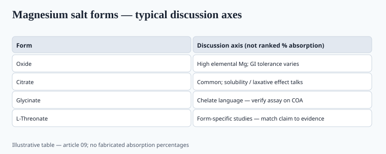
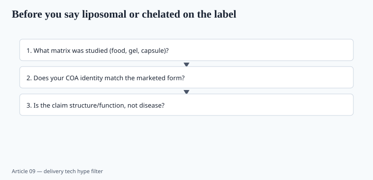

**Disclaimer.** Educational only. Not medical advice. Dietary supplements are not intended to diagnose, treat, cure, or prevent any disease (DSHEA; 21 U.S.C. § 321(ff); 21 CFR 101.93).

"Enhanced absorption" is the easiest claim to write and one of the harder ones to prove in the matrix you actually bottle. The 2020s made liposomes glamorous because COVID-era brands needed a differentiator that was not a virus name. Magnesium just kept accumulating salt-vs-salt arguments.

## What bioavailability means when you are not a PK lab

For a nutrient, the useful questions are: how much of the labeled elemental dose shows up in plasma, urine, or a tissue proxy; whether that difference matters for an outcome (not just a Cmax); and whether the form changes GI tolerance so people actually take it.

A dissolution cup is not a human PK study. A cell-monolayer paper is not a human PK study. A "4x absorption" graph without a citation is art.

## Magnesium — forms that have a file

<!-- graphics-pack:v1 -->

*Figure 1. Form literacy table — no fabricated % absorption bars.*

## Chelates — chemistry, not a halo

An amino-acid chelate (bisglycinate, etc.) is a defined coordination structure if the manufacturer actually made one. "Amino acid chelate" on a spec sheet can also mean a blend of oxide plus glycine in a ribbon blender. Ask for:

- Molar ratio and a method that distinguishes true chelate from a physical mix (FTIR, the supplier's validated method — and a second lab if the SKU is expensive).
- Elemental assay, not just "500 mg magnesium chelate" (of what?).
- Residual free ligand, heavy metals, and the usual Part 111 identity.

Iron bisglycinate has a better human file than most wellness chelates (tolerance vs ferrous sulfate). Do not import iron's data onto zinc, copper, or "cal-mag zinc."

## Liposomes — a delivery idea that outran the citations

<!-- graphics-pack:v1 -->

*Figure 2. Delivery-tech hype filter before art goes to the printer.*

## Other form fights worth having

- **Folate vs folic acid vs methylfolate.** Different molecules. MTHFR marketing is usually ahead of the clinical need. Piece 13.
- **Vitamin D2 vs D3.** D3 raises 25(OH)D more efficiently in most humans. That is older than this pack.
- **Omega-3 triglycerides vs ethyl esters vs phospholipids.** EE need a fatty meal; the REDUCE-IT/STRENGTH products are *drugs* at 4 g (piece 04). A krill oil SKU does not inherit Vascepa.
- **Curcumin with piperine vs phytosome vs "self-emulsifying."** Piperine changes metabolism of *other drugs* too. That is a safety fact, not a boast.

## A buying rule for "better absorbed"

| Claim on the carton | What you need in the folder |
| --- | --- |
| Named salt (citrate, glycinate) | Elemental math + a human comparison or a review like Schuchardt |
| Chelate | Proof it is a chelate + elemental + metals |
| Liposomal | Particle size, encapsulation, stability, and a human PK on that formula — or drop the multiplier |
| "4x more bioavailable" | The paper, the dose, the comparator, the interval. No paper, no number |

## What changed since 2020 (box)

Liposomal left the fringe and became a default adjective on immune SKUs. The PK file did not grow at the same rate. Magnesium glycinate ate oxide's market share in DTC because people hated the bathroom, which is a legitimate tolerance reason. The dishonest move was turning tolerance into a brain-drug story.

If you are white-labeling, pick one form you can assay and explain in a sentence. "Liposomal magnesium threonate glycinate complex" is how you fail a COA review and a Reddit thread on the same day.
