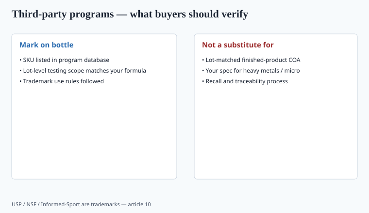
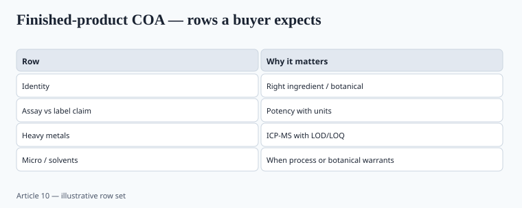

**Disclaimer.** Educational only. Not medical advice. Dietary supplements are not intended to diagnose, treat, cure, or prevent any disease (DSHEA; 21 U.S.C. § 321(ff); 21 CFR 101.93).

"Third-party tested" is the most abused three-word phrase in this trade. It can mean USP Verified on the current lot. It can mean a nephew with an XRF gun. Buyers cannot tell. You can.

## Part 111 is the floor

21 CFR 111 already requires specifications and testing for identity, purity, strength, and composition, plus limits on contaminants. You must test incoming dietary ingredients or qualify the supplier with appropriate verification. You must test finished batches or run a scientifically valid skip-lot program. The COA is how you prove you did it. The regulation does not require a consumer-facing seal.

If you cannot survive an FDA inspection on Part 111, a gold logo will not help.

## Heavy metals — the 2020s consumer story

Lead, arsenic, cadmium, mercury. Botanicals, protein powders (especially plant/cocoa), calcium, and Ayurvedic-adjacent herbs keep showing up in press tests.

Consumer Reports published a protein-powder/shake investigation on 14 October 2025 (updated 8 January 2026): 23 products, samples bought November 2024–January 2025, protein by Dumas (AOAC 968.06), metals by triple-quad ICP-MS (AOAC 2015.01). About 70% of those products were above CR's own lead "level of concern" of 0.5 mcg/day *in one serving*. Plant-based powders ran higher on average than dairy in that set. CR named high-lead examples (Naked Nutrition Vegan Mass Gainer 7.7 mcg lead/serving; Huel Black Edition 6.3 mcg lead and 9.2 mcg cadmium) and later published a second, smaller round of reader-requested powders that came in lower. Those numbers are **CR's benchmark, not an FDA tolerance**. FDA still has no binding lead limit for protein powder. Do not reprint a named SKU on your site without re-opening CR's table — they update, and a 2025 lot is not a 2026 lot.

Clean Label Project has run similar consumer tests. Treat them as press tests — useful pressure, not your release spec.

**Prop 65 (California).** OEHHA's list and safe-harbor levels are not federal GMPs. They are a warning statute with a plaintiff's bar. A lot that is "fine" under a USP <2232> or internal spec can still be a Prop 65 problem for lead. If you ship to CA, model the warning decision with counsel. Do not put "heavy-metal free" on a cacao protein.

**Methods.** ICP-MS is the adult method for these four. Units (mcg/day vs mcg/g vs ppm) have to match the spec. LOD/LOQ on the COA. A lab that only reports "ND" with no LOQ has given you a poster, not a result.

## The three marks people mean when they are being precise

<!-- graphics-pack:v1 -->

*Figure 1. USP, NSF, and Informed-Sport are trademarks — use only when the SKU is in-program.*

### USP Verified (dietary supplement program)

USP audits the facility, checks GMP, tests products against USP standards (identity, potency, contaminants, disintegration), and does marketplace surveillance. The mark is for **specific SKUs** that stay in the program. Look up the product in USP's verified directory. A factory that "follows USP" is not USP Verified. USP monographs and the Verification Program are related and not identical.

### NSF Certified for Sport

NSF's sport mark is about banned substances (the WADA/NFL/MLB-type lists NSF uses), plus contents and manufacturing. Lots are tested. The certified-product search is the source of truth. Athletes and teams actually use this. "NSF registered" on a facility is a different, weaker sentence than "this bottle is Certified for Sport."

### Informed-Sport (LGC)

Batch testing against a banned-substance screen, plus manufacturing quality components. The Informed-Sport site lists certified products. Informed-Choice is a sibling mark with a different sampling intensity. Do not swap the names.

**None of these marks mean "the ingredient treats a disease."** They mean a program was paid for, a standard was applied, and (if current) the SKU is in the database.

## What a finished-product COA has to have

<!-- graphics-pack:v1 -->

*Figure 2. Row set for buyer literacy — your spec column still has to exist in the MMR.*

Piece 16 goes deeper. The short list:

- Your product name, lot, date, spec version.
- Identity test (and method).
- Assay for each dietary ingredient you claim, with method and spec.
- Micro (TAMC, TYMC, pathogens as specified).
- Heavy metals by ICP-MS.
- Residual solvents if you used extracts/excipients that warrant USP <467>.
- Pesticides on botanicals.
- Lab name, ISO/IEC 17025 accreditation scope that **covers these methods**, signature.

A supplier COA for "ashwagandha 5%" that does not match your lot, your label claim, or a method you understand is raw-material paperwork. It is not a finished-product release.

## Theater

- Seal you drew that says "GMP certified" with no registrar.
- "FDA registered facility" (most food facilities file; it is not an approval).
- Last year's NSF certificate on this year's reformulation.
- Testing one lot in 2021 and quoting it in 2026.
- Sending the competitor's product to a lab and implying you test every lot the same way without doing it.

## What changed since 2020 (box)

Retailers and platforms asked for more PDFs. Some brands got real ISO 17025 programs. Some got better at PDFs. Athletes already knew NSF/Informed-Sport; DTC protein and sleep brands started borrowing the language without joining the programs. Prop 65 did not relax.

USP <2232> (elemental contaminants in dietary supplements) and Prop 65 are different rulers. A lot can pass an internal <2232>-style spec and still trigger a CA warning at your serving. Model both before you print "meets USP" — and do not print that unless you mean a monograph *or* the Verification Program, which you should name.

If you can afford one consumer mark, pick the one your buyer can search. If you cannot afford one yet, publish the redacted finished-product COA with methods. That is more adult than a fake badge, and it leaves a clean seat for a future QA hire to tighten the specs.
