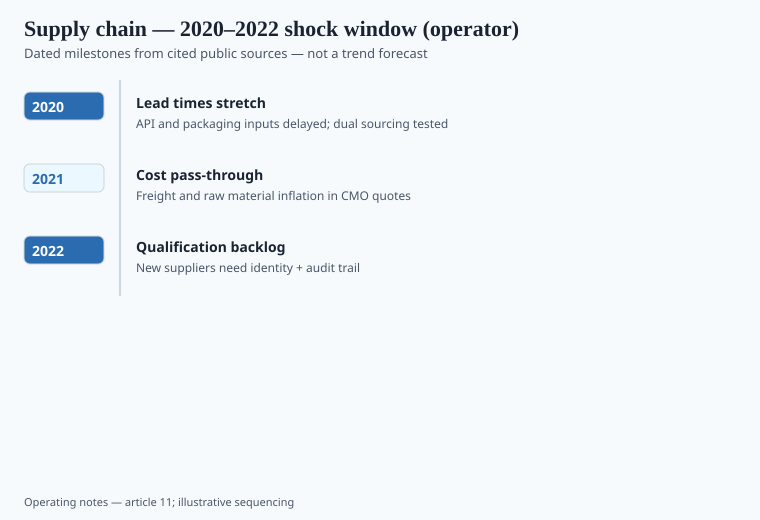
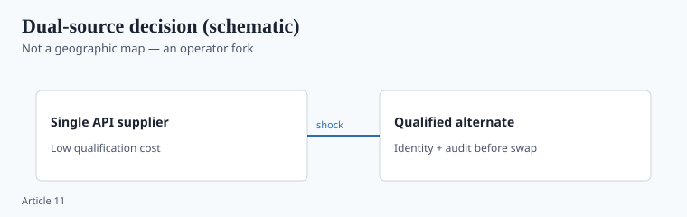

**Disclaimer.** Educational only. Not medical advice. Dietary supplements are not intended to diagnose, treat, cure, or prevent any disease (DSHEA; 21 U.S.C. § 321(ff); 21 CFR 101.93).

The science pieces in this pack are about papers. This one is about drums that did not arrive, drums that arrived too cheap, and bottles that sat in Long Beach.

I do not have a single federal time series that says "vitamin D3 API lead time went from 6 weeks to 22." Trade memory and plant interviews are the record. Where I lack a number, the flag stays on.

## What actually broke

<!-- graphics-pack:v1 -->

*Figure 1. Illustrative sequencing of lead-time, cost, and qualification backlog themes.*

## Failure modes I would underwrite

1. **Single-source API, single broker.** No second assay lab. When the broker's plant went offline, purchasing took an equivalent from Alibaba-adjacent email. The COA font did not match last year's.
2. **Hot lots and short lots.** Vitamin D3 in IU is easy to mis-weigh in a trituration. A new operator and a rushed batch record is how you 2× a label claim — or ship 60%.
3. **Excipient swap without a protocol.** Magnesium stearate to stearic acid, or a different HPMC viscosity, to keep the press running. Dissolution changes. You do not see it unless you test the finished tablet.
4. **3PL heat.** A probiotic or an omega-3 in a non-climate warehouse in July. Stability protocol assumed 25 °C.
5. **Label artwork frozen while the formula moved.** "Contains soy" off the label after a lecithin swap — or still on it after you removed lecithin.

## What a dual-source program looks like when it is real

<!-- graphics-pack:v1 -->

*Figure 2. Dual-source is identity plus audit trail, not a second phone number.*

## Lessons that are still true in 2026

Empty-capsule and softgel shell shortages pushed brands from oil-in-softgel to "powdered oil" or to a different fill weight. EPA/DHA milligrams on the label have to move with the fill, or you are short. Softgel leaks in summer freight are an oxidation problem (PV / p-AV / TOTOX on retain), not a customer-service problem.

The pandemic was a stress test of paperwork. Brands that already had lot genealogy, retained samples, and a second lab used them. Brands that had a Shopify theme and a broker learned what a CMO queue feels like.

White-label founders keep repeating the same miss: they price the landed bottle at 2019 freight and 2019 elderberry, then they accept a 2026 "equivalent extract" to hold margin. That bottle is how you buy a heavy-metal story or a withanolide miss.

If you only take one habit from 2020–2022: **when price or lead time jumps, testing increases, it does not decrease.** The market is offering you a cheaper drum for a reason.

## What changed since 2020 (box)

Ports cleared. API prices mean-reverted on some vitamins and stayed structurally higher on some botanicals. `[VERIFY]` any current price you cite against a supplier quote, not this paragraph. The inspection force came back, but it did not come back larger in any way I would bet a brand on. Dual-source and real incoming ID are still the cheap insurance. They look expensive only in the years nothing breaks.
