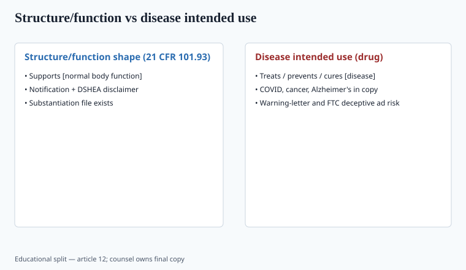
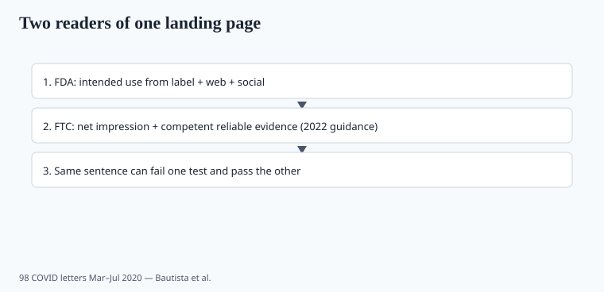

**Disclaimer.** Educational only. Not medical advice. Dietary supplements are not intended to diagnose, treat, cure, or prevent any disease (DSHEA; 21 U.S.C. § 321(ff); 21 CFR 101.93). This is not legal advice.

Two agencies, two statutes, one landing page. Founders still write as if FDA were the only reader. FTC reads ads. FDA reads intended use. The COVID years made both of them faster.

## The split, without a diagram

<!-- graphics-pack:v1 -->

*Figure 1. Educational split under DSHEA and FD&C intended-use rules — counsel owns final copy.*

**FDA (FD&C Act).** A dietary supplement that is *intended* to diagnose, cure, mitigate, treat, or prevent disease is a drug. Intended use is assembled from the four corners of the internet you paid for. Structure/function claims are a defined exception (21 U.S.C. § 343(r)(6); 21 CFR 101.93): they must be truthful, not misleading, substantiated, notified to FDA within 30 days, and paired with the exact-enough disclaimer that the statement has not been evaluated by FDA and the product is not intended to diagnose, treat, cure, or prevent any disease.

**FTC (FTC Act).** Advertising must be truthful and not misleading. Health claims need competent and reliable scientific evidence. In December 2022 FTC issued *Health Products Compliance Guidance*, which replaced the 1998 dietary-supplement advertising guide. The 2022 document is broader (foods, apps, devices, CBD ads) and more explicit that the evidence must match the claim *as consumers take it*, not as your toxicologist footnotes it.

A claim can satisfy 101.93's paperwork and still fail FTC. A claim can be silent on disease and still be deceptive if the before/after photo does the work.

## What the COVID letters taught, mechanically

<!-- graphics-pack:v1 -->

*Figure 2. FDA and FTC both read what you publish; 98 COVID-focused letters Mar–Jul 2020 (Bautista et al.).*

Bautista et al. (PMC7528445): 98 COVID-focused letters, March–July 2020. Most products reclassified as drugs. Vitamin C, CBD, D, silver, elderberry, zinc.

FRS International, 15 June 2020, letter 606701: quercetin chews, websites plus Facebook, FDA and FTC reviewing together. That dual header is the model. Do not celebrate "FDA didn't email us" if your Meta ads would make an FTC attorney lean forward.

Mercola.com, 18 February 2021, letter 607133: liposomal C, liposomal D3, quercetin/pterostilbene, COVID intended use. Dosage-form adjectives did not help.

FDA's fraudulent-COVID-products page kept the roster current. Firms were told they would be added to a public list. That list is a procurement problem (retailers, payment processors) as much as a legal one.

## FTC 2022, the sentences that matter for a PDP

I am paraphrasing; the PDF is the source.

- The standard is competent and reliable scientific evidence, typically well-controlled human studies.
- The claim includes what the *net impression* says. A disclaimer at the footer does not always cure a headline.
- "Clinically proven," "studies show," and doctor actors are claim engines.
- Disease-adjacent words (virus, tumor, Alzheimer's, depression) are how you leave the supplement lane.
- Testimonials need the same substantiation as if you said it in your own voice.

The 2022 guidance is also where "personalized" and app-adjacent health claims should be read. If your quiz outputs a disease story, the quiz is labeling.

## Structure/function that still works, if the file exists

Examples of *shapes*, not blessed copy:

- "Helps maintain healthy immune function" — nutrient file, no pathogen.
- "Supports muscle recovery after resistance exercise" — creatine/protein file, no "treats sarcopenia."
- "Helps fill a dietary magnesium gap" — intake data, no "cures insomnia."

Notification: 30 days, the 101.93 format, keep the receipt. Brands skip this and then act shocked. FDA's structure/function guidance still lists implied-disease patterns (the old 2000 "Structure/Function Claims, Small Entity Compliance Guide" is the ancestor): citation of a study on a disease population, "helpful for people with X," symptom lists that only make sense as disease. The 2020 letters were that logic at pandemic speed.

Joint FDA/FTC COVID letters also taught platforms. Amazon's catalog is not a statute, but a takedown will ruin a quarter as surely as a letter. `[VERIFY]` the live Amazon dietary-supplement and prohibited-claims pages before you brief a seller-central SOP; they move.

Implied disease: "after your positive test," "seasonal shield," a caduceus over a coronavirus illustration, a bundle named for a condition. FDA has seen all of these.

## NMN, NAC, CBD — claims sit on status

Status (can it be a supplement at all?) is piece 08 and piece 14. Claims are this piece. Even a lawful ingredient becomes a drug with the wrong sentence. NAC's enforcement discretion **explicitly dies** on disease intended use. CBD never entered the supplement definition in FDA's 2023 view. NMN's 2025 letters are about exclusion, not about "reverse aging" being fine now.

## Process that keeps you out of the 98

1. Write the PDP. Then highlight every health verb. Each highlight needs a paper and a 101.93 home, or it goes.
2. Run the same highlighter on Amazon bullets, emails, affiliate scripts, and the founder podcast.
3. Counsel + a science/QA seat before the first paid ad. Empty seat is better than a fake MD byline.
4. Keep the warning-letter RSS in the marketing Slack. Shame is a control.

## What changed since 2020 (box)

The statute was not rewritten. The *sample size* of letters about ordinary vitamins was. FTC then updated the advertising guide for the first time in a generation. If your claims SOP is still a 2016 blog post about "the disclaimer protects us," the SOP is the risk.

`CLAIMS_GUARDRAILS.md` is the brand-facing list. This article is the why.
