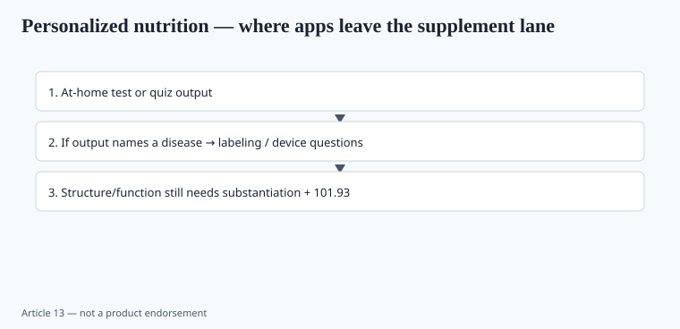
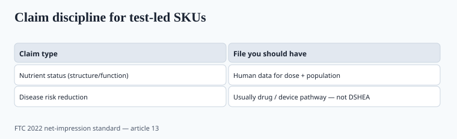

**Disclaimer.** Educational only. Not medical advice. Dietary supplements are not intended to diagnose, treat, cure, or prevent any disease (DSHEA; 21 U.S.C. § 321(ff); 21 CFR 101.93). At-home tests are not a substitute for a clinician. This is not an instruction to diagnose deficiency or disease from a kit.

The pitch writes itself: your genes, your glucose curve, your microbiome — therefore this SKU. Some of the measurement science is real. The last leap (kit → capsule as if it were a prescription) is where brands keep lying.

## PREDICT: the paper, not the app ad

Berry et al., *Nature Medicine* 2020 (PMID 32528151), PREDICT 1: a large nutritional study (twins and unrelated adults) showing that postprandial triglyceride, glucose, and insulin responses to the same meals vary a lot between people, and that models using personal data can predict some of that variation better than generic tables. That is a *meal-response* paper. It is evidence that "eat this, not that" at the population level is crude.

It is not evidence that a DTC brand's 12-question quiz plus a $79 probiotic is personalized medicine. ZOE and other products built on PREDICT-class science are their own stack of validation. If you are not them, do not put their AUC graphs in your Amazon A+.

Later PREDICT papers and app papers exist. `[CITE NEEDED]` before you quote a specific incremental R² or a weight-loss endpoint from a consumer program.

## Genetics: MTHFR and the rest of the merch

DTC SNP reports (23andMe-class health reports are FDA-authorized for *some* specific genetic health risks; the wellness add-ons are a different bucket). The supplement industry fell in love with **MTHFR** and methylfolate. The biochemistry is real (folate metabolism). The clinical jump from "you have a common variant" to "you must buy our methylated B complex or you will get [disease]" is the part FTC 2022 was written for.

Most common MTHFR variants are common. Folic acid still works for most people at usual intakes; neural-tube-defect prevention public health is still a folic-acid story. A brand that scares heterozygous customers toward a $45 bottle should have a better file than a blog. `[VERIFY]` any specific SNP-to-dose algorithm against a medical-genetics source, not a Shopify app.

Pharmacogenomic stories (how you "process caffeine," "need extra vitamin D") are mostly small-effect SNPs. Using them as a subscription engine is a business model. Using them as a diagnosis is a problem.

## Blood-spot, saliva, and "optimal ranges"

At-home 25(OH)D, omega-3 index, hs-CRP, and micronutrient panels proliferated. Some use CLIA labs and real assays. Some use ranges that are not the clinical reference interval ("optimal is the top quartile of our customers").

Questions that separate a test from a prop:

- Is the lab CLIA-certified for *that* analyte?
- Is the dried-blood-spot method validated against venous gold standard, with published bias?
- Who names the reference range — a professional society or the brand's marketing deck?
- Does the result page sell the SKU on the same screen? That is intended use if the text says the bottle treats the number as a disease.

Vitamin D deficiency, iron deficiency, B12 deficiency: these are clinical entities. A serious brand can say "talk to a clinician about testing; here is the ODS page." A serious brand does not auto-ship 10,000 IU because a spot came back at 28 ng/mL.

FDA's LDT / IVD posture moved in the mid-2020s; the exact rule-and-litigation state is something counsel should check on the date you launch a kit. `[VERIFY]` current FDA IVD/LDT page. This draft will not freeze a 2024 rule as eternal.

## Microbiome kits

16S or shotgun stool tests tell you relative abundances with method-specific bias. The probiotic on the upsell page is almost never the strain that was missing in a trial that used *that* test as the enrollment criterion. AGA 2020 (piece 05) did not say "buy a kit, then buy our blend."

If you sell a kit, sell a kit. If you sell a strain with a trial, sell the strain. The arrow between them is the part I would delete until a paper has the arrow.

## Where personalization is already honest

- **Clinician-ordered labs**, then a nutrient to fill a documented gap.
- **Diet records** that show the person eats no fish, therefore an EPA/DHA conversation (not a REDUCE-IT claim).
- **Sport.** Body weight × 3–5 g creatine. Protein at the Morton totals. That is personalization as arithmetic.
- **Allergens and diet pattern.** Vegan D3 (lichen) vs lanolin; HPMC vs gelatin. Not glamorous. Real.

## FTC and the quiz

<!-- graphics-pack:v1 -->

*Figure 1. If the quiz names a disease, you left the supplement lane.*

*Figure 2. FTC 2022 expects evidence for the claim as consumers read it.*

*Figure 2. FTC 2022 expects evidence for the claim as consumers read it.*

*Figure 2. FTC 2022 expects evidence for the claim as consumers read it.*

A quiz that outputs "you have inflammation / pre-diabetes / estrogen dominance, buy this" is an ad claim. 2022 guidance: net impression, human evidence, testimonials. The algorithm is not a clinician and not a defense.

If you need a quiz for UX, output nutrient *intake* gaps ("you reported eating no dairy") not diagnoses.

## What changed since 2020 (box)

PREDICT 1 gave the serious end of the field a real inter-individual meal paper. Consumer kits got cheaper and more aggressive. The evidence for "SKU 37 is your genotype" did not catch the kits. FDA and FTC both have hooks if you turn a test into a disease story.

Leave the science/QA seat for someone who can kill the upsell when the r² is embarrassing. That person will earn the equity.
