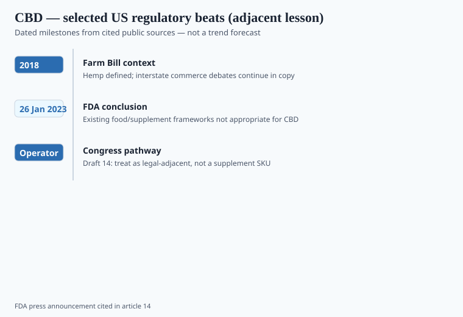

**Disclaimer.** Educational only. Not medical advice. Dietary supplements are not intended to diagnose, treat, cure, or prevent any disease (DSHEA; 21 U.S.C. § 321(ff); 21 CFR 101.93). This is not legal advice, not an instruction to sell or buy CBD, and not a discussion of medical cannabis.

This pack is a *supplement* pack. CBD is here as a cautionary adjacent, because 2020–2024 trained a lot of founders to treat "hemp" as a loophole. FDA disagrees. High level only.

## Two statutes people flatten

**2018 Farm Bill** (Agriculture Improvement Act of 2018) took hemp (cannabis ≤0.3% delta-9 THC on a dry-weight basis, as defined) off the Controlled Substances Act. It did **not** write CBD into the dietary-supplement definition. USDA hemp production rules and FDA food/drug rules are different stacks.

**FD&C Act drug exclusion.** CBD is the active ingredient in Epidiolex (FDA-approved 2018, rare epilepsies). Substantial clinical investigations existed before the gas-station gummy aisle. FDA's position: CBD is excluded from the supplement definition under § 201(ff)(3)(B), and adding it to conventional food is also a problem under § 301(ll). CRS's *FDA Regulation of Cannabidiol (CBD) Products* (IF11250) is a clean congressional briefing if you need a third-party summary.

A state hemp license is not an FDA blessing.

## 26 January 2023: the sentence to keep

<!-- graphics-pack:v1 -->

*Figure 1. Adjacent regulatory lesson — not a guide to launching a CBD supplement SKU.*

FDA announced that existing food and supplement frameworks are **not appropriate** for CBD. A working group had looked at Epidiolex data, published literature, a public docket, and FDA's own work. The agency denied three citizen petitions that asked for rulemaking to allow CBD as a dietary supplement. It said it would **not** start that rulemaking, because it was not apparent how CBD could meet the safety standard for supplements or food additives (liver signal, unknown chronic dose, male-reproductive signals in animals, pregnancy unknown). It asked Congress for a new pathway.

The slide deck FDA posted (`media/168778`) is blunt: inherent risk profile + protective food/supplement safety standards + limited risk-management tools (you cannot put a boxed warning on a gummy the way you can on a drug).

**April 2024.** Commissioner Califf told a House Oversight hearing the same thing: not safe enough, as the file stands, to be a supplement or a food; liver enzymes, drug interactions, male-reproductive signals, pregnancy unknown; Congress can build something else. He also talked about gummies packaged for children — a risk-management tool food law does not give him. Foley & NutraIngredients both covered the hearing. The policy did not thaw.

FDA has issued CBD warning letters since 2015, long before COVID. The 2023 announcement was not a first shot. It was the agency saying it would *not* do the rulemaking industry wanted. Enforcement remains selective. That is not the same as legal.

## COVID made it louder

Bautista et al. counted CBD in 13 of the March–July 2020 COVID letters. "Hemp oil for coronavirus" is how you get two agencies at once. The Farm Bill does not protect a disease claim. Nothing does, without an NDA.

## What a supplement brand should steal as *process*, not as a SKU

1. **Race-to-market is real.** Epidiolex occupied the drug slot. NMN later showed the clause can be argued the other way when US marketing came first (piece 08). CBD did not have that fact pattern in FDA's telling. Learn the clause before you fall in love with a "next cannabinoid."
2. **Delta-8 and unlabeled intoxicants.** The 2020s hemp market filled with semi-synthetics and inconsistent THC. That is a children's-gummy and driving-impairment problem. It is also why payment processors and 3PLs panic. A vitamin brand that shares a 3PL with a delta-8 line will inherit the panic.
3. **Testing is not optional and is not sufficient.** Potency, residual solvents, pesticides, heavy metals, mycotoxins, and *actual* delta-9 — and the lab's scope. A COA that says "0.0% THC" with an LOQ of 0.3% is a joke. Still: a perfect COA does not create a legal supplement identity if FDA says the article is not a supplement.
4. **Copy.** No epilepsy, pain, anxiety, cancer, sleep-as-disease. No "FDA-approved hemp supplement." Epidiolex is the approved drug. Saying that out loud is the opposite of a gummy claim.

## What this brand lane is not doing

No CBD SKU is implied here. No cannabis parent company, no "we are waiting for Congress" teaser on a vitamin site. Women's-health and sleep SKUs in this pack stay on nutrients and botanicals that are actually in the supplement definition, with their own problems (piece 07, piece 15).

If Congress later writes a hemp-food pathway, that will be a dated event and a new counsel memo. Until then, treat "just add 25 mg CBD to the nighttime formula" as a way to lose the nighttime formula.

## Delta-8, child packaging, and the warehouse stain

2024 CBD/delta-8 letters were fewer than 2023 in Waldstein's tally (he counted nine, down from the prior year — trade count, not a federal stat). Several were joint FDA/FTC actions on high-dose delta-8 in packaging that looks like candy. One later letter treated child-appealing delta-8 packaging as enough even without a disease claim. `[VERIFY]` the letter number before you put it in a brief.

That is the 3PL problem in this pack (piece 37). A vitamin book that shares a warehouse with intoxicating hemp inherits processor panic, insurance questions, and a children's-gummy adjacency you did not ask for (piece 34). A perfect CBD COA still fails gate 0: FDA's January 2023 sentence is about *status*, not about potency.

"Next cannabinoid" (CBN, CBG, THCA, whatever the broker emails this quarter) inherits the same §201(ff)(3)(B) and §301(ll) questions unless counsel has a different fact pattern. Do not learn that on a launch week.

## What changed since 2020 (box)

2020: gray market + COVID letters. 2023: FDA closed the supplement-rulemaking door and pointed at Congress. 2024: the Commissioner repeated it on the Hill. The aisle is still full. That is not the same as lawful interstate supplement commerce in FDA's view.

The lesson for a white-label book is mundane: **status, then claims, then COA.** CBD failed at status. Do not build a catalog on an ingredient that cannot clear the first gate.
