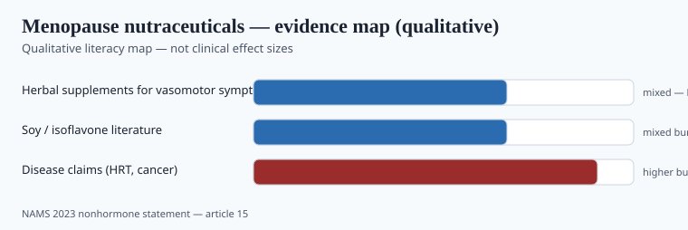

**Disclaimer.** Educational only. Not medical advice. Dietary supplements are not intended to diagnose, treat, cure, or prevent any disease (DSHEA; 21 U.S.C. § 321(ff); 21 CFR 101.93). This is not guidance to treat menopause, osteoporosis, or hormone-sensitive disease, and it is not a substitute for a clinician. Hormone therapy is a prescription decision.

"Women's hormones" is a category built to outrun evidence. The North American Menopause Society (now The Menopause Society) published a document in 2023 that you can hold against a PDP.

## What NAMS 2023 actually recommended

<!-- graphics-pack:v1 -->

*Figure 1. Qualitative map aligned to NAMS 2023 — not a product ranking.*

*Menopause* 2023, PMID 37252752. Nonhormone options for **vasomotor symptoms** (hot flashes, night sweats).

**Recommended (with their evidence grades):** cognitive-behavioral therapy, clinical hypnosis, SSRIs/SNRIs, gabapentin, fezolinetant (Level I); oxybutynin (I–II); weight loss and stellate ganglion block (II–III). Those are mostly *not supplements*. Fezolinetant is a drug.

**Not recommended:** supplements/herbal remedies (Levels I–II); soy foods, soy extracts, equol; black cohosh; cannabinoids; evening primrose; maca; ginseng; dong quai; wild yam; vitamin E; omega-3s for VMS; and a longer list in the paper (paced respiration is not recommended either, for a different reason).

The press release (1 June 2023) said the quiet part: many women cannot or do not want hormone therapy; clinicians still need options that *work*. Herbals did not make the cut.

If you sell a "menopause relief" blend of black cohosh, soy isoflavones, and red clover, you are selling against the current US menopause-society map. You may still sell a *nutrient* SKU to women in midlife. You may not honestly say NAMS is on your side.

## Black cohosh

Cochrane 2012 (Leach & Moore, CD007244): 16 RCTs, 2,027 women, median 40 mg, ~23 weeks. No significant difference vs placebo in VMS frequency. Safety data inconclusive.

USP's botanicals committee previously reviewed hepatotoxicity reports and directed a liver-warning statement on black cohosh products (discontinue and seek care if liver-trouble symptoms; caution in liver disease). NAMS 2023 repeats that history. ODS has a professional fact sheet. This is not a "gentle plant" story.

## Soy and equol

Isoflavone trials for VMS are mixed; NAMS 2023 put soy foods, extracts, and equol in the not-recommended column for hot flashes. Soy food as *food* is a different object from a 80 mg isoflavone capsule. Do not convert tofu epidemiology into a disease claim, and do not promise flash reduction.

## What still belongs on a midlife shelf (narrowly)

These are **not** NAMS-approved VMS treatments. They are nutrients or sports ingredients with their own files, which women also buy.

- **Vitamin D and calcium.** Bone is a clinical topic; high-dose calcium has its own CVD arguments. ODS + a clinician. Not "prevents osteoporosis" on a bottle without going through FDA's disease-claim process (you will not).
- **Protein and creatine.** Morton and ISSN apply to women who lift. The 2025 creatine meta's female subgroup was underwhelming (piece 06). Still: 3–5 g monohydrate is a reasonable sports SKU, not a hot-flash SKU. Chilibeck-type work on creatine + training and bone geometry in postmenopausal women lives in the ISSN stand's citation list — training is the partner, not a pink bottle alone.
- **EPA/DHA.** Not recommended by NAMS *for VMS*. Still a dietary fat conversation (piece 04). Do not sell it as a flash product.
- **Magnesium.** Tolerance and intake gaps (piece 09). Not HRT.

**Iron.** Premenopausal deficiency is common. Postmenopausal excess is a different risk. An all-ages "women's multi" with 18 mg iron is how you annoy a lot of 55-year-olds. Age-split formulas are not a gimmick here.

**Ashwagandha in "menopause cortisol" SKUs.** Piece 07's liver series is not sex-specific. Blending it with black cohosh gives you two hepatotoxicity conversations and zero NAMS VMS votes.

**Creatine for women** is having a 2024–2025 media moment. Sell monohydrate and the training file. Do not sell it as a flash or "hormone balance" product. The 2025 *Nutrients* meta's female subgroup is a reason to stay modest in the copy, not a reason to invent a patented women's ester.

## Claims that must die

- "Natural HRT," "bioidentical hormone in a yam," "estrogen-free estrogen." Wild yam does not become progesterone in a human because a Facebook ad says so.
- "Balances hormones" as a caption under a disease list (PCOS, endometriosis, infertility, breast cancer).
- "Treats menopause." Menopause is not a vitamin deficiency.
- Cannabinoids for VMS — NAMS said not recommended; FDA said CBD is not a supplement (piece 14). Two doors, both closed.

## Quality, because this aisle is a DILI aisle

Black cohosh (liver warning), ashwagandha in "cortisol / menopause" blends (piece 07), multi-herb dust. Identity of *Actaea racemosa* vs cheaper lookalikes is an ABC-class problem. If you insist on a botanical here, one plant, one extract, one warning set, finished-product HPTLC.

## Fezolinetant is the contrast, not a competitor SKU

NAMS 2023 put fezolinetant on the recommended list as a **drug**. That is the point of the map. A supplement PDP that says "natural Veozah" is the berberine/Ozempic joke with a new noun (piece 21). Hormone therapy remains a prescription decision. This pack does not argue it.

What a midlife nutrient book can still do: iron-split multis (piece 26), creatine monohydrate with a training file (piece 06), vitamin D in mcg without an osteoporosis poster (piece 04, piece 27), protein that assays as protein. None of those are VMS treatments. Say so on the page.

If you still sell black cohosh after Cochrane 2012 and NAMS 2023, you are selling a traditional herb with a liver-warning conversation — not a hot-flash drug. Two hepatotoxic botanicals in one "cortisol menopause" blend is how DILI depositions get written.

## What changed since 2020 (box)

The 2015 NAMS nonhormone statement was already cool on herbals. 2023 updated the drug side (fezolinetant) and kept supplements off the recommended list. Retail did the opposite and grew the "menopause wellness" set. A science-curious brand can sell creatine, protein, vitamin D, and an honest multi to women over 45 without pretending to be a vasomotor drug. That is the whole map.

A future science/QA partner should be allowed to kill any SKU whose only job is to argue with PMID 37252752.
