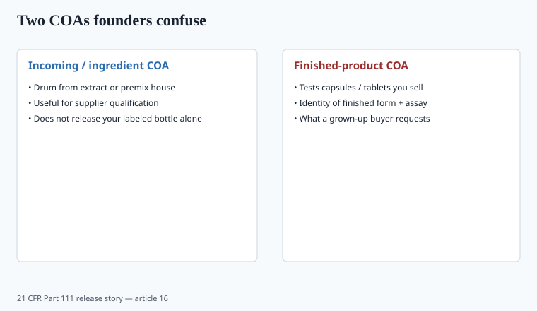
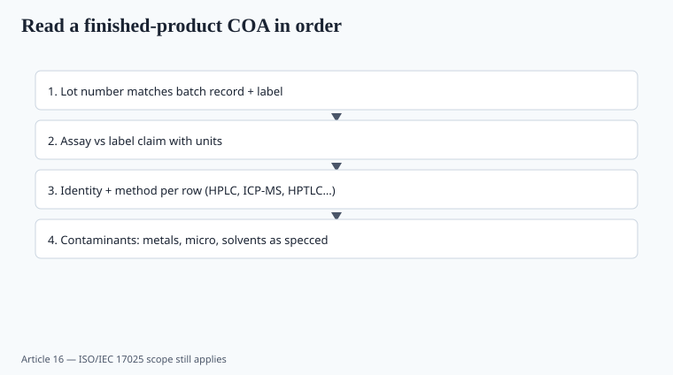

**Disclaimer.** Educational only. Not medical advice. Dietary supplements are not intended to diagnose, treat, cure, or prevent any disease (DSHEA; 21 U.S.C. § 321(ff); 21 CFR 101.93). This is not legal advice and not an audit.

If you only read one operator piece in this pack, read this one. Papers do not ship. Lots do.

A certificate of analysis is a signed statement that *this lot* was tested against *this spec* by *this lab* with *these methods* and passed or failed. Everything else is a brochure.

## The two COAs people confuse

<!-- graphics-pack:v1 -->

*Figure 1. Incoming drum COAs do not release your labeled bottle by themselves.*

**Incoming / ingredient COA.** The extract plant or the vitamin premix house tested the drum. Useful. Not sufficient to release *your* bottle.

**Finished-product COA.** Someone tested the capsules that will see a label. Identity of the finished form, assay vs label claim, contaminants, micro. This is the document a grown-up buyer asks for.

A CMO that only forwards the ingredient PDF is asking you to treat 21 CFR 111 as optional. You can qualify a supplier and skip some incoming tests *if* the verification is real. You cannot skip having a scientifically sound finished-product story.

## The first five matches

Open the COA and the label art and the batch record. If any row fails, stop.

1. **Product name and SKU** match the bottle, not last year's formula.
2. **Lot number** on the COA = lot on the drum / bottle / case.
3. **Date of manufacture and date of test** make sense (a test from 2021 on a 2026 lot is a costume).
4. **Label claim vs assay.** 125 mcg D3 on the panel; assay 118–132 or whatever the spec says, with units. IU vs mcg mixups are how D3 lots get released wrong.
5. **Serving size math.** Assay is per g or per capsule; the label is per 2-capsule serving. Do the multiplication yourself.

## Methods or it is a rumor

<!-- graphics-pack:v1 -->

*Figure 2. Read lot match first — methods on every row, ISO/IEC 17025 scope still applies.*

Every result row needs a method: HPLC, UPLC, ICP-MS, HPTLC, USP monograph number, AOAC, a validated in-house method. "Withanolides 5%" with no method is a number from a sales rep.

For botanicals: identity (HPTLC against a reference) **and** a marker assay. Marker alone is how you buy spiked material (piece 02, piece 07).

For protein: nitrogen method and, if the SKU is expensive or plant-based, an amino-acid profile so you can see glycine dumps.

For probiotics: strain ID + CFU, and whether CFU is at manufacture or through expiry. Ask for the stability points.

For lipids: oxidation (PV, p-AV, TOTOX) on omega-3s, not just EPA/DHA milligrams.

## Labs

**ISO/IEC 17025** accreditation is necessary and not sufficient. Read the **scope**. A lab accredited for water microbiology is not thereby accredited for ICP-MS lead in a botanical. The COA should name the lab. You should be able to find the accreditation.

In-house CMO labs can be fine. They can also be the same team that needs the batch to ship on Friday. A split-sample to an outside 17025 lab on a schedule (every lot, every 5th lot, every new supplier) is how you sleep.

## Specs that should already exist before you see a COA

You do not "receive" specs from a COA. You write them (or approve the CMO's) in the master manufacturing record:

- Identity tests and accept/reject.
- Assay range (e.g. 90–110% of claim, or the USP range).
- Micro limits (USP <2023>/<2022> style or your tighter set).
- Heavy metals — numeric, per daily serving, method ICP-MS.
- Residual solvents if the process needs USP <467>.
- Pesticides on botanicals.
- Allergens if the line is mixed.

If the CMO's COA has no spec column, only "results," you cannot tell a pass from a vibe.

## Tricks that survive a Shopify launch

- **COA for the flavor, not the active.**
- **Composite / skip-lot** presented as "every bottle tested."
- **ND without LOQ.**
- **"Conforms" with no number** on a potency row.
- **Supplier letterhead, no lab.**
- **Wrong language / obviously recycled PDF** (same pH to three decimals on two lots).
- **Prop 65-relevant lead** reported as ppm in the powder without converting to mcg/day at your serving.
- **NSF/USP logo** on the CMO website but not on *your* SKU in the directory (piece 10).
- **Retest after fail** until the number moves, with no investigation. Ask for OOS procedure.

## Packaging and shipping, because the COA ends at the dock

A passing lot can die in a hot trailer. Spec the ship: temperature, desiccant, induction seal, light for oils. Retain samples (Part 111) in a closet you control, not only at the CMO. When a customer complaint comes in 11 months later, you will want *your* retain.

Carton claims ("third-party tested," "USP grade") are labeling. If the COA cannot support the adjective, the adjective goes (piece 12).

## A first-lot script for a founder

1. Pay for a finished-product COA from a named 17025 lab on your nickel, even if the CMO already ran one. Compare.
2. Check strain / salt / species against the label.
3. Convert metals to mcg/day.
4. Read micro.
5. File the PDF with the batch record, the spec, and the label PDF in one folder named `LOT-XXXX`.
6. Do not launch ads until step 5 exists.

Leave the QA seat empty in public. Fill it in private with someone who has failed a lot and held the line. That is the partner this pack keeps a chair for.

## What changed since 2020 (box)

More founders launched DTC without walking a plant. CMOs got better at sending pretty PDFs. The regulation did not get simpler. The founders who treat a COA like a bank statement — match the account, match the date, match the amount — are the ones who still have a brand after the first retailer audit.

Quality is not a vibe and it is not a stock photo (see `PHOTO_NOTES.md`). It is a lot number you can defend.
