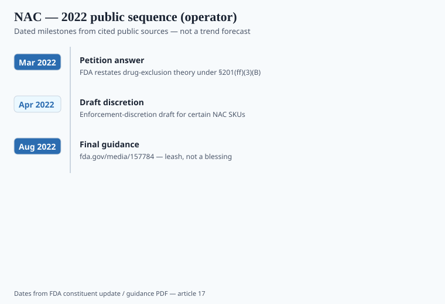

**Disclaimer.** Educational only. Not medical advice. Dietary supplements are not intended to diagnose, treat, cure, or prevent any disease (DSHEA; 21 U.S.C. § 321(ff); 21 CFR 101.93). NAC is a prescription drug in other presentations. This is not a treatment guide for acetaminophen overdose, lung disease, or psychiatric use.

N-acetyl-L-cysteine sat on gym and "liver" shelves for years. Then FDA said the article was a drug first. Then it said it would not chase otherwise-lawful supplement SKUs for that reason alone. The second sentence is the one brands printed. The first one did not go away.

## The 2022 sequence

<!-- graphics-pack:v1 -->

*Figure 1. Dated 2022 public sequence — a leash, not a blessing. See fda.gov/media/157784.*

March 2022: FDA answered a citizen petition and restated that NAC is excluded from the dietary-supplement definition because of its drug history — the same race-to-market logic later used on NMN. The agency's theory lives in 21 U.S.C. § 321(ff)(3)(B): an article is not a dietary supplement if it was approved as a new drug, or authorized for investigation as a new drug, before it was marketed as a food or supplement.

April 2022: draft enforcement-discretion guidance. August 2022: final guidance (*Policy Regarding N-acetyl-L-cysteine*; PDF at fda.gov/media/157784). The constituent-update page that announced the final text is the one operators bookmarked.

The final text is a leash, not a blessing. FDA intends not to object to sale of certain NAC products *labeled as dietary supplements* that would be lawful if NAC were not excluded, and that are **not otherwise** in violation of the FD&C Act. The policy **does not apply** if the product is intended to diagnose, cure, mitigate, treat, or prevent disease. It does not apply if the lot is adulterated or misbranded for some other reason. FDA said it would keep the discretion until it finished a rulemaking or denied the petition's rulemaking ask — unless a safety problem showed up.

Read that as an operator. You can ship a 600 mg NAC capsule with a structure/function file and a 101.93 disclaimer today under a policy FDA can withdraw. You cannot ship "NAC protocol for long COVID" or "replaces Mucomyst." Those sentences turn the leash into a letter.

Retailers moved faster than the Federal Register. When exclusion talk circulated in 2021–2022, some marketplaces paused NAC listings. After the August guidance, many restocked. That is not a safety finding. It is a platform reading a PDF.

## What NAC is, chemically, without the mystique

A cysteine donor. The acetylated form is more stable on the shelf than free cysteine. Hospitals use NAC as a drug for a specific overdose. It has also been studied in many other disease settings that a supplement label does not get to inherit. ODS does not treat NAC as a vitamin. There is no RDA, no UL table, no fortification program.

Human data on "respiratory comfort" and "antioxidant status" exist and are mixed, often in clinical populations — COPD clinics, psychiatric wards, ICU protocols. Those papers are real. They are also the wrong objects for a DTC label. I will not invent a 2024 mega-trial that turned NAC into a wellness nutrient. `[CITE NEEDED]` before you put a numeric responder rate under a SKU.

The 2020–2021 COVID aisle used NAC as a stack ingredient next to zinc and quercetin. That intended use is exactly what the 2022 guidance carved out. Bautista and colleagues (PMC7528445) catalogued how quickly "immune" pages became disease pages in 2020. NAC was one of the nouns that showed up.

If a clinician wants NAC for a named condition, that is a clinic. If a brand wants NAC as a sulfur-amino SKU with a narrow metabolic structure/function, that is a different file — and a thinner one.

## How this differs from NMN (2022–2025)

NMN: FDA said excluded (2022), then in September 2025 said *not* excluded because of earlier US supplement marketing (piece 08). NAC: FDA still describes it as excluded, and uses discretion instead of a reinterpretation. Two ingredients, two legal objects. A catalog that files them in one "gray-market amino" folder will brief counsel wrong.

The distinction matters for how you write the SKU brief:

| Ingredient | Agency posture (as of the dates in this pack) | What a founder can print |
| --- | --- | --- |
| NAC | Excluded + enforcement discretion (Aug 2022 guidance) | Lawful-if-not-excluded supplement copy; no disease use |
| NMN | 2025 petition answers: not excluded on marketing-history theory; NDI still due | Status ≠ efficacy; NDIN is a separate gate (piece 30) |
| CBD | Jan 2023: existing food/supplement frameworks not appropriate | Not a supplement SKU (piece 14) |

NDI: if you were not in the US food supply as NAC before 15 October 1994, you have a notification problem *in addition to* exclusion. Discretion is not an NDIN. `[VERIFY]` your supplier's theory with counsel; this draft is not that memo.

Self-affirmed GRAS talk does not close either gate. FDA has not treated a consultant's GRAS dossier as a substitute for § 413 when the article is new, or as a cure for § 201(ff)(3)(B) when the article is old as a drug.

## Copy that spends the truce

The guidance is written so that one sentence can spend it:

- "Clinically proven for COPD / flu / psychiatric use."
- "Hospital-grade NAC." The IV drug is a drug.
- "Detox" as a liver-disease claim.
- Stack names that are protocols ("long-COVID kit," "Mucomyst alternative").
- Lung art on the principal display panel. A pair of bronchi is intended use.

Allowed shape, if the file exists: a narrow structure/function on antioxidant metabolism, plus the DSHEA line, plus a warning set (not for kids as candy; talk to a clinician if you take prescription drugs — NAC has interaction logic with nitroglycerin-class products and with some chemotherapy conversations that belong in a clinic, not a blog). I would still take that sentence to counsel.

FTC's December 2022 *Health Products Compliance Guidance* is the second reader. Even if FDA's discretion holds, a Reel that says "this is what they give you in the ER for your lungs" is a disease ad. The footer disclaimer does not un-say the video.

## QA

Assay as NAC, not as "cysteine complex" or "glutathione precursor blend." Residual solvents if the synthesis warrants USP <467>. Heavy metals. A finished-product COA, not a broker amino PDF. Identity should match the labeled salt (N-acetyl-L-cysteine, not a mystery acetylated mix).

Stability is the quiet problem. NAC oxidizes. A bottle that also contains minerals or a flavored powder can lose assay before expiry. Ask for the real-time or accelerated points in *your* pack-out, not a drum study from 2019.

Gummies are a poor matrix for a thiol. If someone pitches a NAC gummy, ask why.

## What changed since 2020 (box)

2020: NAC was a quiet SKU and a COVID stack extra. 2021–early 2022: exclusion letters and marketplace flinches. August 2022: discretion guidance. 2026: the guidance is still a PDF, not a statute. Build the catalog as if the PDF can vanish on a Friday. The disease copy is what makes it vanish on a Thursday.
