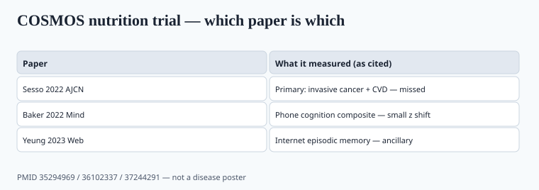

**Disclaimer.** Educational only. Not medical advice. Dietary supplements are not intended to diagnose, treat, cure, or prevent any disease (DSHEA; 21 U.S.C. § 321(ff); 21 CFR 101.93). The COcoa Supplement and Multivitamin Outcomes Study is a nutrition RCT. It is not this software repository. Small shifts on cognitive composites are not a dementia treatment.

The largest US multivitamin trial of the 2020s has an awkward acronym if you live in this git tree. Say the long name once: **COcoa Supplement and Multivitamin Outcomes Study**. Then say what it measured.

## Sesso 2022: the primary endpoints missed

<!-- graphics-pack:v1 -->

*Figure 1. Which paper is which — primary miss stays in the same slide as the cognitive ancillaries.*

Sesso, Rist, Aragaki, et al., *American Journal of Clinical Nutrition*, PMID 35294969. Factorial trial. 21,442 US adults (women ≥65, men ≥60). Daily multivitamin-mineral vs placebo. Intervention June 2015–December 2020. Median follow-up 3.6 years. Primary: total invasive cancer (not nonmelanoma skin).

Invasive cancer: 518 vs 535 events, HR 0.97 (95% CI 0.86–1.09), P = 0.57. Composite CVD: HR 0.98 (0.86–1.12). All-cause mortality: HR 0.93 (0.81–1.08). Breast and colorectal: not significant. A lung-cancer secondary HR of 0.62 (0.42–0.92) showed up; that is not a license to put "prevents lung cancer" on a Centrum-class bottle. The authors' conclusion was the primary: **daily MVM did not significantly reduce total invasive cancer.**

Cocoa-extract CVD results were reported separately. Do not steal a flavanol HR (or a null) and hang it on a multi. The factorial design is why both nouns sit in the trial name. It is also why a landing page that mashes "cocoa + multi = heart and cancer protection" is reading the protocol backwards.

Follow-up of 3.6 years is long for a supplement RCT and short for cancer latency. The paper does not pretend otherwise. A brand that waits for "the next COSMOS" to print a cancer claim is waiting for a sentence the primary analysis did not write.

## COSMOS-Mind: a cognitive composite, not a dementia drug

Baker et al., *Alzheimer's & Dementia* 2022, PMID 36102337. 2,262 participants, telephone cognition, three years. **Cocoa extract:** no effect on the global composite (mean z 0.03, 95% CI −0.02 to 0.08). **MVM vs placebo:** a statistically significant benefit on the global composite (mean z 0.07, 0.02 to 0.12), also on memory and executive composites, more visible in a CVD-history subgroup (nominal interaction).

A 0.07 z on a phone battery is not "reverses Alzheimer's." It is a small mean shift on tests. COSMOS-Web (Yeung et al., *AJCN* 2023, PMID 37244291; NCT04582617) then reported an internet battery in 3,562 older adults. Prespecified primary: change in episodic memory (ModRey immediate recall) at one year — statistically significant vs placebo. The authors estimated the difference as equivalent to about 3.1 years of age-related memory change on a cross-sectional age-performance slope. That estimate is their method, not a birthday rewind. Secondary outcomes (novel object recognition, executive function) did not move the same way.

Vyas et al., *AJCN* 2024, PMID 38244989, added COSMOS-Clinic (in-person tests, n = 573 with complete baseline cognition) and a meta-analysis of non-overlapping participants across Clinic, Mind, and Web. The meta found benefits on global cognition and episodic memory of similar small size. It is still not a dementia-drug file. It is still not a reason to put a brain MRI on a multi.

If you quote any of these numbers on a product page, quote the primary cancer/CVD miss in the same paragraph. Cognitive ancillaries do not rescue a disease claim the parent trial missed.

## PHS II is still in the folder

Gaziano et al., *JAMA* 2012, PMID 23162860: Physicians' Health Study II, men, daily MVM, modest reduction in total cancer, no CVD benefit. Older, male-only, different product era. Cognitive follow-up in PHS II did not show the same pattern COSMOS-Mind later reported. `[VERIFY]` Grodstein et al. 2013 if you put PHS II cognition on a slide.

COSMOS is the 2020s adult conversation for mixed-sex older adults. Together the two trials say: a basic multi is not a cardiovascular drug and is a weak, inconsistent cancer story. That is a *nutrient-insurance* product, not a hero SKU.

ODS's MVM professional fact sheet is the public ballast. It does not tell you to print COSMOS-Web's 3.1-year estimate on a carton.

## How to sell a multi in 2026 without lying

The honest use is dietary gap-filling: people who skip food groups, older adults with lower intake, pregnancy (that one is a clinician + prenatal formula, not this bottle). A 65-year-old who eats poorly may still want a boring multi. A 65-year-old who wants a cancer poster should not get one from you.

Label problems that outlasted the trial:

- 100%+ of a dozen ULs in one gummy serving (kids, piece 34).
- Iron in a 65+ "adult" multi (piece 26).
- "Clinically proven to prevent cancer" citing the lung secondary or PHS II without the primary miss.
- Cocoa flavanols and MVM mashed into one PDP because the trial was factorial.
- "Clinically proven to reverse cognitive aging by 3 years" — that is the Yeung cross-sectional estimate wearing a disease hat.

QA: assay the expensive and unstable actives (D, B12, folate, iron, iodine). Gummy degradation is real. A multi with 20 ingredients and one "pass" on vitamin C is not a finished-product story. Piece 16 is the COA read; this piece is why the multi still exists after a null primary.

If you cite COSMOS at all, name the product class (a standard MVM, Centrum Silver in the published ancillaries) and the population (older US adults). Do not transfer the cognitive composite onto a 20-something "focus" gummy.

## What changed since 2020 (box)

The trial's intervention phase ended in December 2020; the MVM cancer/CVD paper landed in 2022; Mind in 2022; Web in 2023; Clinic plus meta in 2024. Brands that had been waiting for "the big multi study" got a null on the endpoints that sell. The cognitive papers are the ones that will be abused. Keep PMID 35294969 in the same slide as 36102337, 37244291, and 38244989.
